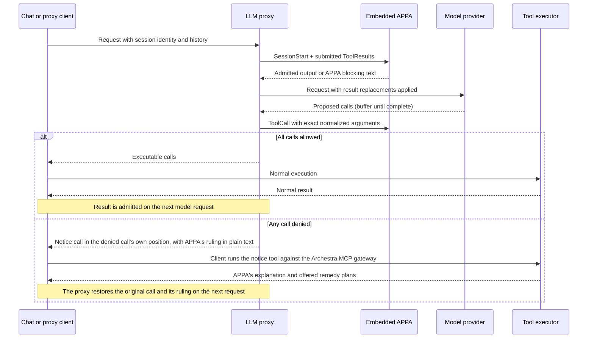

# Archestra × OpenAPPA

OpenAPPA evaluates tool calls and results at the LLM proxy guardrail checkpoints.
The proxy discovers session identity from native client headers or an explicit `X-Appa-Session-ID`.
External client sessions are scoped to their authenticated principal (`user:<id>`, `app:<id>`, or `virtual-key:<id>`).
This prevents one organization member from attaching to another member's session by guessing its ID.
Two MCP tools complete the negotiation loop: `archestra__get_remedy_plans` and `archestra__execute_remedy_plan`.

Session state is keyed by session ID.
Platform-internal requests (such as Slack threads) use shared session IDs over loopback.
Chat requests require an authenticated user who owns the target conversation.
External requests always require platform credentials.
Uncredentialed loopback is the platform trust boundary; a frontend forwarding `/v1` over loopback extends that boundary to its callers.
Without a session signal, requests share a fallback root per credential and agent.
The unreleased session-key migration clears old sessions, events, and receipts.
Saved policies remain intact.

## Startup configuration

`ARCHESTRA_OPENAPPA_ENABLED` defaults to `false`. Explicit `true` enables APPA
and the OpenAPPA editor. It automatically registers the proxy plugin.
The **Enable Guardrails v2** switch on `/openappa` controls APPA enforcement
across every organization and agent in the deployment. It defaults to off and
requires organization administration permission to change. Both the server flag
and this shared switch must be on for APPA to enforce policies. Each request
reads the shared setting, so replicas do not rely on a process-local switch.
Policy editing and GitHub sync remain available while enforcement is off.
`ARCHESTRA_BETA` and the plugin list alone do not activate them.
The OpenAPPA editor stores organization policy revisions in PostgreSQL. Restart
the backend when changing the flag; saving a policy requires no restart.

Existing trusted-data and invocation guardrails always remain active. When APPA
is enabled, existing result filters run first and APPA evaluates their filtered
output. Rewritten tool calls pass existing invocation checks before APPA reserves
them; either engine can block a call. Disabling APPA does not disable existing
guardrails or delete policies. A request already inside APPA fails closed if the
switch is turned off before its next native operation.

The HTTP API and agent read/validate/update tools share validation and revision
checks. Edits compile without executing external services. The next dispatch
loads the latest saved revision under the native runtime lock. New conversations
use it; existing conversations retain their recorded policy.

The editor accepts `[policy]` and URL/builtin bindings in `[externals]`. File
includes, local commands, and runtime-owned settings are rejected. Tokens are
referenced through `token_env`; policy documents must not contain credentials.
Existing file-based deployments must copy their policy into the editor. An
unconfigured organization starts with only a catch-all annotator. It returns
empty changes and requirements, leaving trust and audience unchanged. Explicit
tool rules take precedence over the catch-all. The local backend serves this
fixed answer without calling a model or accessing user data.

| Boundary | APPA inactive | Flag and global switch on |
| --- | --- | --- |
| Incoming tool results | Existing result policies | Existing result policies, then APPA admission and saved output |
| Outgoing calls | Existing invocation policies | Existing invocation policies, then APPA decision |
| Denied call | Existing adapter refusal | Notice call carrying APPA's explanation and remedies |
| Session header | No APPA wiring | Stable conversation identity |
| Special MCP tools | Hidden and unavailable | Notice reading and embedded remedy execution |
| Runtime | Not loaded or initialized | Lazy native initialization; errors fail closed |

Migrations remain additive and deployment-wide; runtime APPA records are accessed
only when enabled. The existing guardrails remain active with the APPA flag off.

## GitHub policy sync

Open **OpenAPPA** (`/openappa`) and select **Connect GitHub** below the policy
editor. `/guardrails-v2` redirects to this page. With APPA enabled, organization
administrators can choose an `owner/repository`, branch or tag (blank uses the
default branch), and a repository-relative TOML file. Public repositories need no
credential; private repositories use an existing organization token or GitHub App
credential, with credential-read permission required to select one.

Saving the source queues the first pull. Choose every 15 minutes, every hour, or
once a day; **Sync now** requests an immediate pull. The panel shows the last
check, accepted commit, and any error. The scheduler checks for due sources every
minute and deduplicates queued/running pulls per organization.

Each pull resolves a commit before downloading the file, limits the policy to
1 MiB of UTF-8, and runs the native policy validator. Accepted changes atomically
create an organization policy revision and record source metadata. Unchanged
bytes create no additional revision. Failed pulls preserve the active policy;
a source edit or disconnect prevents an in-flight stale pull from publishing.

While connected, the policy editor is read only and manual API/agent updates are
rejected. **Stop syncing** keeps the current policy and enables local editing.
GitHub sync only pulls changes; it does not push editor changes to the repository.
New conversations use the accepted revision; existing conversations retain theirs.
Migration `0477_appa_github_sync` adds source storage, task deduplication, and the deployment switch.

## Tool calls and results

A denied call is replaced in place with a call to `archestra__get_remedy_plans`.
The notice keeps the original call position and provider call ID.
Its arguments carry the blocked tool, its proposed arguments, and the policy ruling in plain text.
The ruling is not encoded, allowing client-side classifiers (such as Claude Code auto-mode) to inspect the text directly.
The client executes the notice through its normal tool loop.
The model reads the ruling and offered remedy plans, then acts on them in the same turn.

On subsequent requests, the proxy restores each notice back to the original tool call and injects the ruling as its result.
Restoration is a stateless, pure function of the request body.
Restoration needs no lookup beyond the typed records in history, so it survives restarts and replica changes.
The runtime withholds results submitted under call IDs it never released.
For remedy results, it returns the recorded output by logical call ID, regardless of the client's serialization wrapper.

## Remedies

Two MCP tools handle remedies:
1. `archestra__get_remedy_plans`: Returns the ruling and remedy plans carried in the notice arguments. It runs no code and changes no state.
2. `archestra__execute_remedy_plan`: Executes the remedy plan chosen by the model through the embedded OpenAPPA runtime.

The model selects every remedy. The proxy releases the model's own `execute_remedy_plan` call for the client to execute.

Offer routing and execution receipts are durable in PostgreSQL. Any backend replica can resolve an offer after a restart or routing change. The recorded owner routes the call to its session. The runtime still validates the offer lifecycle and control-call vouch.

Ordinary session receipts belong to authorized participants in one organization. A personal offer requires its originating user; an organization-scoped offer allows an organization caller. Remedy-execution receipts additionally bind the actual authenticated spender. Unknown, unauthorized, and spent offers return terminal feedback without applying a remedy.

The embedded API carries typed remedy outcomes, refusal reasons, and offer descriptions. The host uses these fields rather than rendered text.

Interactive human approval is not connected. Calls requiring human approval remain blocked.

## Persistence and current limits

The Rust binding stores event batches, policy snapshots, sessions, and receipts in PostgreSQL. Completed processing receipts commit with runtime events. Repeated results return their saved admitted output. Interrupted work remains pending and fails closed.

The proxy sends `Prompt` at the start of each user turn. It sends `TurnEnd` only after a terminal model answer. Before releasing a remedy call, it adds a typed execution frame with the provider's real tool call ID, displayed tool name, and original argument bytes. Ordinary MCP clients return this frame without a client change. Before forwarding later history, the proxy removes the frame and restores the original arguments, even when the current request has no tools. The gateway rejects a frame whose semantic arguments differ from the visible call.

The same logical call ID and arguments return the durable result without another execution. Reusing an ID with different arguments is refused. A new ID for a spent offer returns terminal feedback. JSON-RPC request IDs are not logical retry IDs. Direct calls need a stable host-supplied logical ID. An interrupted execution without a committed result remains blocked because the external action may already have occurred.

Full notice restoration runs on Anthropic Messages (including Bedrock InvokeModel), OpenAI Responses, and OpenAI Chat Completions.
Azure Responses tool traffic is refused while OpenAPPA is enabled; Azure Chat Completions remains supported.
On other protocols (Gemini, Bedrock Converse, Cohere, native Ollama), OpenAPPA rules on calls and results, but notices remain recorded in history as notice calls.
Interactive human review, child subagent delegation, and operator recovery remain follow-up work.
Start new conversations when enabling APPA: old tool results have no receipts.

## Build and deployment

The addon is compiled alongside Archestra's existing native addons and packaged
inside the normal platform image. Cargo fetches OpenAPPA at the full commit
pinned in `openappa-rs/Cargo.toml` and `archestra-rs/Cargo.lock`; neither a sibling
checkout nor an extra Docker build context is required. Archestra's existing
release workflow stays unchanged. There is no separate addon release.
