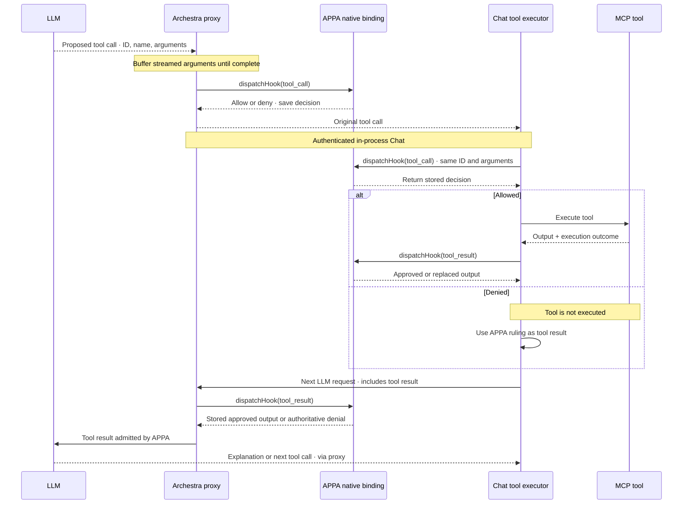
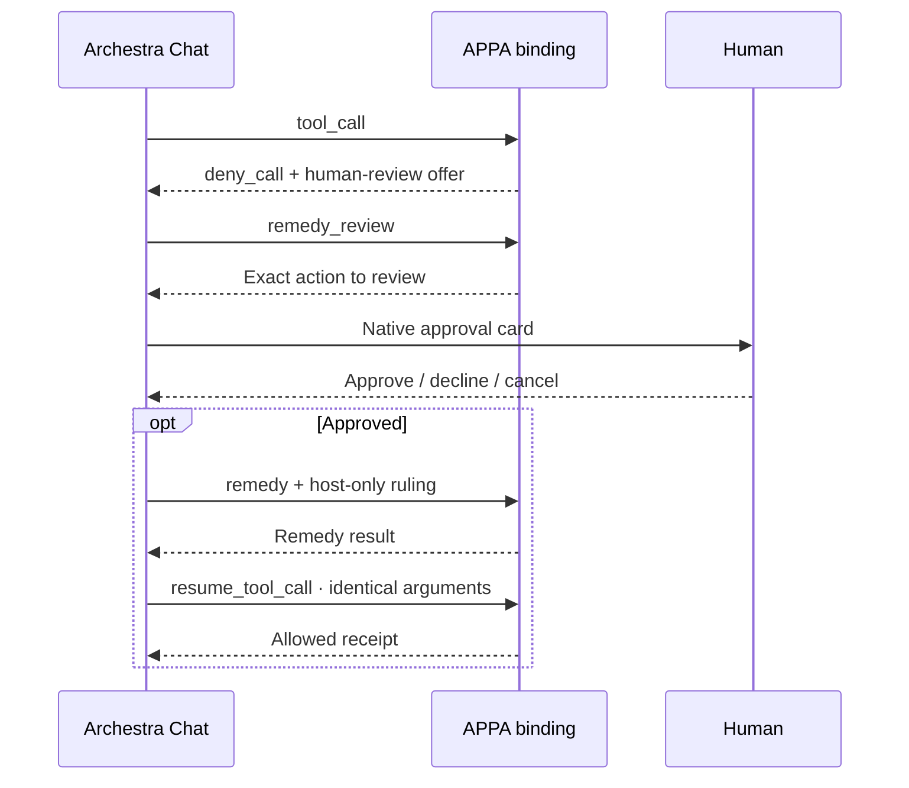
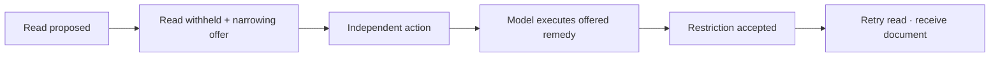
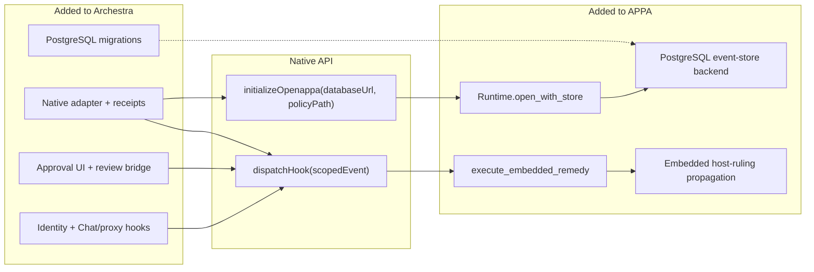
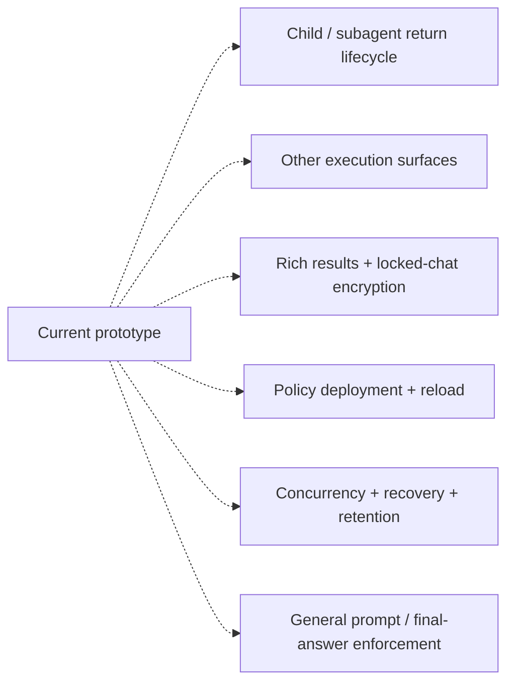

# Archestra × OpenAPPA

Prototype integration · 11 September 2026

## 01 · Tool execution

The second `tool_call` check is at the execution boundary. For the same call ID and arguments, it returns the persisted decision rather than evaluating policy again. Changed arguments are rejected.

## 02 · Human review and narrowing

**Approval does not reset restrictions.** Narrowing offers are never automatically accepted.

## 03 · Interface and ownership

Scope: `organization_id` · `caller_id` · `session_id` · optional `parent_id`.

Events: `session_start` · `prompt` · `tool_call` · `tool_result` · `remedy_review` · `remedy` · `resume_tool_call` · `turn_end`.

## 04 · Remaining boundaries

Not included: demo tools, Policy Studio, team resolver, GitHub annotator, status line.
