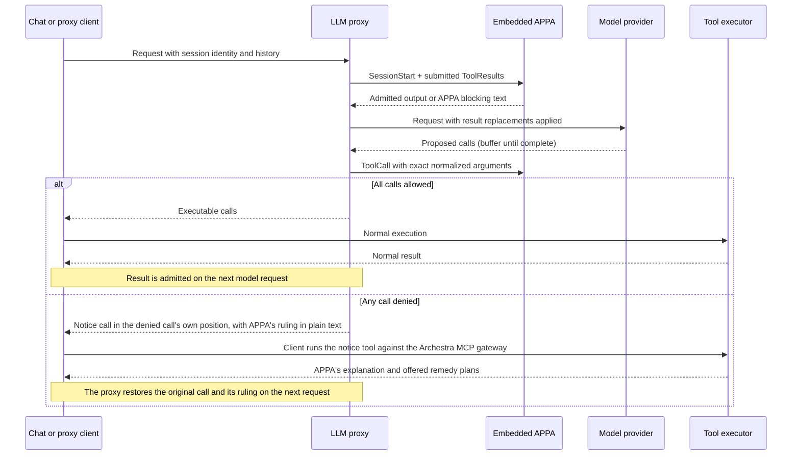

# Archestra × OpenAPPA

OpenAPPA evaluates tool calls and tool results at the LLM proxy guardrails. The proxy detects session identity from client headers or an explicit `X-Appa-Session-ID`. External client sessions are scoped to the authenticated credential (`user:<id>`, `app:<id>`, or `virtual-key:<id>`). This prevents callers from accessing another user's session by guessing its ID. Two MCP tools manage remedies: `archestra__get_remedy_plans` and `archestra__execute_remedy_plan`.

Session state is keyed by session ID. Internal requests over loopback use shared session IDs. Chat requests require an authenticated user who owns the conversation. External requests require platform credentials. Uncredentialed loopback is the platform trust boundary. Requests without a session header share a fallback session per credential and agent.

## Startup configuration

`ARCHESTRA_OPENAPPA_ENABLED` defaults to `false`. Explicit `true` enables APPA
and the OpenAPPA editor. It automatically registers the proxy plugin.
The **Enable Guardrails v2** switch on `/openappa` controls APPA enforcement
across every organization and agent in the deployment. It defaults to off and
requires organization administration permission to change. Both the server flag
and this shared switch must be on for APPA to enforce policies. Each request
reads the shared setting, so replicas do not rely on a process-local switch.
Policy editing and GitHub sync remain available while enforcement is off.
`ARCHESTRA_BETA` and the plugin list alone do not activate them.
The OpenAPPA editor stores organization policy revisions in PostgreSQL. Restart
the backend when changing the flag; saving a policy requires no restart.

Existing trusted-data and invocation guardrails always remain active. When APPA
is enabled, existing result filters run first and APPA evaluates their filtered
output. Rewritten tool calls pass existing invocation checks before APPA reserves
them; either engine can block a call. Disabling APPA does not disable existing
guardrails or delete policies. A request already inside APPA fails closed if the
switch is turned off before its next native operation.

The HTTP API and agent read/validate/update tools share validation and revision
checks. Edits compile without executing external services. The next dispatch
loads the latest saved revision under the native runtime lock. New conversations
use it; existing conversations retain their recorded policy.

The editor accepts `[policy]` and URL/builtin bindings in `[externals]`. The
only `include` entries admitted are battery declarations (see Batteries); any
other include, local command, or runtime-owned setting is rejected with the line
that carries it. Tokens are referenced through `token_env`; policy documents
must not contain credentials.
Existing file-based deployments must copy their policy into the editor. An
unconfigured organization starts with only a catch-all annotator. It returns
empty changes and requirements, leaving trust and audience unchanged. Explicit
tool rules take precedence over the catch-all. The local backend serves this
fixed answer without calling a model or accessing user data.

Tool names match exactly, or as the `*` catch-all; partial globs do not exist,
so a rule named `grain__*` matches nothing. Globs live in argument selectors
(`shell(command:*publish*)`).

| Boundary | APPA inactive | Flag and global switch on |
| --- | --- | --- |
| Incoming tool results | Existing result policies | Existing result policies, then APPA admission and saved output |
| Outgoing calls | Existing invocation policies | Existing invocation policies, then APPA decision |
| Denied call | Existing adapter refusal | Notice call carrying APPA's explanation and remedies |
| Session header | No APPA wiring | Stable conversation identity |
| Special MCP tools | Hidden and unavailable | Notice reading and embedded remedy execution |
| Runtime | Not loaded or initialized | Lazy native initialization; errors fail closed |

Migrations remain additive and deployment-wide; runtime APPA records are accessed
only when enabled. The existing guardrails remain active with the APPA flag off.

## GitHub policy sync

Open **OpenAPPA** (`/openappa`) and select **Connect GitHub** below the policy
editor. `/guardrails-v2` redirects to this page. With APPA enabled, organization
administrators can choose an `owner/repository`, branch or tag (blank uses the
default branch), and a repository-relative TOML file. Public repositories need no
credential; private repositories use an existing organization token or GitHub App
credential, with credential-read permission required to select one.

Saving the source queues the first pull. Choose every 15 minutes, every hour, or
once a day; **Sync now** requests an immediate pull. The panel shows the last
check, accepted commit, and any error. The scheduler checks for due sources every
minute and deduplicates queued/running pulls per organization.

Each pull resolves a commit before downloading the file, limits the policy to
1 MiB of UTF-8, and runs the native policy validator. Accepted changes atomically
create an organization policy revision and record source metadata. Unchanged
bytes create no additional revision. Failed pulls preserve the active policy;
a source edit or disconnect prevents an in-flight stale pull from publishing.

While connected, the policy editor and the Batteries panel are read only and
manual API/agent updates are rejected. **Stop syncing** keeps the current policy
and enables local editing. GitHub sync only pulls changes; it does not push
editor changes to the repository. New conversations use the accepted revision;
existing conversations retain theirs.

A pull is *held* rather than published when the repository text would drop a
battery this deployment declared (only while `declarations_pending_publish` is
set, i.e. until the deployment's own declarations have been published once) or
would add or rekey a `[credentials]` grant. The sync row stores the held content,
its hash, the source commit and the reasons (`drops_batteries`,
`changes_credentials`); the declarations endpoint reports them and the panel
shows them. `POST /api/openappa/github-sync/accept-held` publishes the held text
under the accepting user's permissions: `toolPolicy:update` and
`organization:update`, plus `credential:update` when the reasons include
`changes_credentials`. The audit record of the acceptance lists the dropped
batteries and changed variables. While the repository owns the text, alias
targets do not follow a catalog rename; the battery reads `server_missing` with
the stale target until the repository text changes.

Migration `0477_appa_github_sync` adds source storage, task deduplication, and
the deployment switch; `0485_fine_silver_surfer` adds the held-pull columns and
`declarations_pending_publish`, and makes `repo`/`path` nullable so a sync row
can carry the declaration flags alone.

## Batteries

A battery is an OpenAPPA policy package for one provider: a policy file that
names tools by their canonical namespace (`mcp/github/get_file_contents`), optional
helper scripts the policy consults over the externals protocol, and the
`APPA_PROVIDER_*` credential each helper reads. The addon exposes the batteries
bundled with the pinned OpenAPPA commit that govern MCP tools, the only tools
Archestra serves, and validates uploaded packages with the same marketplace
checks (`openappa-rs/src/batteries.rs`): a `command` external is admitted and
rewritten to the helper bridge below, a `url` external is refused. The Archestra
adapter, which maps a spelled tool name onto its canonical identity and back,
lives in the addon (`openappa-rs/src/adapter.rs`); OpenAPPA knows only that a
host embeds it.

### Declarations

The organization's policy text is the source of truth for batteries
(`backend/src/openappa/declarations.ts`). A battery is included by an `include`
entry, spelled `batteries/<name>/appa.toml` for a bundled battery or
`batteries/<name>@sha256-<64 hex>/appa.toml` for an uploaded package; the
`[server_aliases]` table maps each battery namespace to the catalogs' tool
prefixes; one `[credentials]` table per organization maps `APPA_PROVIDER_*`
variables to runtime credential keys. Resolution is exact: a bundled spelling
always resolves to the bundled battery and an upload never shadows it. A name may
be included once; a second include of the same name is refused with 409 at write
time, and a stored duplicate resolves to nothing.

Install rows (`openappa_battery_install`) are a read model derived from the
text: every recompose plans the rows from the declarations and replaces them
wholesale, preserving ids. `enabled` is `true` for every declared battery; a
battery is off by being absent from the text. Unticking the wizard checkbox
unbinds the alias but keeps the include, which then composes as the
`server_missing` stub until the panel removes the battery
(`DELETE /api/openappa/battery-includes/:name`, which drops the entry and every
alias its namespaces bind) or the text is edited. An attach to a catalog with no
synced tools is refused with 409, since the alias would have no target, and so
is one to a catalog whose tool prefix holds `__`; `GET /api/openappa/battery-matches`
answers `attach` (`ready | unsynced | conflicting`) beside the matches, and the
wizard checkbox and the panel's attach form disable on it with the reason; the
form lists only catalog entries with an install, since tools are discovered on
install and an entry nobody installed has no prefix to alias. A
detach or disable that would edit nothing (the row outlived the prefixes it was
derived from, or the alias is another included battery's) is refused with 409
pointing at the include removal rather than answering success over an unchanged
text. Every write path edits the text
through the addon's `editOpenappaPolicy` and saves a revision: the batteries
routes (attach, detach, remove, rebind, upload), the wizard checkbox, the
editor, the MCP guardrails tools, and GitHub sync. Attaching through the routes requires
`toolPolicy:update` and `organization:update`; nothing attaches a battery on
catalog install, and the bundled match list
(`backend/src/openappa/battery-match.ts`) is advisory only, served by
`GET /api/openappa/battery-matches` for the wizard checkbox. The policy-save
grant gate (`backend/src/services/guardrails-policy.ts`) requires
`credential:update` whenever the resulting text adds or rekeys a
`[credentials]` grant, whatever the path. A variable may be read by several
included batteries; each battery's declarations carry its `readers`, and a
rebind that would unset a variable another included battery reads is skipped
by the backend and refused by the panel.

An include entry that stopped resolving is a validation error only when it is
new or changed against the previous revision; an unchanged one is a warning and
composes as an empty stub, so a stale entry never takes the document down. A
battery the host holds back (unresolved, missing a credential, without a
server, in a naming conflict) composes as the same stub, so the runtime never
consults a helper the host cannot serve.

`GET /api/openappa/policy-declarations` returns what the text declares, per
entry: name, source, package hash, line, status, helpers, servers and credential
rows with readers, plus unused aliases, the root revision, the composition error,
whether GitHub owns the text, and the held pull. The panel and the editor's
annotations read it; the MCP guardrails tools return the same composition view
as `effective.batteries`.

### Statuses

Each derived row carries one status, evaluated in this precedence
(`backend/src/openappa/batteries.ts`, `batteryStatus`):

- `unavailable`: the entry resolves to no battery, or the name is included twice;
- `missing_credentials`: a declared variable has no key, or its key has no organization-level value;
- `naming_conflict`: a catalog's tool prefix contains `__` (the adapter splits at the last `__`), or one alias target is carried by more than one catalog;
- `server_missing`: the battery's namespace has no alias target, or the target names no catalog;
- `active`: otherwise.

A composition the runtime refuses overrides all of them: every row of the
organization is marked `refused` with the error, and the stored document is the
last composition that opened (`accepted ?? previousContent ?? root`), so a
refused revision is not retried on every call and the last enforceable document
remains visible as such. A battery may govern any number of catalogs; every row
of one battery carries the same status. The helper owner is the earliest row
(by `createdAt`, then id): its install id is the one the composed helper URLs
point at.

### Composition

The runtime opens the composed *effective policy* rather than the root policy
alone. The composer reads the latest root revision, its declarations, and the
tool names synced for each aliased catalog; each battery namespace becomes a
`server_aliases` entry whose targets are the catalog's tool prefixes, so a rule
for `mcp/github/get_file_contents` judges the platform tool
`github_prod__get_file_contents` and feedback to the model spells the platform
name. The composed document is stored per organization with the root revision
and a fingerprint of the compose inputs, including the `[credentials]` table.

Composition runs after each root save, GitHub import or held-pull acceptance,
battery route write, package upload, runtime credential change, catalog rename,
delete or restore, and tool sync, and hourly for every organization as a
backstop. Before each dispatch the runtime compares the stored root revision to
the latest one and recomposes on a mismatch; a declarations read also recomposes
when the fingerprint moved. Overlapping recomposes of one organization coalesce;
contention beyond three jittered attempts answers 503 rather than failing the
caller's write. A composition whose grants exceed the previous one's (after a
bundled-battery pin bump, say, with no user write) logs
`OpenAPPA composition grants credentials the previous composition did not`.

### Helpers

Helper scripts never run on the API host. The composer rewrites every `command`
binding into a URL binding on the loopback helper bridge,
`POST /api/openappa/helpers/<install id>/<external name>`, authenticated by a
per-process bearer the backend mints at boot and exports as
`APPA_ARCHESTRA_BRIDGE_TOKEN`. Neither a root policy nor a battery may name an
`APPA_ARCHESTRA_` variable in a `token_env` of its own (validation, upload and
composition all refuse it), so no author can send the runtime, bearer in hand, to
another install's helper or to an outside URL. The bridge refuses non-loopback
sockets and any other bearer, resolves the install's credentials at organization
scope, mounts the battery files into a fresh sandbox container under
`/skills/<battery>`, passes the consult envelope on stdin and the credential as a
sandbox secret, and returns the helper's stdout as the answer. The bridge needs
the code execution sandbox (`ARCHESTRA_CODE_RUNTIME_ENABLED` with a Dagger runner
or orchestrator kubeconfig; `daggerRuntimeEnabled` follows
`skillsSandboxEnabled` in `backend/src/config.ts`). Its budget is 4.5 seconds
including container start, and helpers may hold at most half the sandbox pool;
a slow, failed, unavailable or over-cap helper answers 5xx, which the runtime
treats as no answer, never as a denial. A dispatch holds its pooled PostgreSQL
connection across its consults, so slow helpers keep those connections busy and
dispatches waiting for one fail closed once the wait runs out; the addon's
global state lock is not involved, as it covers initialization, policy reload
and the start hook only.

### Packages and persistence

Uploaded packages are content-addressed: `(organization, content_hash)` is
unique and insert-only, several versions of a name may coexist, and an upload
that repeats stored bytes returns the stored row. A package name matches
`^[a-z0-9][a-z0-9-]*$`, carries at most 64 files, and its manifest name must
equal the uploaded name. Uploading a package that declares credentials or
externals requires `credential:update`. An upload rewrites an existing include of
that name to the new hashed entry. Deleting a package is refused while the latest
policy revision or a held pull spells its hash.

Migration `0483_openappa_batteries` adds the package, install and effective
policy tables; `0485_fine_silver_surfer` adds install `status`, `package_hash`
and `last_error`, moves package uniqueness from name to content hash, and adds
the GitHub-sync held-pull columns. `declareExistingInstalls()`
(`backend/src/openappa/declare-installs.ts`) runs at startup, idempotently, and
as `pnpm db:openappa-declare-installs`: it authors declarations for install rows
that predate them, dropping (with a structured log) a disabled row, a row
whose battery resolves to neither an upload nor the bundle, a non-owner row's
bindings, and a variable two owners bind to different keys (left unbound, so
those batteries read `missing_credentials` until an operator binds one key).

## Tool calls and results

The proxy replaces a denied call with `archestra__get_remedy_plans`. The notice keeps the original call position and provider call ID. Notice arguments contain the blocked tool name, proposed arguments, and the policy ruling in plain text. The ruling is unencoded so client classifiers (such as Claude Code auto-mode) inspect plain text. The client executes the notice through its normal tool loop. The model reads the ruling and selects an offered remedy plan in the same turn.

A `run_tool` dispatch is ruled on as the tool it targets. The runtime receives the target's name and its own `tool_args`, so named rules, annotator bindings, and the wildcard catch-all apply to the tool that executes, not the wrapper. A denial presents the same identity: the notice names the target and carries its arguments, and history restores the target call with the ruling. A released call stays the wrapper the client declared.

On later requests, the proxy restores notice calls back to original tool calls and injects the ruling as their result. Restoration is a stateless pure function of the request body. It requires no database lookup, surviving restarts and replica changes. The runtime withholds results for call IDs it never released.

## Remedies

Two MCP tools handle remedies:
1. `archestra__get_remedy_plans`: Returns the ruling and remedy plans from the notice arguments. It executes no code and changes no state.
2. `archestra__execute_remedy_plan`: Runs the remedy plan selected by the model through the embedded OpenAPPA runtime.

The model selects each remedy. The proxy releases the model's `execute_remedy_plan` call to the client for execution.

Remedy routing is a flattened JWS (RFC 7515 §7.2.2, RFC 7797 unencoded payload) on the denial notice and `execute_remedy_plan` call: `protected`, `payload`, `signature`. That is integrity (JWS), not encryption (JWE). `protected.alg` selects the verify method; unknown algorithms fail closed. The event log is the authority for whether the offer still stands. A claim carries no expiry: it is a routing token, not an authorization, and the event log's operation idempotency gates the spend — replaying a claim from another conversation can only reach an offer the same session minted, and never twice.

Session receipts belong to authorized users within an organization. A personal offer requires its original user. An offer id alone cannot be spent; the caller must present a valid signature for that offer. Spent, unknown, or unauthorized offers return terminal feedback without executing.

Interactive human approval is not connected. Calls requiring human approval stay blocked.

## Persistence and current limits

The Rust binding stores event batches, policy snapshots, sessions, and receipts in PostgreSQL. Completed receipts commit with runtime events. Repeated results return their saved output. Interrupted work fails closed.

The proxy sends `Prompt` at the start of each user turn, and `TurnEnd` after a terminal model answer. Before releasing a remedy call, the proxy attaches a typed execution frame with the provider tool call ID and original arguments. Standard MCP clients return this frame unchanged. Before forwarding later history to providers, the proxy removes the frame and restores the original arguments.

Submitting the same logical call ID and arguments returns the saved result without re-execution. Submitting changed arguments under that ID is refused. Spent offers return terminal feedback.

Notice restoration runs on Anthropic Messages (including Bedrock InvokeModel), OpenAI Responses, and OpenAI Chat Completions. Other protocols evaluate calls and results, but notices remain in history as notice calls. Azure Responses tool traffic is refused while OpenAPPA is enabled.

Start new conversations after enabling OpenAPPA. Tool results from before activation have no receipts and are refused.

## Build and deployment

The addon is compiled alongside Archestra's existing native addons and packaged
inside the normal platform image. Cargo fetches OpenAPPA at the full commit
pinned in `openappa-rs/Cargo.toml` and `archestra-rs/Cargo.lock`; neither a sibling
checkout nor an extra Docker build context is required. Archestra's existing
release workflow stays unchanged. There is no separate addon release.
