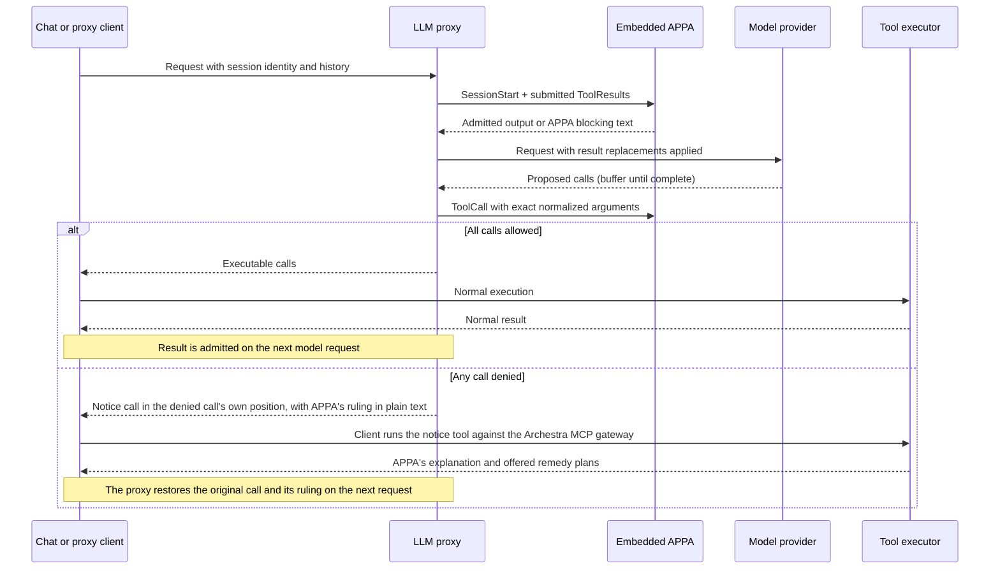

# Archestra × OpenAPPA

OpenAPPA evaluates tool calls and tool results at the LLM proxy guardrails. The proxy detects session identity from client headers or an explicit `X-Appa-Session-ID`. External client sessions are scoped to the authenticated credential (`user:<id>`, `app:<id>`, or `virtual-key:<id>`). This prevents callers from accessing another user's session by guessing its ID. Two MCP tools manage remedies: `archestra__get_remedy_plans` and `archestra__execute_remedy_plan`.

Session state is keyed by session ID. Internal requests over loopback use shared session IDs. Chat requests require an authenticated user who owns the conversation. External requests require platform credentials. Uncredentialed loopback is the platform trust boundary. Requests without a session header share a fallback session per credential and agent.

## Startup configuration

`ARCHESTRA_OPENAPPA_ENABLED` defaults to `false`. Explicit `true` enables APPA
and the OpenAPPA editor. It automatically registers the proxy plugin.
The **Enable Guardrails v2** switch on `/openappa` controls APPA enforcement
across every organization and agent in the deployment. It defaults to off and
requires organization administration permission to change. Both the server flag
and this shared switch must be on for APPA to enforce policies. Each request
reads the shared setting, so replicas do not rely on a process-local switch.
Policy editing and GitHub sync remain available while enforcement is off.
`ARCHESTRA_BETA` and the plugin list alone do not activate them.
The OpenAPPA editor stores organization policy revisions in PostgreSQL. Restart
the backend when changing the flag; saving a policy requires no restart.

Existing trusted-data and invocation guardrails always remain active. When APPA
is enabled, existing result filters run first and APPA evaluates their filtered
output. Rewritten tool calls pass existing invocation checks before APPA reserves
them; either engine can block a call. Disabling APPA does not disable existing
guardrails or delete policies. A request already inside APPA fails closed if the
switch is turned off before its next native operation.

The HTTP API and agent read/validate/update tools share validation and revision
checks. Edits compile without executing external services. The next dispatch
loads the latest saved revision under the native runtime lock. New conversations
use it; existing conversations retain their recorded policy.

The editor accepts `[policy]` and URL/builtin bindings in `[externals]`. File
includes, local commands, and runtime-owned settings are rejected. Tokens are
referenced through `token_env`; policy documents must not contain credentials.
Existing file-based deployments must copy their policy into the editor. An
unconfigured organization starts with only a catch-all annotator. It returns
empty changes and requirements, leaving trust and audience unchanged. Explicit
tool rules take precedence over the catch-all. The local backend serves this
fixed answer without calling a model or accessing user data.

| Boundary | APPA inactive | Flag and global switch on |
| --- | --- | --- |
| Incoming tool results | Existing result policies | Existing result policies, then APPA admission and saved output |
| Outgoing calls | Existing invocation policies | Existing invocation policies, then APPA decision |
| Denied call | Existing adapter refusal | Notice call carrying APPA's explanation and remedies |
| Session header | No APPA wiring | Stable conversation identity |
| Special MCP tools | Hidden and unavailable | Notice reading and embedded remedy execution |
| Runtime | Not loaded or initialized | Lazy native initialization; errors fail closed |

Migrations remain additive and deployment-wide; runtime APPA records are accessed
only when enabled. The existing guardrails remain active with the APPA flag off.

## GitHub policy sync

Open **OpenAPPA** (`/openappa`) and select **Connect GitHub** below the policy
editor. `/guardrails-v2` redirects to this page. With APPA enabled, organization
administrators can choose an `owner/repository`, branch or tag (blank uses the
default branch), and a repository-relative TOML file. Public repositories need no
credential; private repositories use an existing organization token or GitHub App
credential, with credential-read permission required to select one.

Saving the source queues the first pull. Choose every 15 minutes, every hour, or
once a day; **Sync now** requests an immediate pull. The panel shows the last
check, accepted commit, and any error. The scheduler checks for due sources every
minute and deduplicates queued/running pulls per organization.

Each pull resolves a commit before downloading the file, limits the policy to
1 MiB of UTF-8, and runs the native policy validator. Accepted changes atomically
create an organization policy revision and record source metadata. Unchanged
bytes create no additional revision. Failed pulls preserve the active policy;
a source edit or disconnect prevents an in-flight stale pull from publishing.

While connected, the policy editor is read only and manual API/agent updates are
rejected. **Stop syncing** keeps the current policy and enables local editing.
GitHub sync only pulls changes; it does not push editor changes to the repository.
New conversations use the accepted revision; existing conversations retain theirs.
Migration `0477_appa_github_sync` adds source storage, task deduplication, and the deployment switch.

## Batteries

A battery is an OpenAPPA policy package for one provider: a policy file that
names tools by their canonical namespace (`mcp/github/get_file_contents`), optional
helper scripts the policy consults over the externals protocol, and the
`APPA_PROVIDER_*` credential each helper reads. The addon exposes the batteries
bundled with the pinned OpenAPPA commit that declare the `archestra` host, and
validates uploaded packages with the same marketplace checks. An organization can
upload its own package under a bundled name to replace it.

The runtime opens the composed *effective policy* rather than the root policy
alone. A battery install binds a battery to one MCP catalog entry. The composer
reads the organization's latest root revision, every enabled install, and the tool
names synced for each installed catalog. Each battery namespace becomes a
`server_aliases` entry whose targets are the catalog's tool prefixes, so a rule for
`mcp/github/get_file_contents` judges the platform tool `github_prod__get_file_contents`
and feedback to the model spells the platform name. The runtime is opened under the
Archestra adapter, which splits a tool name at its last `__`; a catalog whose tool
prefix contains `__` cannot be aliased and its install is marked `naming_conflict`.
The composed document is stored per organization with the root revision and a
fingerprint of the install inputs. A composition the runtime refuses stores the root
alone with the refusal, so a refused revision is not retried on every call.

Composition runs after each root save, GitHub import, install change, package upload,
catalog rename, catalog delete, and tool sync, and hourly for every organization as a
backstop. Before each dispatch the runtime compares the stored root revision to the
latest one and recomposes on a mismatch. Installing an MCP server whose catalog
matches a bundled battery (by server URL host, container image, or name) attaches
the battery automatically. A battery without helpers activates at once; a battery
with helpers stays `missing_credentials` until every declared credential is bound to
an organization-level runtime credential.

Helper scripts never run on the API host. The composer rewrites every `command`
binding into a URL binding on the loopback helper bridge,
`POST /api/openappa/helpers/<install id>/<external name>`, authenticated by a
per-process bearer the backend mints at boot and exports as
`APPA_ARCHESTRA_BRIDGE_TOKEN`. A root policy may not name an `APPA_ARCHESTRA_`
variable in a `token_env` of its own, so an author cannot point the runtime, bearer
in hand, at another install's helper. The bridge refuses non-loopback sockets and any other
bearer, resolves the install's credentials at organization scope, mounts the battery
files into a fresh sandbox container under `/skills/<battery>`, passes the consult
envelope on stdin and the credential as a Dagger secret, and returns the helper's
stdout as the answer. The bridge needs the sandbox runtime
(`ARCHESTRA_DAGGER_RUNTIME_ENABLED`). Its budget is 4.5 seconds including
container start; a slow, failed, or unavailable helper answers 5xx, which the
runtime treats as no answer, never as a denial. Because helper consults run
while the runtime holds its global state lock, one slow helper delays every other
OpenAPPA operation in the process for up to that budget.

A battery with helpers can be enabled for one catalog entry per organization at a
time. Uploaded packages cannot be deleted while an install references their name.
Migration `0480_previous_gideon` adds the package, install, and effective policy
tables.

## Tool calls and results

The proxy replaces a denied call with `archestra__get_remedy_plans`. The notice keeps the original call position and provider call ID. Notice arguments contain the blocked tool name, proposed arguments, and the policy ruling in plain text. The ruling is unencoded so client classifiers (such as Claude Code auto-mode) inspect plain text. The client executes the notice through its normal tool loop. The model reads the ruling and selects an offered remedy plan in the same turn.

On later requests, the proxy restores notice calls back to original tool calls and injects the ruling as their result. Restoration is a stateless pure function of the request body. It requires no database lookup, surviving restarts and replica changes. The runtime withholds results for call IDs it never released.

## Remedies

Two MCP tools handle remedies:
1. `archestra__get_remedy_plans`: Returns the ruling and remedy plans from the notice arguments. It executes no code and changes no state.
2. `archestra__execute_remedy_plan`: Runs the remedy plan selected by the model through the embedded OpenAPPA runtime.

The model selects each remedy. The proxy releases the model's `execute_remedy_plan` call to the client for execution.

Remedy offers and execution receipts are stored in PostgreSQL (`openappa_offer_owners`). Any backend replica can resolve an offer after a restart or routing change. The runtime validates the offer before execution.

Session receipts belong to authorized users within an organization. A personal offer requires its original user. An organization offer allows any caller in that organization. Spent, unknown, or unauthorized offers return terminal feedback without executing.

Interactive human approval is not connected. Calls requiring human approval stay blocked.

## Persistence and current limits

The Rust binding stores event batches, policy snapshots, sessions, and receipts in PostgreSQL. Completed receipts commit with runtime events. Repeated results return their saved output. Interrupted work fails closed.

The proxy sends `Prompt` at the start of each user turn, and `TurnEnd` after a terminal model answer. Before releasing a remedy call, the proxy attaches a typed execution frame with the provider tool call ID and original arguments. Standard MCP clients return this frame unchanged. Before forwarding later history to providers, the proxy removes the frame and restores the original arguments.

Submitting the same logical call ID and arguments returns the saved result without re-execution. Submitting changed arguments under that ID is refused. Spent offers return terminal feedback.

Notice restoration runs on Anthropic Messages (including Bedrock InvokeModel), OpenAI Responses, and OpenAI Chat Completions. Other protocols evaluate calls and results, but notices remain in history as notice calls. Azure Responses tool traffic is refused while OpenAPPA is enabled.

Start new conversations after enabling OpenAPPA. Tool results from before activation have no receipts and are refused.

## Build and deployment

The addon is compiled alongside Archestra's existing native addons and packaged
inside the normal platform image. Cargo fetches OpenAPPA at the full commit
pinned in `openappa-rs/Cargo.toml` and `archestra-rs/Cargo.lock`; neither a sibling
checkout nor an extra Docker build context is required. Archestra's existing
release workflow stays unchanged. There is no separate addon release.
