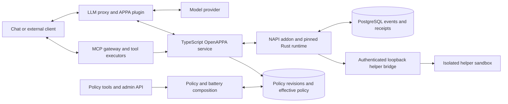
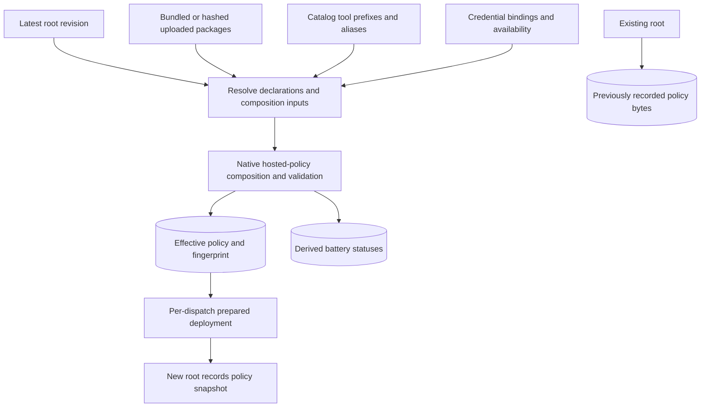
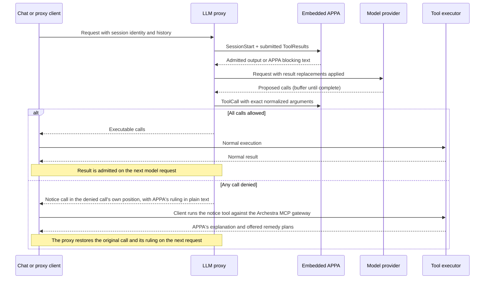

# OpenAPPA Engineering Handoff

**Baseline:** Archestra commit [`3aa876d1c3bfc227035c740b420f964f731bb47e`](https://github.com/archestra-ai/archestra/tree/3aa876d1c3bfc227035c740b420f964f731bb47e), inspected on 2026-10-05. OpenAPPA is pinned to [`c7c1e1ef36aa07604b421c48be266d7397557656`](https://github.com/archestra-ai/OpenAPPA/tree/c7c1e1ef36aa07604b421c48be266d7397557656), with locked crate version `0.31.1`.

This document explains the OpenAPPA integration in Archestra for engineers who build, maintain, or debug it. APPA is shorthand for OpenAPPA. **Guardrails v2** is its product name. For operator setup, read the [user guide](pages/platform-ai-tool-guardrails.md). This document covers architecture, runtime code, persistence, and operations.

## Reading Guide

1. Read [System Overview](#system-overview), [Policy Model](#policy-model), and [Startup Configuration](#startup-configuration) for core concepts.
2. Read [Tool Calls and Results](#tool-calls-and-results), [Remedies](#remedies), and [Identity and Clients](#identity-and-clients) for the request path.
3. Read [Batteries](#batteries), [GitHub Policy Sync](#github-policy-sync), and [APIs and UI](#apis-and-ui) for policy control.
4. Read [Persistence and Recovery](#persistence-and-recovery), [Diagnostics and Runbooks](#diagnostics-and-runbooks), and [Testing and Qualification](#testing-and-qualification) for operations.
5. Read [Known Limits](#known-limits) before you roll out or change policies.

## System Overview

OpenAPPA is a Rust policy engine embedded in the Fastify backend via NAPI. It runs in-process, not as a standalone service. Archestra handles authenticated caller identity, tool normalization, policy composition, and wire protocols. The upstream Rust engine evaluates policies, encodes events, replays history, and checks log consistency.

The LLM proxy evaluates proposed tool calls before release, subject to adapter limits in [Streaming Boundary](#streaming-boundary). The client executes allowed calls through an executor, such as the MCP gateway. On the next model turn, the proxy admits or replaces the tool results. An allowed call does not mean the tool succeeded. The MCP gateway still enforces its own RBAC and invocation policies.


```mermaid
flowchart LR
  Client[Chat or external client] <--> Proxy[LLM proxy and APPA plugin]
  Proxy <--> Provider[Model provider]
  Client <--> Gateway[MCP gateway and tool executors]
  Proxy <--> Host[TypeScript OpenAPPA service]
  Gateway --> Host
  Host <--> Native[NAPI addon and pinned Rust runtime]
  Native <--> Ledger[(PostgreSQL events and receipts)]
  Admin[Policy tools and admin API] --> Composer[Policy and battery composition]
  Composer <--> PolicyDB[(Policy revisions and effective policy)]
  Host --> PolicyDB
  Native --> Bridge[Authenticated loopback helper bridge]
  Bridge --> Sandbox[Isolated helper sandbox]
```

Control-plane data and runtime events both live in PostgreSQL. Archestra currently provisions one organization per deployment. The data model preserves organization scoping for future multi-tenant support. The enforcement switch is deployment-wide.

### Critical Invariants

- The beta flag and the deployment switch are separate gates. The beta flag stands down legacy trusted-data checks even when APPA enforcement is off.
- A root keeps the policy snapshot it opened with. Saving a new policy never rewrites an active session.
- A signature verifies host integrity only. It does not prove an offer is live or that a tool executed.
- Unreleased tool calls are withheld unless fork inheritance or a control rule admits them.
- A pending receipt blocks normal dispatch across the family. The peer-read path is an exception to this rule.
- Commits for receipts and event appends are separate transactions. They do not guarantee exactly-once external side effects.
- A stored composition refusal does not stop traffic. Dispatch can still serve retained effective-policy bytes.
- Unsupported clients bypass APPA by default. Provider-hosted tools execute before Archestra can inspect them.
- A configured battery is not always active. Coverage, enforcement, composition, and credentials are distinct states.

### Terms

| Term | Implementation Meaning |
| --- | --- |
| Session | Host conversation ID, scoped to an authenticated caller. |
| Actor | Native identity derived from a session. A family holds a root and child actors. |
| Trajectory / root | Event-sourced policy history. A family shares concurrency and failure fences. |
| Label | Current trust and allowed-reader restrictions built from admitted values. |
| Annotation | Call contract with label changes (`delta`), requirements, and effects. |
| Effect | History marker for ordering rules. It is not the tool return value. |
| Offer / remedy | Runtime-issued plan to resolve a blocked operation. |
| Battery | Pre-packaged policy with optional helper scripts and credential mappings. |
| Root policy | Organization-authored TOML, stored in database revisions or synced from GitHub. |
| Effective policy | Composed TOML passed to the runtime. It differs from an active session snapshot. |
| Receipt | Host processing record or signed client carrier. Neither is an arbitrary permission grant. |

## Code Map

| Responsibility | Entry Points |
| --- | --- |
| Proxy pipeline | [`llm-proxy-handler.ts`](../platform/backend/src/routes/proxy/llm-proxy-handler.ts), [`registry.ts`](../platform/backend/src/proxy/plugins/registry.ts) |
| APPA plugin and client adapters | [`appa-plugin-archestra/`](../platform/backend/src/proxy/plugins/appa-plugin-archestra/), especially `plugin.ts` and `session-identity.ts` |
| Native dispatch facade | [`openappa/service.ts`](../platform/backend/src/openappa/service.ts): `evaluateToolCalls`, `processProxyResults`, `executeRemedyByOffer`, child and peer operations |
| Request restoration and wire protocols | [`request.ts`](../platform/backend/src/openappa/request.ts), [`wire.ts`](../platform/backend/src/openappa/wire.ts), [`notice.ts`](../platform/backend/src/openappa/notice.ts) |
| Command policy normalization | [`command-normalization.ts`](../platform/backend/src/openappa/command-normalization.ts) and its real-native validation test |
| Signed artifacts and lineage | [`offer-claims.ts`](../platform/backend/src/openappa/offer-claims.ts), [`session-token.ts`](../platform/backend/src/openappa/session-token.ts), [`trajectory-stamp.ts`](../platform/backend/src/openappa/trajectory-stamp.ts), [`lineage.ts`](../platform/backend/src/openappa/lineage.ts) |
| Policy administration | [`guardrails-policy.ts`](../platform/backend/src/services/guardrails-policy.ts), [`guardrails-deployment.ts`](../platform/backend/src/services/guardrails-deployment.ts), [`openappa-policy-change.ts`](../platform/backend/src/services/openappa-policy-change.ts) |
| Composition and helpers | [`batteries.ts`](../platform/backend/src/openappa/batteries.ts), [`declarations.ts`](../platform/backend/src/openappa/declarations.ts), [`helper-bridge.ts`](../platform/backend/src/openappa/helper-bridge.ts) |
| MCP control tools | [`archestra-mcp-server/openappa.ts`](../platform/backend/src/archestra-mcp-server/openappa.ts), [`mcp-gateway/utils.ts`](../platform/backend/src/routes/mcp-gateway/utils.ts) |
| Native host | [`openappa-rs/src/lib.rs`](../platform/archestra-rs/openappa-rs/src/lib.rs), [`index.d.ts`](../platform/archestra-rs/openappa-rs/index.d.ts), [`Cargo.toml`](../platform/archestra-rs/openappa-rs/Cargo.toml), [`Cargo.lock`](../platform/archestra-rs/Cargo.lock) |
| Database declarations | [`schemas/openappa.ts`](../platform/backend/src/database/schemas/openappa.ts), [`schemas/openappa-batteries.ts`](../platform/backend/src/database/schemas/openappa-batteries.ts) |
| UI and permissions | [`frontend/src/app/openappa/`](../platform/frontend/src/app/openappa/), [`shared/access-control.ts`](../platform/shared/access-control.ts) |
| Qualification fixtures | [`native tests`](../platform/archestra-rs/openappa-rs/), [`OpenAPPA e2e tests`](../platform/e2e-tests/tests/openappa/), [`CLI qualification runbook`](../platform/e2e-tests/fixtures/appa-root-flow/README.md) |

The live native path pins deployment policy via `PreparedDeployment` in [`deployments.rs`](../platform/archestra-rs/openappa-rs/src/deployments.rs). Do not describe policy saves as calls to `Runtime::reload` - that function is for tests only. This addon has no separate `openappa-core` crate. `lib.rs` hosts both runtime logic and NAPI exports.

## Policy Model

These semantics come from the [pinned OpenAPPA engine](https://github.com/archestra-ai/OpenAPPA/tree/c7c1e1ef36aa07604b421c48be266d7397557656). Archestra does not re-implement the trust algebra in TypeScript.

### Labels and Checks

Admitted values restrict one concrete label. Trust folds with minimum rank (lower is less trusted). Audience folds with set intersection. Public audience is unrestricted. An empty audience means nobody. The built-in audience chain is `self` within `internal` within `public`. Audience specifies who can receive data - not network targets or RBAC roles.

Tool requirements check the label at sinks. A private read can block a later public send. Trust and audience are independent: authenticated input can be untrusted, and tool access permissions do not authorize sending data everywhere.

Directory checks can pass, fail, or need evidence. Missing evidence is not a denial. The runtime can query an audience source and re-evaluate with recorded facts. Dynamic annotations bind to call digests. Rewritten calls require new annotations. Replay uses saved facts rather than calling annotators again.

### Effects and Outcomes

| Primitive | Behavior |
| --- | --- |
| `delta` | Label change from an admitted value. Normal propagation restricts the trajectory. |
| `requires` | Label, history, or attention constraints that the call must satisfy. |
| `prior(k)` | Requires effect `k` to be committed. An open reservation does not satisfy it. |
| `no_prior(k)` | Fails if effect `k` is committed or reserved. |
| `emits` | Reserves an effect while a call runs. Commits it only on success. |
| Success | Can commit effects even when no value is admitted. |
| Failure / Indeterminate | Does not commit effects. Indeterminate means the host cannot confirm execution. |

The host maps unknown tool outcomes to indeterminate and withholds the output. Policy denials, output replacements, and operational refusals are distinct outcomes. A helper timeout is an operational refusal, not a policy finding.

### Matching and Authority

Root rules run before battery rules. The first match wins. Names match exact strings or the wildcard `*`. There are no partial namespace globs. Argument selectors support patterns (`shell(command:*publish*)`). Unmatched tools are refused.

The native adapter maps `<catalog>__<tool>` to `mcp/<catalog>/<tool>`. Other names map to `host/archestra/<name>`. Remedy calls map to `appa/execute_remedy_plan`. Use [`adapter.rs`](../platform/archestra-rs/openappa-rs/src/adapter.rs) when adding tools.

Only the runtime's offered plan can relax a restriction. An agent explanation, a peer note, or an unsigned approval string is never authorization. Upstream supports file-based IFC, but Archestra does not install file logs or run a file workspace.

## Startup Configuration

`ARCHESTRA_BETA=true` turns on the feature and registers the proxy plugin. There is no separate `ARCHESTRA_OPENAPPA_ENABLED` flag. The deployment switch row in PostgreSQL sets `enabled` and `unsupported_client_action`. Changing the database row takes effect immediately. Changing the beta flag requires a backend restart.

| Beta Flag | Deployment Switch | APPA Behavior | Legacy Proxy Guardrails |
| --- | --- | --- | --- |
| Off | Either | Feature unavailable, plugin not registered. | Trusted-data and invocation checks run normally. |
| On | Off | Plugin observes traffic but does not gate calls. | Trusted-data checks stand down. Invocation checks still run. |
| On | On | Eligible sessions use APPA. | Trusted-data checks stand down. Invocation checks run before APPA reserves calls. |

**The middle row is a protection gap.** Beta-on disables legacy trusted-data labeling, dual-LLM sanitization, and sensitive boundaries. Context appears trusted, so invocation rules that only check untrusted context will not fire on the proxy. Unconditional block or approval rules still run. The MCP gateway independently uses `!agent.considerContextUntrusted` for its invocation checks.

Each request captures its activation state. If enforcement turns off mid-request, that turn finishes under its policy. Later requests observe the switch and proceed unenforced. Sessions that start while enforcement is off stay bypassed while their observation record exists (30-day retention). Expired records allow new starts, but older unobserved results remain withheld. Always start a fresh conversation after enabling protection.

The deployment switch defaults to off. `unsupported_client_action` defaults to `bypass`, with `block` available. The switch checks policy validity before enabling. An invalid policy returns 409.

Revision `0` is an unsaved starter template. It includes the bundled Archestra battery, an Archestra alias, `internal = ["archestra:members"]`, `context_control = true`, and a local no-op wildcard annotator. The wildcard adds no restrictions to uncovered tools. The template source is `initialPolicy()` in [`guardrails-policy.ts`](../platform/backend/src/services/guardrails-policy.ts).

Saving revision `1` through MCP local publication can auto-enable enforcement if the user has `organization:update`. Direct HTTP PUT saves and GitHub imports do not auto-enable. The explicit deployment API checks `organizationSettings:update`. Later saves leave the switch unchanged.

New roots adopt the latest effective policy. Active roots replay their recorded policy snapshot. A policy save does not replace existing root snapshots. Stored composition errors keep previous effective bytes, as described under Batteries. Rotating credentials can cause dispatches to fail if the runtime cannot resolve them. Disabling beta restores legacy UI and guardrails without deleting policy data.

Sources: [`config.ts`](../platform/backend/src/config.ts), [`guardrails-deployment.ts`](../platform/backend/src/services/guardrails-deployment.ts), [`trusted-data.ts`](../platform/backend/src/guardrails/trusted-data.ts), [`tool-invocation.ts`](../platform/backend/src/guardrails/tool-invocation.ts), [`proxy integration tests`](../platform/backend/src/routes/proxy/llm-proxy-openappa.test.ts).

## GitHub Policy Sync

GitHub sync lets a Git repository own the root policy text. It works even while enforcement is off. Settings specify `owner/repository`, branch or tag, and a file path. Blank branches use the default branch. Public repositories need no credentials. Private repositories use a GitHub App or token with `credential:read`.

The sync worker checks repositories on schedule (every 15m, 1h, or 1d) or when triggered with **Sync now**. It downloads files up to 1 MiB, validates the TOML, and saves revisions atomically. Unchanged files create no revision. Failed pulls preserve the active policy.

When sync is active, the UI policy editor is read-only and direct HTTP PUT saves return 409. Calling `update_guardrails_policy` via MCP opens a pull request instead of saving directly. Opening a PR requires a GitHub App, `credential:read`, and a branch head matching the synced commit. Merged PRs take effect on the next sync pull.

Pulls are *held* if incoming text drops declared batteries or adds/rekeys `[credentials]`. Held text is saved in the database with reasons (`drops_batteries`, `changes_credentials`). To apply it, call `POST /api/openappa/github-sync/accept-held`. This requires `openappaPolicy:update`, plus `credential:update` if credentials changed.

An invalid download keeps the current revision. A failed composition on an accepted revision keeps serving the previous effective policy bytes.

Sources: [`openappa-github-sync.ts`](../platform/backend/src/services/openappa-github-sync.ts), [`openappa-policy-change.ts`](../platform/backend/src/services/openappa-policy-change.ts), [`GitHub routes`](../platform/backend/src/routes/openappa-github-sync/openappa-github-sync.routes.ts), [`GitHub sync model`](../platform/backend/src/models/openappa-github-sync.ts).

## Batteries

A battery is a policy package for a tool provider. Catalog batteries define rules for tools like `mcp/github/get_file_contents`. Organization batteries define annotators. You must add tool rules to route calls to them.

The addon provides bundled batteries and validates uploaded packages. It rewrites battery `command` externals to the sandbox helper bridge and rejects battery `url` externals. The Archestra adapter translates canonical tool names to platform names.

### Declarations

The organization policy text owns battery declarations:
- `include`: names bundled batteries (`batteries/<name>/appa.toml`) or uploaded packages (`batteries/<name>@sha256-<hash>/appa.toml`).
- `[server_aliases]`: maps battery namespaces to catalog tool prefixes.
- `[credentials]`: maps `APPA_PROVIDER_*` variables to runtime credential keys.

Resolution is exact: bundled names always resolve to bundled packages. Duplicate includes fail validation. Discovery can recommend newer uploads of the same name, but declared bundled includes stay bundled.

Install rows in `openappa_battery_installs` are a derived read model. Recomposition replaces rows while preserving IDs. Every declared battery is enabled. Removing its `include` line deletes the battery. Removing an alias keeps the include and leaves the battery in `server_missing`.

Mutating batteries through API routes rewrites policy text and increments the revision. Routes require `openappaPolicy:update`. Adding or rekeying credentials requires `credential:update`. Installing an MCP catalog does not activate its battery.

Attaching to a catalog without synced tools, or one with an ambiguous `__` prefix, returns 409. Detaches that do not change declarations also return 409. `DELETE /api/openappa/battery-includes/:name` removes the include and its aliases. If several batteries read one credential, unbinding must not break the other readers.

Unresolved includes produce errors if new, or warnings if unchanged. Catalog batteries with missing servers, credentials, or naming conflicts compose as empty stubs. Organization-wide annotator batteries compose even when `unrouted` or `missing_credentials`. Calls to a helper with missing credentials return no answer and fail closed.

`GET /api/openappa/policy-declarations` returns declaration details, statuses, helpers, and held pulls for UI panels and MCP inspection tools.

### Statuses

Derived rows report one status by priority order:
- `unavailable`: unresolved package or duplicate include.
- `missing_credentials`: unbound variable, non-organization credential definition, or missing organization connection.
- `naming_conflict`: catalog prefix contains `__`, or multiple catalogs share a prefix.
- `server_missing`: namespace has no alias target, or target matches no catalog.
- `unrouted`: organization battery has no rules routing to its annotators.
- `active`: battery is ready and enforcing rules.

A composition error marks rows as `refused`. Stored effective content becomes `accepted ?? previousContent ?? root.content`. `getEffectivePolicy` returns this row without throwing. The dispatch facade serves `.content` even when `lastError` is set. If the native runtime cannot open those bytes, dispatch fails at execution time. Unchanged errors are cached to avoid repeated work.

A battery can cover multiple catalogs. Each catalog row shares the battery status. The oldest install row owns the helper URL.

### Composition

The runtime evaluates the composed *effective policy*, not the raw root text. The composer combines the root revision, declarations, and catalog tool names into alias mappings. Composed text is stored per organization with a fingerprint of its inputs.

Recomposition triggers on policy saves, GitHub imports, battery changes, package uploads, credential updates, catalog renames, tool syncs, and an hourly cron job. Before dispatch, the backend compares the stored root revision with the database and recomposes on mismatch. Concurrent runs coalesce. High contention returns 503 after three jittered retries.


```mermaid
flowchart TD
  Root[Latest root revision] --> Plan[Resolve declarations and composition inputs]
  Packages[Bundled or hashed uploaded packages] --> Plan
  Catalog[Catalog tool prefixes and aliases] --> Plan
  Credentials[Credential bindings and availability] --> Plan
  Plan --> Native[Native hosted-policy composition and validation]
  Native --> Effective[(Effective policy and fingerprint)]
  Native --> Status[(Derived battery statuses)]
  Effective --> Dispatch[Per-dispatch prepared deployment]
  Dispatch --> NewRoot[New root records policy snapshot]
  OldRoot[Existing root] --> Snapshot[(Previously recorded policy bytes)]
```

Dispatch freshness checks root revisions and the revision-0 starter hash. Declarations and coverage reads also check the fingerprint. A catalog match marked `available` is a recommendation, not an active install.

### Helpers

Helper scripts run inside an isolated sandbox container, never on the backend host. The composer rewrites `command` externals to loopback URLs: `POST /api/openappa/helpers/<installId>/<externalName>`. Calls require the secret bearer token `APPA_ARCHESTRA_BRIDGE_TOKEN`. Roots and batteries cannot use `APPA_ARCHESTRA_*` in `token_env`.

The bridge rejects non-loopback calls and invalid tokens. It mounts battery files read-only under `/skills/<battery>`, sends the request on stdin, injects credentials as sandbox secrets, and reads JSON from stdout. Execution timeout is 4 seconds, and wall deadline is 4.5 seconds.

Helper concurrency is capped at `max(1, floor(sandbox maxConcurrent / 2))`. Error codes: 404 for missing helpers, 502 for execution errors, 503 for capacity limits, 504 for timeouts. The runtime treats non-200 responses as no answer, not a policy denial. Because consults hold PostgreSQL connections, slow helpers can exhaust connection pools.

The bundled Archestra audience battery runs in-process without sandbox overhead. Its `members`, `team/<team>`, and `user/<user>` selectors resolve directly against the database.

### Packages and Persistence

Uploaded packages are immutable and content-addressed by `(organization_id, content_hash)`. Packages support up to 64 files. Manifest names must match package names. Uploading packages with credentials or externals requires `credential:update`. Deleting packages in active use returns 409.

Startup calls `declareExistingInstalls()` in [`declare-installs.ts`](../platform/backend/src/openappa/declare-installs.ts) to backfill declarations for legacy rows. Run it manually with `pnpm --dir backend db:openappa-declare-installs` if startup migration fails.

Sources: [`batteries.ts`](../platform/backend/src/openappa/batteries.ts), [`declarations.ts`](../platform/backend/src/openappa/declarations.ts), [`native policy.rs`](../platform/archestra-rs/openappa-rs/src/policy.rs), [`helper-bridge.ts`](../platform/backend/src/openappa/helper-bridge.ts).

## Tool Calls and Results


```mermaid
sequenceDiagram
  participant C as Chat or proxy client
  participant P as LLM proxy
  participant A as Embedded APPA
  participant L as Model provider
  participant T as Tool executor
  C->>P: Request with session identity and history
  P->>A: SessionStart + submitted ToolResults
  A-->>P: Admitted output or APPA blocking text
  P->>L: Request with result replacements applied
  L-->>P: Proposed calls (buffer until complete)
  P->>A: ToolCall with exact normalized arguments
  alt All calls allowed
    P-->>C: Executable calls
    C->>T: Normal execution
    T-->>C: Normal result
    Note over C,P: Result is admitted on the next model request
  else Any call denied
    P-->>C: Notice call in the denied call's own position, with APPA's ruling in plain text
    C->>T: Client runs the notice tool against the Archestra MCP gateway
    T-->>C: APPA's explanation and offered remedy plans
    Note over C,P: The proxy restores the original call and its ruling on the next request
  end
```

The proxy replaces denied calls with `archestra__get_remedy_plans`. The notice retains the original call index and provider ID. It passes the target tool name, arguments, and plain-text ruling. The client runs the notice tool, and the model reads offered remedy plans in the same turn.

### Pipeline Order

1. Check activation, authenticate the caller, and resolve bypass routes (setup, unsupported clients, delegated tasks).
2. Resolve session identity, check lineage, and confirm chat ownership.
3. Collect signed offers, restore prior notices, and reject unsupported tool types.
4. Submit previous tool results via `processProxyResults` and apply admitted outputs.
5. Clean the provider-bound request payload. This cleanup runs even when APPA is bypassed.
6. Trigger prompt hooks. `Prompt` fires for new user turns, not result continuations.
7. Call the model provider and accumulate tool call chunks.
8. Apply dispatch rewrites and run legacy invocation checks on the prepared batch.
9. Run APPA's finalizer. It reserves allowed calls, replaces denied calls with notices, or refuses the batch.
10. Send calls to the client for execution.
11. Send `TurnEnd` for final parent answers. Active calls or remedies keep the turn open.

`evaluateToolCalls` rejects duplicate IDs and invalid JSON. It logs operation IDs as `call:<id>`. If a call fails mid-batch, the host attempts to cancel admitted sibling calls.

Calls targeting `run_tool` evaluate against the inner tool and arguments. The client sees the wrapper released, but policy checks inspect the real target. On subsequent requests, the proxy restores notice calls back to original tool calls and injects the ruling as their result. Restoration is a stateless function that needs no database lookup.

### Streaming Boundary

Tool calls are held until stream completion so the proxy can evaluate the full batch. Stream adapters hold calls by omitting `sseData`. Text streams immediately for parents. Child runs and client compaction buffer the entire response up to 10 MiB (413 on overflow).

On unbuffered streams, adapters that emit chunks containing both text and tool calls (like Gemini, MiniMax, or OpenAI delta content) can release calls before policy validation runs. Responses terminal frames can do the same. Audit your stream adapter before relying on pre-execution guarantees. See [`llm-proxy-handler.ts` lines 2823-2837](../platform/backend/src/routes/proxy/llm-proxy-handler.ts#L2823-L2837).

Provider-hosted tools (like server-side web search) run inside the model provider before Archestra sees them. The proxy can withhold or alter their output, but cannot prevent their execution.

### What Reaches the Provider

The proxy cleans requests before sending them to providers:
- Restores notice calls, control calls, and `ask_user` questions on supported wire families.
- Strips proxy metadata: notice records, signed JWS offers, execution frames, and `ask_user` offers.
- Removes proxy-only parameters from remedy tool schemas.
- Restores trajectory stamps in text to real provider IDs.

Restoration ensures previous turns remain byte-stable for models that enforce strict cache keys. However, the plugin appends guidance to `system` between turns for active remedies or questions. This can invalidate prefix caches on providers that reject modified system prompts.

Native questions use signed `aq1` IDs (`<prefix>_aq1_<nonce>_<tag>`). These IDs are preserved in conversation history so earlier turns do not change bytes.

Sources: [`registry.ts`](../platform/backend/src/proxy/plugins/registry.ts), [`plugin.ts`](../platform/backend/src/proxy/plugins/appa-plugin-archestra/plugin.ts), [`service.ts`](../platform/backend/src/openappa/service.ts), [`request.ts`](../platform/backend/src/openappa/request.ts), [`wire.ts`](../platform/backend/src/openappa/wire.ts).

## Remedies

Two MCP tools handle blocked calls:
1. `archestra__get_remedy_plans`: returns the ruling and available plans from notice arguments. It runs no code.
2. `archestra__execute_remedy_plan`: runs the selected remedy plan through the OpenAPPA runtime.

Names use the default `archestra__` prefix, but can change with branding or client labels.

The gateway advertises only model-written arguments. It strips internal fields (`offers`, `execution`, `protected`, `payload`, `signature`) from the public tool schema. The proxy injects them during dispatch.

If a client rejects a remedy call (like a user rejecting a permission prompt), the proxy returns the error to the model with an explanation that the plan was not applied.

Remedy tokens use flattened JWS with HS256 and unencoded payloads (RFC 7515/7797). They provide integrity, not encryption. Tokens do not expire because the runtime ledger validates whether an offer is still spendable. Tokens cannot be reused across conversations.

### Review Lifecycle

1. The model selects a remedy plan. The proxy attaches execution frames and signed claims.
2. The gateway verifies claims and confirms arguments match the original blocked call.
3. If the tool call would fail regardless of approval, the host returns a precheck refusal without spending the offer.
4. If human review is required, the gateway stages review and returns `review_required`, or chat triggers elicitation.
5. The user approves or denies the review. Execution consumes the answer and the runtime spends the offer.
6. Denied, expired, or missing reviews leave the action blocked.

Review state lives in PostgreSQL Keyv cache with a 10-minute TTL. `consumeHitlRuling` uses `DELETE ... RETURNING` for atomic consumption. Denials take priority over approvals.

The gateway correlates calls using `_meta["com.archestra/logicalToolCallId"]` or the frame's `call_id`, not the JSON-RPC ID. Reusing an ID with different arguments returns 400.

Sources: [`openappa.ts`](../platform/backend/src/archestra-mcp-server/openappa.ts), [`offer-claims.ts`](../platform/backend/src/openappa/offer-claims.ts), [`hitl-review.ts`](../platform/backend/src/openappa/hitl-review.ts), [`cache-manager.ts`](../platform/backend/src/cache-manager.ts).

## Identity and Clients

Adapters match in strict order: Claude Code, Codex, OpenCode, then Chat. An explicit `X-Appa-Session-ID` overrides native extraction. `X-Appa-Parent-ID` overrides native parent claims.

| Client | Match Rule | Session Source | Notes |
| --- | --- | --- | --- |
| Claude Code | User agent or session header | `x-claude-code-session-id`, else `metadata.user_id` | Uses native `AskUserQuestion`, spawn, and teammate paths. |
| Codex | User agent or turn metadata | `thread_id` from metadata | Contradictory claims return 400. Code mode (`exec`) is refused. |
| OpenCode | User agent or session header | `x-opencode-session` | Gateway tools use `<label>_<name>` without distinct delimiter. |
| Archestra Chat | Internal loopback source | Conversation ID | Validates user ownership. Active encrypted chats return 409. |
| Other | Explicit APPA headers or wire fallback | Header value or wire metadata | Unsupported clients trigger `unsupported_client_action` (default bypass). |

External sessions are scoped as `<caller-id>|<session-id>`. Caller IDs identify `user:`, `app:`, or `virtual-key:` credentials. Platform loopback requests can use unscoped sessions.

When callers provide no session ID, the fallback is `<caller-id>@<agent-id>`. This combines all conversations for that credential into one root trajectory. A turn end in one chat will expire unspent vouches across that shared root. Use explicit session IDs to avoid this.

Native actors derive from session IDs. New top-level roots hash both organization ID and session ID. Existing sessions keep their saved root. Modifying a recorded parent or fork source returns an error.

### Wire Support

| Wire Family | Supported Features |
| --- | --- |
| Anthropic Messages, Bedrock InvokeModel | Full notice restoration, result admission, turn accounting, and cleanup. |
| OpenAI Responses (supported providers) | Restoration, turn accounting, hosted tool gating, and compaction. |
| OpenAI Chat Completions (compatible) | Common wire restoration and turn accounting. Streaming requires qualification. |
| Gemini, Bedrock Converse, Cohere, native Ollama | Evaluates calls and results, but notices stay in history. No turn accounting. |
| Azure Responses | Refused during request preparation if tools are declared. |

Deferred tools (`tool_search`), `local_shell`, computer-use tools, and conflicting APPA declarations fail validation immediately.

Connection-setup calls and delegated A2A runs bypass APPA. A2A tasks do not get checked child trajectories.

Sources: [`session-identity.ts`](../platform/backend/src/proxy/plugins/appa-plugin-archestra/session-identity.ts), [`adapters/`](../platform/backend/src/proxy/plugins/appa-plugin-archestra/adapters/), [`request.ts`](../platform/backend/src/openappa/request.ts), [`unenforced.ts`](../platform/backend/src/openappa/unenforced.ts).

## Child and Peer Flows

### Child Versus Root Fork

| Operation | Relationship | Return Boundary |
| --- | --- | --- |
| `parent_id` child | Same root family, checked spawn, shared history. Child starts with parent label. | Output crosses via `ChildEnd` and checked return contracts. |
| `fork_of` root fork | New family with frozen copy of label, effects, reservations, and policy. | No return contract. History does not flow between roots. |
| Child readdress/resume | Parent flows updated label into an existing child. | Unacknowledged staged returns are dropped. |

Allowed spawns receive signed delegation markers binding caller, organization, and prompt. Missing markers cancel the batch with 400.

Child model responses buffer completely before crossing. `endChild` can admit, block, or require a return echo. Parents verify returns against `loadChildReturns` records, not the marker string.

Root forks inherit results only from before the fork timestamp. The engine walks at most 32 ancestor forks. Deeper chains inherit nothing. Pending receipts block dispatch across the family, except peer reads.

### Peer Messages

Sending and reading peer messages are separate operations. Sending saves a message. It does not grant read rights. Reading evaluates stored trust and audience rules before delivering content. Client-supplied read outputs are rejected without a native receipt.

The embedded sender must target actors in the same family. Empty bodies and bodies over 64 KiB are rejected. Peer reads skip the pending-receipt fence in [`peer.rs`](../platform/archestra-rs/openappa-rs/src/peer.rs#L95-L115). Unenforced teammates cannot read governed messages.

Sources: [`delegation.ts`](../platform/backend/src/openappa/delegation.ts), [`child-return.ts`](../platform/backend/src/openappa/child-return.ts), [`peer-claims.ts`](../platform/backend/src/openappa/peer-claims.ts), [`plugin.ts`](../platform/backend/src/proxy/plugins/appa-plugin-archestra/plugin.ts), [`peer.rs`](../platform/archestra-rs/openappa-rs/src/peer.rs).

## Persistence and Recovery

### Ownership and Tables

Drizzle manages schemas and migrations. The native store encodes events and manages operation receipts. TypeScript reads projections through models. It never alters raw event payloads.

| Table | Purpose |
| --- | --- |
| `openappa_events` | Native event log, keyed by `(root, seq)` with binary payloads. |
| `openappa_policy_files` | Content-addressed policy snapshots for trajectory replay. |
| `openappa_host_keys` | Runtime key-to-root index (not a secret store). |
| `openappa_sessions` | Actor, root, caller, session, parent, fork metadata, and start decision. |
| `openappa_operations` | Host operation receipts (`pending` or `complete`) and decisions. |
| `openappa_processed_results` | Processed tool results and decisions by session and tool call ID. |
| `openappa_held_peer_messages` | Native held peer messages. |
| `openappa_embedded_peer_messages` | Native actor-scoped peer delivery states. |
| `guardrails_policy_revisions` | Root policy revisions per organization. |
| `guardrails_deployment` | Deployment switch and unsupported-client configuration. |
| `openappa_battery_packages` | Content-addressed uploaded package files. |
| `openappa_battery_installs` | Derived battery install rows. |
| `openappa_effective_policies` | Composed policy text and input fingerprints per organization. |
| `openappa_github_sync` | GitHub sync settings, commits, and held pull data. |
| `openappa_unenforced_sessions`, `calls` | Observations of calls run while enforcement was disabled. |
| `openappa_external_consults` | Diagnostic records of external helper queries. |
| `openappa_yells` | Stored diagnostic yell reports and archive metadata. |
| `keyv_cache` | Shared review cache for human approval decisions (TTL 10m). |

### Commit and Replay

Execution follows three steps under a family advisory lock: insert pending receipt, run native hook and append events, and mark receipt complete. A crash after event commit leaves a pending receipt, which fails future operations closed.

Completed receipts return saved decisions without re-evaluating the engine. Changed arguments on reused IDs are refused. The event log enforces sequence ordering using advisory locks. Snapshots insert with content hashes.

There is no automated cleanup API for pending receipts. Do not delete pending rows or truncate tables. Investigate the cause and check external effects first.

### Locks and Connections

The host acquires an in-process root lock before leasing a database connection. A PostgreSQL advisory lock (`pg_advisory_lock`) serializes the family across instances. Roots can run concurrently. Siblings in a root run sequentially.

The connection pool defaults to 4 connections (max 64). Calls wait up to 30s for a connection. Connections use 30s lock timeouts and 60s statement timeouts. Pool exhaustion usually comes from slow external consults. Dead connections are replaced automatically. Changing pool size requires a backend restart.

### Native Contract

`dispatchHook` processes events: `session_start`, `tool_call`, `tool_result`, `cancel_call`, `remedy`, `prompt`, `turn_end`, `child_end`, `child_address`, and `yell`.

| Native Decision | Host Action |
| --- | --- |
| `allow_call` / `pass_control` | Release the call to the client or control handler. |
| `deny_call` / `block` | Replace call with a notice or withhold output. |
| `replace_output` | Deliver replacement text chosen by policy. |
| `ack` (known outcome) | Return tool output. Unknown outcome is withheld. |
| `deliver_value` / `child_return` | Deliver admitted child value. |
| `context` | Provide return contract at lifecycle step. |
| `refuse` | Operational error surfaced as an API exception. |

Native panics fail closed. A panic after a pending receipt commits leaves the family locked.

Sources: [`lib.rs`](../platform/archestra-rs/openappa-rs/src/lib.rs), [`index.d.ts`](../platform/archestra-rs/openappa-rs/index.d.ts), [`deployments.rs`](../platform/archestra-rs/openappa-rs/src/deployments.rs), [`consults.rs`](../platform/archestra-rs/openappa-rs/src/consults.rs).

## APIs and UI

Permissions use `openappaPolicy`, `openappaDiagnostics`, and `organizationSettings`. Older `toolPolicy` permissions are deprecated.

| Endpoint | Role | Permission |
| --- | --- | --- |
| `GET /api/guardrails-policy` | Read current policy revision and content. | `openappaPolicy:read` |
| `PUT /api/guardrails-policy` | Save full policy text with expected revision. | `openappaPolicy:update` (+ `credential:update` if grants change) |
| `POST /api/guardrails-policy/validate` | Validate policy text without saving. | `openappaPolicy:update` |
| `GET /api/guardrails-deployment` | Read deployment enforcement status. | `organizationSettings:read` |
| `PUT /api/guardrails-deployment` | Toggle enforcement or set unsupported client action. | `organizationSettings:update` |
| `/api/openappa/batteries/*` | Inspect and manage batteries, packages, and aliases. | `openappaPolicy:read` / `update` |
| `/api/openappa/github-sync/*` | Configure sync, inspect commits, accept held pulls. | `organizationSettings:read` / `update` (accept: `policy:update`) |
| `GET /api/openappa/coverage/*` | View static tool coverage summary. | `openappaPolicy:read` |
| `GET /api/openappa/external-consults` | View helper consult logs. | `openappaDiagnostics:read` (`admin` views all users) |
| `/api/openappa/yells/*` | View diagnostic reports and download archives. | `openappaDiagnostics:read` / `update` |
| `GET /api/chat/conversations/:id/openappa-status` | Read chat conversation governance status. | `chat:read` |
| `POST /api/openappa/helpers/:installId/:name` | Loopback helper bridge transport. | Loopback socket + bearer token |

### Policy Publication

1. Read root text, revision, effective composition, and delivery mode.
2. Preview proposed TOML using `preview_guardrails_policy_change`.
3. Review diffs, warnings, and credential grants.
4. Publish with `expectedRevision`. Reconcile on conflict (409).
5. For local saves, check effective status and enforcement. For GitHub PRs, wait for merge and sync.
6. Test changes in a new session. Existing sessions retain their original policy.

MCP tools expose policy operations: `get_guardrails_policy`, `validate_guardrails_policy`, `preview_guardrails_policy_change`, `update_guardrails_policy`, `get_guardrails_policy_change_status`, `create_guardrails_repository`, `inspect_guardrails_server`, and `list_guardrails_battery_fits`. Preview needs `openappaPolicy:read`, and validation needs `update`.

### Frontend Map

| Page | Content |
| --- | --- |
| `/openappa` | Overview cards, deployment switch, coverage table. |
| `/openappa/policy` | Read-only policy viewer (Monaco), warnings, effective view. |
| `/openappa/batteries` | Installed batteries, attach/detach controls, uploads. |
| `/settings/openappa` | GitHub repository sync configuration panel. |
| `/openappa/yells` | Diagnostic yell list and archive downloads. |
| `/consults/logs` | External helper consult log viewer. |
| Chat UI | OpenAPPA status badge and human-review dialogs. |

The backend `/api/config` endpoint exposes `openappaEnabled` via `useFeature`. When beta is off, OpenAPPA routes return 404.

Coverage tables show static rule matching, not live runtime evaluations. Root rules take precedence over battery rules. No-op catch-all rules are marked as uncovered.

Sources: [`guardrails routes`](../platform/backend/src/routes/guardrails-policy/), [`battery routes`](../platform/backend/src/routes/openappa-batteries/openappa-batteries.routes.ts), [`coverage routes`](../platform/backend/src/routes/openappa-coverage/openappa-coverage.routes.ts), [`MCP RBAC`](../platform/backend/src/archestra-mcp-server/rbac.ts).

## Build and Deployment

The addon is built with the platform image using Cargo dependencies pinned in `openappa-rs/Cargo.toml`. There is no separate release workflow.

### Configuration Reference

| Setting | Default | Notes |
| --- | --- | --- |
| `ARCHESTRA_BETA` | `false` | Enables OpenAPPA when set to `"true"`. Requires restart. |
| `ARCHESTRA_LLM_PROXY_PLUGINS` | Empty | Automatically appends `appa` when beta is enabled. |
| `guardrails_deployment.enabled` | `false` | Database row switch. Effective immediately without restart. |
| `guardrails_deployment.unsupported_client_action` | `bypass` | Action for unknown clients (`bypass` or `block`). |
| `ARCHESTRA_OPENAPPA_OFFER_SIGNING_SECRET` | Auto-derived | Secret for signing offers and tokens. Min 32 chars if explicit. |
| `ARCHESTRA_OPENAPPA_POSTGRES_MAX_CONNECTIONS` | `4` | Max native pool connections (cap 64). Requires restart. |
| `ARCHESTRA_OPENAPPA_YELL_ENABLED` | `true` | Enables yell diagnostic reporting when beta is on. |
| `ARCHESTRA_ANALYTICS` | `enabled` | Controls forwarding of yell archives to cloud receiver. |
| `ARCHESTRA_DATABASE_URL` | None | Database connection string. Strips `schema` parameter on init. |
| `ARCHESTRA_CODE_RUNTIME_ENABLED` | `false` | Required for sandbox helper script execution. |

Helm manages `offer-signing-secret` inside the auth Secret. Never delete the auth Secret to rotate tokens. Rotate secrets intentionally across all pods, then restart them. Existing signed tokens will invalidate.

Native PostgreSQL TLS uses system certificates and URL parameters. The addon does not support custom CA flags.

Sources: [`config.ts`](../platform/backend/src/config.ts), [`.env.example`](../platform/.env.example), [`Dockerfile`](../platform/Dockerfile), [`Helm templates`](../platform/helm/archestra/templates/).

## Diagnostics and Runbooks

### Evidence Sources

Correlate policy revisions, session IDs, operation IDs, provider call IDs, and trace IDs when investigating issues. Coverage entries do not prove tool execution, and client UI receipts do not prove ledger commit.

External consults record authority, sanitizer, annotator, and audience queries (up to 256 per call). Recording is best effort. Missing logs do not prove an external call did not occur. Audience details require `member:read`. Ordinary users see only their own consults. The `openappaDiagnostics:admin` permission grants an organization-wide view.

Yell reports store diagnostic archives. When analytics is on, the receiver forwards archives upstream. Do not put personal or secret data in yell messages. Resolving a yell is a manual operator action.

There are no dedicated OpenAPPA Prometheus metrics. The generic `llm_blocked_tools_total` counter does not distinguish APPA decisions from legacy invocation policies. Use database receipts and traces instead.

### Failure Handling

| Symptom | Root Cause | Safe Action |
| --- | --- | --- |
| `/openappa` returns 404 | Beta flag is off. | Verify `ARCHESTRA_BETA=true` in environment. |
| Policy saved but calls unblocked | Switch is off, or session started unenforced. | Check deployment switch, and test in a new session. |
| 409 revision conflict | Another user or sync saved a revision. | Reload latest revision and re-apply changes. |
| Effective policy `refused` | Composed TOML rejected by engine. | Fix the invalid policy. Notice: old policy may still serve. |
| 500 error from proxy | Configuration or native compilation error. | Check trace ID and fix policy syntax. Do not retry blindly. |
| 503 with `Retry-After: 5` | Connection pool exhausted or runtime saturated. | Inspect helper latency, and raise connection pool if needed. |
| Interrupted processing error | Crash occurred while receipt was pending. | Check external tool effects, and preserve database records. |
| Unknown or spent offer | Offer was already used, expired, or invalid. | Treat as terminal denial. Do not reuse IDs. |
| Child return 409 | Returned value changed or child ran unenforced. | Rewind conversation or start a new session. |
| Signing verification failure | Inconsistent signing keys across backend replicas. | Synchronize `offer-signing-secret` across instances. |
| Helper error (502/503/504) | Helper script failed, timed out, or hit capacity. | Check container logs, credential bindings, and limits. |
| Held GitHub pull | Sync text changes credentials or drops batteries. | Review diff and accept via `POST .../accept-held`. |

### Recovery Boundaries

Event logs, policy snapshots, session lineage, and operation receipts must stay consistent. Restoring only policy revisions does not restore session history.

1. Back up database rows for the affected root family before modifying data.
2. Check pending receipts to verify if external tools actually executed.
3. Treat the entire family as affected, including parent and children. Never delete individual pending rows.
4. If a session is broken, start a fresh conversation.
5. Do not use `pnpm --dir backend db:reset-openappa` to fix stuck sessions. It wipes organization policy and configuration data.

Sources: [`failure.ts`](../platform/backend/src/openappa/failure.ts), [`consult routes`](../platform/backend/src/routes/openappa-external-consults/openappa-external-consults.routes.ts), [`yell routes`](../platform/backend/src/routes/openappa-yells/openappa-yells.routes.ts).

## Testing and Qualification

Mocked Vitest tests verify proxy plumbing and route validation, but do not test the native engine or PostgreSQL ledger.

| Layer | What It Tests | Limitations |
| --- | --- | --- |
| Backend Vitest (PGlite) | Proxy routing, rewrites, models, and HTTP routes. | Uses mocked native addon, not real Rust engine. |
| Native module load test | Compiles NAPI bindings and tests uninitialized state. | Does not connect to a database. |
| Native `.cjs` test suite | Real hooks, policy rules, concurrency, and persistence. | Requires real PostgreSQL database with pgvector. |
| Cargo workspace tests | Engine unit tests and connection permit logic. | Runs Rust unit tests only, with no TypeScript integration. |
| Playwright `openappa` | End-to-end proxy flow, remedies, and gateway execution. | Uses WireMock fixtures for provider calls. |
| Manual CLI validation | Live interactive sessions with Claude Code, Codex, etc. | Must be re-tested across external CLI versions. |

### Local Commands

Run commands from `platform/`:

```bash
pnpm --filter @archestra/openappa-rs build:dev
pnpm --filter @archestra/openappa-rs smoke:load

pnpm --dir backend exec vitest run src/openappa/command-normalization.unit.test.ts
pnpm --dir backend exec vitest run src/openappa src/proxy/plugins/appa-plugin-archestra src/routes/proxy/llm-proxy-openappa.test.ts

cargo fmt --manifest-path archestra-rs/Cargo.toml --all --check
cargo check --manifest-path archestra-rs/Cargo.toml --workspace --locked
cargo test --manifest-path archestra-rs/Cargo.toml --workspace --locked
```

To run the real native database suite, provide an isolated PostgreSQL test database with pgvector:

```bash
test -n "${ARCHESTRA_OPENAPPA_TEST_DATABASE_URL:-}" && \
  ARCHESTRA_DATABASE_URL="$ARCHESTRA_OPENAPPA_TEST_DATABASE_URL" pnpm --dir backend db:migrate

test -n "${ARCHESTRA_OPENAPPA_TEST_DATABASE_URL:-}" && \
  pnpm --filter @archestra/openappa-rs test
```

To run the Playwright suite on a local test container:

```bash
ARCHESTRA_BETA=true pnpm test:e2e:lite:up
pnpm test:e2e:lite -- --project=openappa
pnpm test:e2e:lite:down
```

### CI and Evidence

Backend unit tests and Rust checks run on merge groups. The real native database suite (`openappa-native-tests`) runs on merge groups and updater-bot branches (`chore/openappa-v*`).

The Playwright `openappa` project runs on a dedicated single-worker lite stack with beta enabled.

Sources: [`on-pull-requests.yml`](../.github/workflows/on-pull-requests.yml), [`platform-e2e-tests.yml`](../.github/workflows/platform-e2e-tests.yml), [`playwright.config.ts`](../platform/e2e-tests/playwright.config.ts).

## Change Guide

| Change Type | Code Touched | Verification |
| --- | --- | --- |
| Update OpenAPPA pin | Cargo dependencies, `Cargo.lock`, NAPI bindings. | Run native database suite, test snapshot replay. |
| Add client or wire family | Client adapter, wire parser, notice restoration. | Verify argument streaming, terminal frames, compaction. |
| Add tool contract | Root rules, battery files, annotators. | Verify allowed/denied behavior, missing credentials. |
| Change policy publishing | Policy service, conflict checks, GitHub sync. | Test concurrent saves, held pulls, first-save auto-enable. |
| Add or change helper | Helper bridge, sandbox runner, timeouts. | Verify loopback checks, timeouts, container limits. |
| Modify persistence | Drizzle schemas and native event store. | Test snapshot replay, advisory locks, fork inheritance. |
| Change remedies or HITL | Signed claims, gateway tools, review cache. | Test claim validation, expired reviews, concurrent approval. |
| Change child/peer transport | Delegation markers, return verification, peer messages. | Test unrecorded returns, peer read exceptions. |

### Upgrade Checklist

1. Record current Archestra and OpenAPPA git commit hashes.
2. Review upstream schema, event, and policy changes.
3. Build the NAPI addon and run load tests in target containers.
4. Run the native database test suite (`pnpm --filter @archestra/openappa-rs test`).
5. Verify replay of historical sessions under existing policy snapshots.
6. Verify multi-process concurrency against a shared database.
7. Test target client versions (Claude Code, Codex, OpenCode).
8. Inspect battery statuses and credential grants after upgrading.
9. Have a rollback plan. Toggling the database switch off does not re-enable legacy trusted-data checks while beta is on.

## Known Limits

| Area | Known Behavior | Impact |
| --- | --- | --- |
| Activation | Beta flag disables legacy trusted-data checks immediately. | Rollouts must coordinate beta flags and DB switch. |
| Unsupported clients | Default action is bypass. Unenforced sessions stay bypassed (30d retention). | Configure `unsupported_client_action = block` if required. |
| Composition refusal | `lastError` does not block dispatch. Old effective policy serves. | Alert on composition errors, and do not assume calls are blocked. |
| Streaming | Unbuffered streams can emit mixed text/tool frames before evaluation. | Audit model stream adapter frames before rollout. |
| Hosted tools | Provider tools run on the model server before proxy inspection. | Proxy can withhold outputs but cannot prevent execution. |
| Protocol parity | Notice restoration works on mapped wire families only. | Unsupported wires evaluate calls but leave notices in history. |
| Fallback identity | Unidentified sessions share a single root per credential and agent. | Use explicit session IDs to isolate conversation state. |
| Delegation | Native checked spawns and A2A platform runs use different mechanisms. | Do not assume A2A runs share child trajectory guarantees. |
| Crash recovery | Pending receipts lock normal dispatch. Peer reads skip the lock. | Never delete pending receipt rows manually. |
| External side effects | Receipts and events do not commit in one transaction with external tools. | Exactly-once tool execution is not guaranteed. |
| File IFC | Upstream file logs are not installed in Archestra. | Filesystem information flow is not tracked. |
| Permissions | First-save auto-enable checks `organization:update`. Deployment API checks `organizationSettings:update`. | Test custom roles on policy publication. |
| Capacity | Helper calls hold pooled database connections. | Connection pool size must account for slow helpers. |
| Diagnostics | Consult logs are recorded best-effort. No APPA Prometheus series exist. | Use database consults and traces, not blocked-tool metrics. |
| Provider history | Guidance injected into `system` prompts alters conversation bytes. | Verify provider support for modified system prompts. |

### Documentation Drift

At the baseline commit, these repository documents contained outdated statements:
- [`openappa-rs/README.md`](../platform/archestra-rs/openappa-rs/README.md): outdated git pin, incorrect flag names, and obsolete single-connection claims.
- [`platform-deployment.md`](pages/platform-deployment.md): says beta does not enable OpenAPPA, contradicting actual configuration code.
- Phase 1 plans and backlogs: historical documents with outdated line numbers and design targets.
- Declare-installs comments: describes Helm chaining that is not present in migration manifests.

Trust the code and executable test suites over older documentation.
