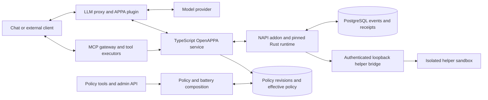
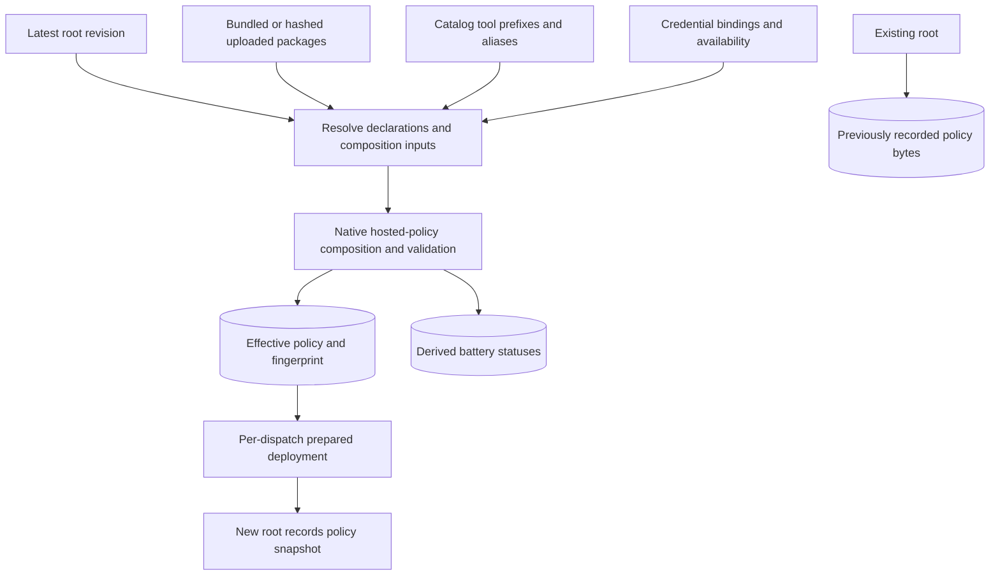
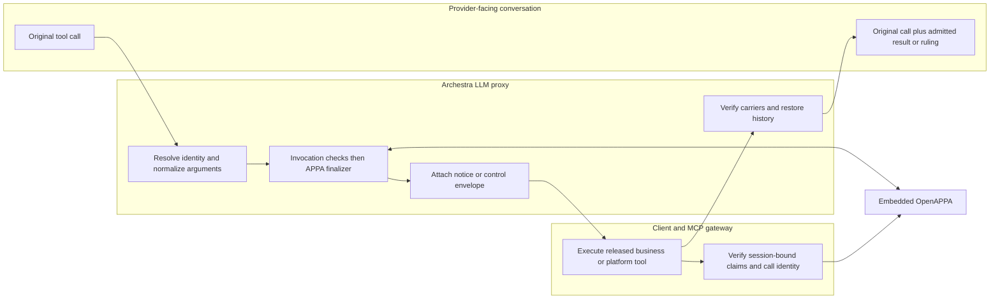
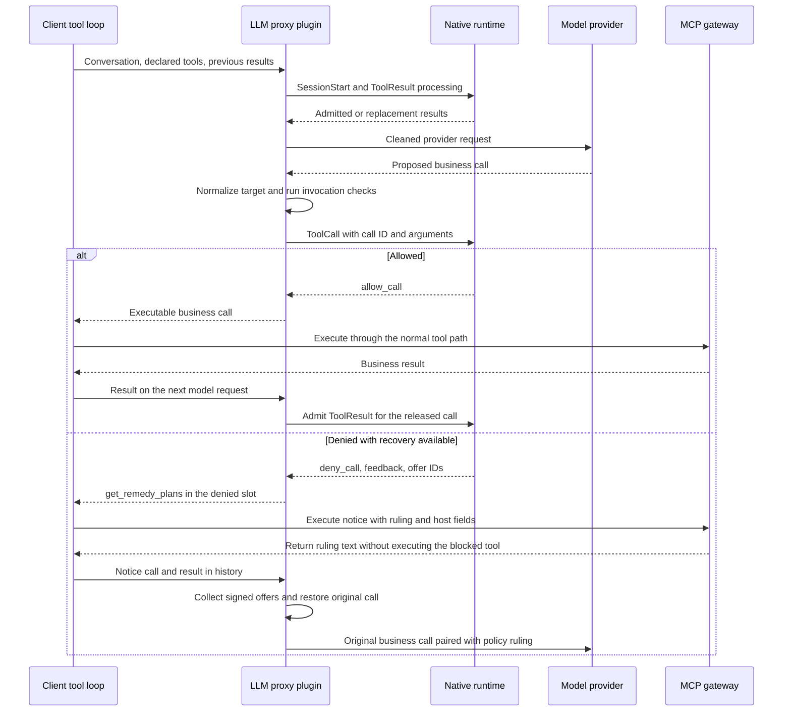
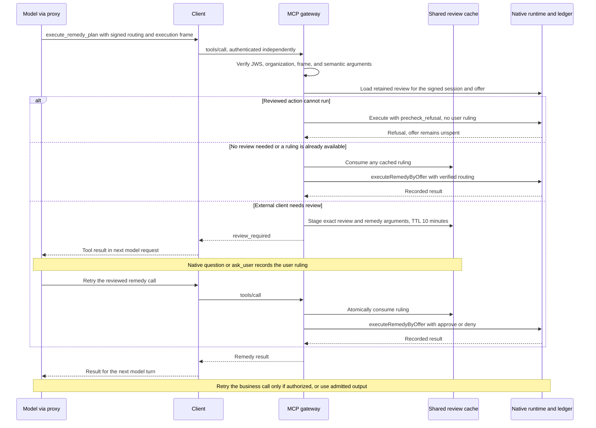
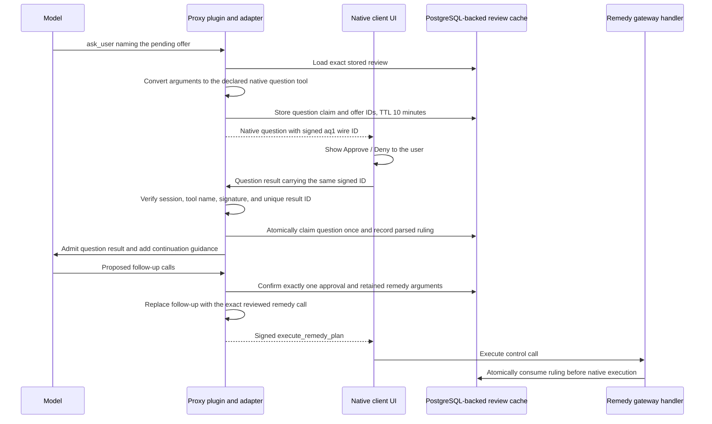
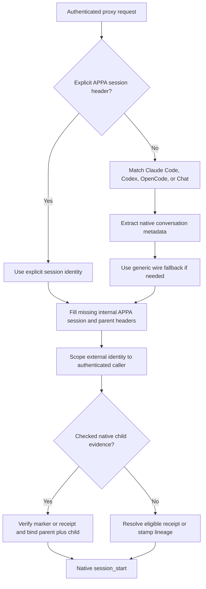
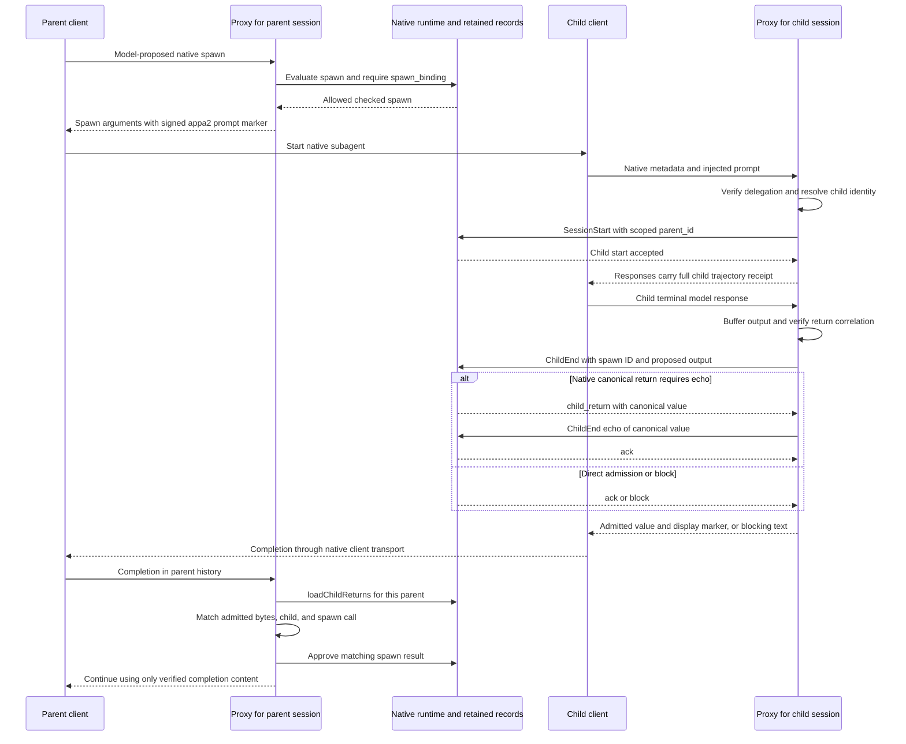
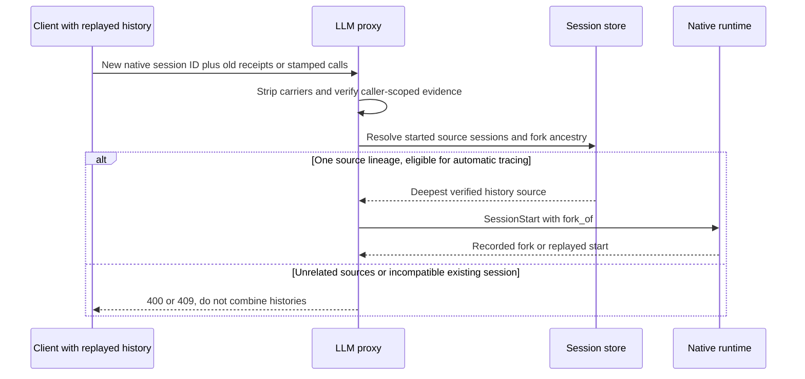
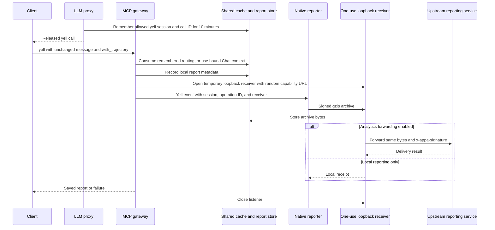

# Archestra × OpenAPPA

OpenAPPA evaluates tool calls and tool results at the LLM proxy. The proxy identifies sessions from client headers or an explicit `X-Appa-Session-ID`. External client sessions scope to the authenticated credential (`user:<id>`, `app:<id>`, or `virtual-key:<id>`). This prevents callers from guessing another user's session ID. Two MCP tools manage policy remedies: `archestra__get_remedy_plans` and `archestra__execute_remedy_plan`.

The runtime keys session state by session ID. Internal requests over loopback share session IDs. Chat requests require an authenticated user who owns the conversation. External requests require platform credentials. Uncredentialed loopback forms the platform trust boundary. Requests without a session ID fall back to a shared identity per credential and agent (`<caller-id>@<agent-id>`), which couples their histories and turn approvals.

This guide explains Archestra's integration rather than OpenAPPA policy syntax. The source baseline is Archestra `3aa876d1`, with [OpenAPPA pinned at `c7c1e1ef`](https://github.com/archestra-ai/OpenAPPA/tree/c7c1e1ef36aa07604b421c48be266d7397557656). Examples use the default `archestra__` tool prefix. Client labels and branding can change this prefix on the wire.

Protocol jump links: [call rewriting](#tool-calls-and-results), [remedy execution](#remedies), [user questions](#ask_user-and-native-elicitation), [session and child markers](#protected-session-markers), and [yell reporting](#yell-and-diagnostic-tools).

The baseline records the version examined, not a promise about later releases. Check [`Cargo.toml`](../platform/archestra-rs/openappa-rs/Cargo.toml) for the current OpenAPPA pin. Review this guide when that pin or the host protocols change.


```mermaid
flowchart LR
  Client[Chat or external client] <--> Proxy[LLM proxy and APPA plugin]
  Proxy <--> Provider[Model provider]
  Client <--> Gateway[MCP gateway and tool executors]
  Proxy <--> Host[TypeScript OpenAPPA service]
  Gateway --> Host
  Host <--> Native[NAPI addon and pinned Rust runtime]
  Native <--> Ledger[(PostgreSQL events and receipts)]
  Admin[Policy tools and admin API] --> Composer[Policy and battery composition]
  Composer <--> PolicyDB[(Policy revisions and effective policy)]
  Host --> PolicyDB
  Native --> Bridge[Authenticated loopback helper bridge]
  Bridge --> Sandbox[Isolated helper sandbox]
```

## Startup configuration

OpenAPPA uses the `ARCHESTRA_BETA` master switch. Setting `ARCHESTRA_BETA=true` enables the OpenAPPA UI, registers the proxy plugin, and mounts the policy API.

The **Enable Guardrails v2** switch on `/openappa` controls policy enforcement for the whole deployment. It defaults to off and lives in the database (`guardrails_deployment.enabled`). You need both the server flag and this database switch to enforce policies. Each request reads the database switch, so replicas do not depend on local process state.

Policy editing and GitHub sync stay available while enforcement is off. The OpenAPPA editor stores policy revisions in PostgreSQL. Restart the backend after changing `ARCHESTRA_BETA`. Toggling the database switch takes effect immediately without a restart.

Existing invocation guardrails always stay active. When APPA is on, tool calls pass existing invocation checks before APPA reserves them. Unconditional block or approval rules still fire normally.

Setting `ARCHESTRA_BETA=true` stands down the legacy trusted-data guardrail on the proxy. It marks no tool result as untrusted, skips dual-LLM sanitization, and ignores the agent setting for untrusted context. Proxied requests then read as trusted context. Because of this, legacy invocation rules that only restrict untrusted context stop firing on the proxy. The flag alone does not enforce APPA policies. Until you also turn on the database switch, neither guardrail judges context trust on the proxy. The MCP gateway independently checks `!agent.considerContextUntrusted` for its invocation rules.

Turning off `ARCHESTRA_BETA` restores the legacy Guardrails page, Security tab, and trusted-data evaluation, leaving all policy rows intact.

| Boundary | Beta off | Beta on, switch off | Both on |
| --- | --- | --- | --- |
| Incoming tool results | Legacy result policies | Stood down (treated as trusted) | APPA admission and saved output |
| Outgoing calls | Legacy invocation policies | Legacy invocation policies | Legacy invocation policies, then APPA decision |
| Denied call | Legacy adapter refusal | Legacy adapter refusal | Notice call carrying APPA ruling and remedies |
| Session header | No APPA wiring | Observes unenforced sessions | Stable conversation identity and trajectory |
| Runtime MCP tools | Not advertised implicitly | Notice, remedy, and peer tools not advertised implicitly | Notice, remedy, and peer tools advertised |
| Runtime | No proxy enforcement | Unenforced-session observation | Lazy native init, call reservation, receipt commits |

The HTTP API and policy tools share validation and revision checks. Edits compile without calling external services. The next dispatch loads the latest saved revision under the runtime lock. New conversations use it, while existing conversations keep their recorded policy snapshot.

The editor accepts `[policy]`, `[server_aliases]`, `[credentials]`, and URL bindings in `[externals]`. It only permits battery declarations in `include` entries. Any other include, local command, or runtime setting causes a validation failure. Reference tokens through `token_env` — policy documents must not contain raw secrets.

Revision `0` is an unsaved starter template (`initialPolicy()` in [`guardrails-policy.ts`](../platform/backend/src/services/guardrails-policy.ts)). It includes the bundled Archestra battery, an Archestra server alias, `internal = ["archestra:members"]`, `context_control = true`, and a local wildcard annotator (`noop`). The wildcard annotator adds no restrictions to uncovered tools. Explicit tool rules always take precedence over the wildcard.

Saving revision `1` through MCP local publication can auto-enable enforcement if the caller has `organizationSettings:update`, the same permission the explicit deployment toggle API checks. Direct HTTP PUT saves and GitHub imports do not auto-enable enforcement.

`ask_user` has its own advertisement path. Policy authoring tools stay available to agent profiles while beta is on. The `yell` tool follows the reporting flag rather than the deployment switch, but still requires session and call correlation.

## GitHub policy sync

Open **OpenAPPA** (`/openappa`) and select **Connect GitHub**, or configure it under **Settings → OpenAPPA**. When APPA is on, organization administrators can pick an `owner/repository`, a branch or tag (blank uses default), and a repository-relative TOML path. Public repositories need no credential. Private repositories use an organization token or GitHub App, requiring `credential:read`.

Saving the source queues the first pull. Choose a schedule: every 15 minutes, every hour, or once a day. You can also select **Sync now** for an immediate pull. The panel displays the last check, the accepted commit, and any errors. The background scheduler checks for due syncs every minute and deduplicates jobs per organization.

Each pull resolves the commit, caps file size at 1 MiB, and runs the native validator. Accepted changes atomically commit an organization policy revision with source metadata. Unchanged bytes create no revision. Failed pulls leave the active policy untouched. Editing or disconnecting a source prevents in-flight pulls from publishing.

While connected, the policy editor and Batteries panel are read-only, and direct HTTP PUT updates return 409. Calling `update_guardrails_policy` through MCP opens a pull request instead of saving directly. Opening a PR requires a GitHub App, `credential:read`, and a source commit that matches the branch head. Merged changes take effect on the next sync pull.

Stopping sync keeps the active policy and re-enables local editing. Existing conversations keep their original policy snapshot.

The system *holds* a pull instead of publishing it if the file drops a declared battery (while `declarations_pending_publish` is set) or modifies a `[credentials]` grant. The database stores the held text, its hash, the commit, and the hold reasons (`drops_batteries` or `changes_credentials`). To accept held text, call `POST /api/openappa/github-sync/accept-held`. This call requires `openappaPolicy:update`, plus `credential:update` if credentials changed.

An invalid download preserves the current revision. If composition fails on a new revision, the runtime continues serving the previous effective policy.

## Batteries

A battery packages OpenAPPA policies for one tool provider. It contains a policy file that names canonical tool paths (such as `mcp/github/get_file_contents`), optional helper scripts for external checks, and required `APPA_PROVIDER_*` credentials. The native addon exposes bundled batteries from the pinned OpenAPPA commit and validates uploaded packages. The Archestra adapter translates wire tool names to canonical names and back ([`adapter.rs`](../platform/archestra-rs/openappa-rs/src/adapter.rs)).

### Declarations

Your organization policy text owns battery declarations:
- `include`: names bundled batteries (`batteries/<name>/appa.toml`) or uploaded packages (`batteries/<name>@sha256-<64 hex>/appa.toml`).
- `[server_aliases]`: maps battery namespaces to catalog tool prefixes.
- `[credentials]`: maps `APPA_PROVIDER_*` variables to runtime credential keys.

Resolution is exact. Bundled names always resolve to bundled packages, and uploads never shadow them. You can include a battery name only once. Declarations in `openappa_battery_installs` form a derived read model. Recomposition updates these rows while preserving their IDs. Removing an `include` line removes that battery. Removing an alias keeps the battery included, moving its status to `server_missing`.

Battery management APIs rewrite the policy text and increment the revision. These routes require `openappaPolicy:update`. Adding or rekeying credentials requires `credential:update`. Connecting an MCP catalog does not activate its battery automatically.

Connecting to a catalog without synced tools, or one with an ambiguous `__` prefix, returns 409. Detaching without changing declarations also returns 409. Calling `DELETE /api/openappa/battery-includes/:name` removes the include and its aliases. Multiple batteries can read the same credential variable, so unbinding one battery must not remove credentials that another battery needs.

New unresolved includes cause errors, while unchanged ones show warnings. Catalog batteries with missing credentials, missing servers, or naming conflicts compose as empty stubs. Organization-wide annotator batteries compose even when `unrouted` or `missing_credentials`. Calls to a helper with missing credentials return no answer and fail closed.

`GET /api/openappa/policy-declarations` returns declaration details, statuses, helpers, and held pulls for UI panels and MCP tools.

### Statuses

Each derived battery row has one status, evaluated in order:
- `unavailable`: the entry resolves to no battery, or the name is included twice.
- `missing_credentials`: unbound variable, non-organization credential definition, or missing organization connection. Personal connections do not qualify.
- `naming_conflict`: catalog prefix contains `__` (the adapter splits at the last `__`), or multiple catalogs share a prefix.
- `server_missing`: namespace has no alias target, or target names no catalog.
- `unrouted`: organization-wide battery has no rules routing to its annotators.
- `active`: battery is ready to compose its rules. Request enforcement still depends on the activation gates.

Composition errors mark rows as `refused`. The stored effective content becomes `accepted ?? previousContent ?? root.content`. The `getEffectivePolicy` helper returns this row without throwing. The dispatch facade continues serving `.content` even when `lastError` is set. If the native runtime cannot parse those bytes, dispatch fails when called.

A battery can cover multiple catalogs, and each catalog row shares that status. The oldest install row owns the helper URL.

### Composition

The runtime evaluates the composed *effective policy*, not raw root text. The composer merges the root revision, declarations, and catalog tool prefixes into alias mappings. It stores the composed text per organization with a fingerprint of its inputs.

Recomposition runs on policy saves, GitHub imports, battery changes, package uploads, credential updates, catalog renames, tool syncs, and an hourly cron job. Before dispatch, the backend compares the stored root revision with the database and recomposes if they differ. Concurrent runs coalesce. If contention exceeds three attempts, the call returns 503.


```mermaid
flowchart TD
  Root[Latest root revision] --> Plan[Resolve declarations and composition inputs]
  Packages[Bundled or hashed uploaded packages] --> Plan
  Catalog[Catalog tool prefixes and aliases] --> Plan
  Credentials[Credential bindings and availability] --> Plan
  Plan --> Native[Native hosted-policy composition and validation]
  Native --> Effective[(Effective policy and fingerprint)]
  Native --> Status[(Derived battery statuses)]
  Effective --> Dispatch[Per-dispatch prepared deployment]
  Dispatch --> NewRoot[New root records policy snapshot]
  OldRoot[Existing root] --> Snapshot[(Previously recorded policy bytes)]
```

Before dispatch, the host compares root revisions and the revision-0 starter hash. Declarations and coverage reads also check the fingerprint. A catalog match marked `available` is a discovery suggestion, not an active install.

### Helpers

Helper scripts run in an isolated sandbox container, never on the backend host. The composer rewrites `command` externals to loopback URLs: `POST /api/openappa/helpers/<installId>/<externalName>`, authenticated with `APPA_ARCHESTRA_BRIDGE_TOKEN`. Neither root policies nor batteries can use `APPA_ARCHESTRA_*` tokens.

The bridge rejects non-loopback calls and invalid tokens. It mounts battery files read-only under `/skills/<battery>`, passes requests on stdin, injects credentials as sandbox secrets, and reads JSON from stdout. [`helper-bridge.ts`](../platform/backend/src/openappa/helper-bridge.ts) sets a 4-second execution timeout and a 4.5-second deadline, including setup. A timed-out run holds its concurrency slot until it settles.

Helper concurrency is capped at `max(1, floor(sandbox maxConcurrent / 2))`. Error responses: 404 for missing helpers, 502 for script errors, 503 for capacity limits, 504 for timeouts. The runtime treats non-200 responses as no answer, failing closed. Because consults hold database connections, slow helpers can exhaust connection pools.

The bundled Archestra audience battery runs in-process without sandbox overhead. Its `members`, `team/<team>`, and `user/<user>` selectors resolve directly against PostgreSQL.

### Packages and persistence

Uploaded packages are content-addressed: `(organization, content_hash)` is unique and insert-only. Packages support up to 64 files. Manifest names must match package names. Uploading packages with credentials or externals requires `credential:update`. Deleting packages in active use returns 409.

Startup calls `declareExistingInstalls()` in [`declare-installs.ts`](../platform/backend/src/openappa/declare-installs.ts) to backfill declarations for legacy rows. You can run this manually with `pnpm --dir backend db:openappa-declare-installs` if needed.

## Tool calls and results

The proxy and gateway handle different parts of a tool call. The proxy sees conversation context and provider call IDs. The gateway receives a later MCP `tools/call` request with independent authentication. Rewrites attach the metadata needed to connect these requests without asking the model to reconstruct it.


```mermaid
flowchart LR
  subgraph ModelWire[Provider-facing conversation]
    Proposal[Original tool call]
    History[Original call plus admitted result or ruling]
  end
  subgraph Proxy[Archestra LLM proxy]
    Prepare[Resolve identity and normalize arguments]
    Check[Invocation checks then APPA finalizer]
    Encode[Attach notice or control envelope]
    Restore[Verify carriers and restore history]
  end
  subgraph ClientWire[Client and MCP gateway]
    Execute[Execute released business or platform tool]
    Control[Verify session-bound claims and call identity]
  end
  Runtime[Embedded OpenAPPA]
  Proposal --> Prepare --> Check
  Check <--> Runtime
  Check --> Encode --> Execute
  Execute --> Control --> Runtime
  Execute --> Restore --> History
```

The `Control` path handles platform recovery tools. Allowed business tools run through their normal executor. Native operational failures do not automatically turn into recovery notices. Policy denials normally become notices that the client can execute. These represent distinct execution paths.

### Tool identity and release order

Client tool names do not prove gateway identity. The gateway appends `[[gwa1.<payload>.<mac>]]` to tool descriptions during `tools/list`. The proxy verifies this organization-bound marker before mapping client names to advertised tools. Claude Code prefixes names with `mcp__<label>__`, Codex uses MCP namespaces, and OpenCode appends an underscore label.

In attested mode, the proxy demotes unverified lookalike tools. Internal Chat trusts the tool list it builds. If no attestation verifies, the resolver falls back to a label-based compatibility mode. That mode does not provide cryptographic proof.

Outgoing calls flow through dispatch rewrites, `onPrepareToolCalls`, legacy invocation validation, and the APPA finalizer. The registry prevents finalizers from adding calls that skipped validation. APPA can allow a call, replace a denied call with a notice, or append delegation metadata. If partial processing fails, the proxy attempts to cancel already-admitted calls. Failed cancellation is logged.

Sources: [`gateway-tool-names.ts`](../platform/backend/src/routes/proxy/utils/gateway-tool-names.ts), [`tool-attestation.ts`](../platform/backend/src/archestra-mcp-server/tool-attestation.ts), [`registry.ts`](../platform/backend/src/proxy/plugins/registry.ts).

### Denial and notice round trip


```mermaid
sequenceDiagram
  participant C as Client tool loop
  participant P as LLM proxy plugin
  participant A as Native runtime
  participant L as Model provider
  participant G as MCP gateway
  C->>P: Conversation, declared tools, previous results
  P->>A: SessionStart and ToolResult processing
  A-->>P: Admitted or replacement results
  P->>L: Cleaned provider request
  L-->>P: Proposed business call
  P->>P: Normalize target and run invocation checks
  P->>A: ToolCall with call ID and arguments
  alt Allowed
    A-->>P: allow_call
    P-->>C: Executable business call
    C->>G: Execute through the normal tool path
    G-->>C: Business result
    C->>P: Result on the next model request
    P->>A: Admit ToolResult for the released call
  else Denied with recovery available
    A-->>P: deny_call, feedback, offer IDs
    P-->>C: get_remedy_plans in the denied slot
    C->>G: Execute notice with ruling and host fields
    G-->>C: Return ruling text without executing the blocked tool
    C->>P: Notice call and result in history
    P->>P: Collect signed offers and restore original call
    P->>L: Original business call paired with policy ruling
  end
```

The `buildNoticeArguments` helper builds the client envelope below. It preserves the logical call ID and position. A trajectory stamp can change the wire ID, but the proxy removes it before forwarding to the provider. The notice keeps the namespace in which the client declared it.

| Field | Purpose |
| --- | --- |
| `tool`, `arguments` | Blocked target spelling and original arguments. Arguments can be a JSON string or object. |
| `ruling` | Plain-text runtime feedback, including the offered plans. It is not an encoded transcript. |
| `notice` | `{v: 1, call_id, namespace?, custom?}`. Records how to restore the original call. |
| `offers` | Signed routing claims for the offer IDs. The model does not author these. |

The following example shows a provider-neutral projection. Values in angle brackets represent illustrative data rather than real signatures:

```json
{
  "id": "call_send",
  "name": "archestra__get_remedy_plans",
  "arguments": {
    "tool": "mail__send",
    "arguments": {"to": "reader@example.net", "body": "report"},
    "ruling": "<runtime feedback and offered plans>",
    "notice": {"v": 1, "call_id": "call_send"},
    "offers": [{"protected": "<header>", "payload": "<claims JSON>", "signature": "<MAC>"}]
  }
}
```

`get_remedy_plans` returns the `ruling` text directly from its arguments. It does not query the runtime or execute a plan. On the next turn, the proxy restores this history:

```text
assistant: call_send -> mail__send({to: "reader@example.net", body: "report"})
tool:      call_send -> <runtime feedback and offered plans>
```

The proxy restores the original call using the embedded ruling, avoiding a database lookup. Restoration depends on declared tool identity and host metadata. The native runtime separately checks actual tool-result admission against released calls and retained records.

If the client did not declare the notice tool, the proxy cannot deliver this protocol. It refuses the call, attempts to cancel sibling calls, and writes a client failure report. A missing notice tool does not authorize releasing the denied call.

When a client uses a `run_tool` wrapper, OpenAPPA evaluates the call as the underlying target. The runtime receives the target tool name and arguments. This ensures that policy rules, annotators, and wildcards match the tool that runs, not the wrapper. If denied, the notice identifies the target tool. If allowed, the call uses the wrapper declared by the client.

Sources: [`notice.ts`](../platform/backend/src/openappa/notice.ts), [`request.ts`](../platform/backend/src/openappa/request.ts), [`plugin.ts`](../platform/backend/src/proxy/plugins/appa-plugin-archestra/plugin.ts), [`service.ts`](../platform/backend/src/openappa/service.ts).

### Streaming boundary

The intended streaming boundary holds tool calls until the stream completes. Stream adapters hold calls by omitting `sseData`. Parent text normally streams immediately. Child runs and marked client-compaction requests buffer responses up to 10 MiB (returning 413 on overflow). The compaction flag does not cover every internal chat compaction request.

On unbuffered streams, mixed text/tool chunks can release calls before policy validation. The handler identifies `gemini.ts`, `minimax.ts`, and `openai.ts` as affected adapters. Terminal frames on Responses can do the same. Audit your adapter before relying on pre-execution guarantees ([`llm-proxy-handler.ts`](../platform/backend/src/routes/proxy/llm-proxy-handler.ts#L2823-L2837)).

Provider-hosted tools (like server-side web search) run inside the model provider before Archestra receives the request. The proxy can modify or withhold their outputs, but cannot prevent their execution.

### What reaches the provider

Provider cleanup removes host carriers before sending requests upstream. It runs even when enforcement is bypassed. On supported wire formats, the proxy restores notices, control calls, and gateway questions. It strips `notice`, `offers`, JWS fields, execution frames, and `remedy_offers` from tool calls and schemas. It also collects session and delegation carriers, restoring trajectory stamps to original provider IDs.

A call is rewritten when gateway identity resolves it to a platform tool, or when its envelope matches cleanup recognition rules (such as notice records naming their own call or deployment-signed JWS). A notice record is not a signature. Catch-all routes (`/v1/messages/count_tokens` and similar) recognize these carriers without normal gateway resolution. Cleanup recognition does not grant authorization to execute or admit a result.

Restoration keeps prior turns stable, including protocols with signed reasoning history. However, it does not guarantee universal byte stability. Turn-specific question and remedy guidance still alters `system`. Test the relevant model provider when modifying this code.

Native questions use signed `aq1` IDs (`<prefix>_aq1_<nonce>_<tag>`). These IDs stay in conversation history so earlier turns maintain byte consistency.

Model-facing remedy text states who makes decisions: the organization policy, and the user when the policy mandates approval. It must not instruct the model to bypass the user or assume remedies are pre-approved.

## Remedies

The public remedy tool is `archestra__execute_remedy_plan`. There is no `execute_remedy_offer` tool in the codebase. The gateway calls TypeScript `executeRemedyByOffer`, which invokes the native NAPI export. The native adapter maps this control tool to `appa/execute_remedy_plan`.

### Execution envelope

The gateway maintains separate public and execution schemas. The model sees `offer_id` along with optional `plan`, `label`, and `return_schema`. It does not see routing claims or execution-frame parameters. The proxy attaches those fields after the model proposes the control call.

| Execution field | Checked by |
| --- | --- |
| `protected`, `payload`, `signature` | Gateway JWS verification. Claims bind version, organization, root, session, parent, caller, offer, tool, and spelling. Wrapped dispatches also retain their wrapper name. |
| `execution.v`, `execution.kind` | Version `1` and kind `appa_remedy`. |
| `execution.call_id` | Correlates this remedy invocation, not the original blocked business call. |
| `execution.tool_name`, optional `namespace` | Client-facing control-tool spelling and namespace for restoration. The tool name is display context, not authority. |
| `execution.original_arguments` | JSON string of the semantic remedy arguments, excluding host routing fields. Its parsed value must deep-equal the submitted semantic arguments. |

```json
{
  "offer_id": "offer-1",
  "plan": "<name from the ruling>",
  "protected": "<header>",
  "payload": "<claims JSON>",
  "signature": "<MAC>",
  "execution": {
    "v": 1,
    "kind": "appa_remedy",
    "call_id": "call_remedy",
    "tool_name": "archestra__execute_remedy_plan",
    "original_arguments": "{\"offer_id\":\"offer-1\",\"plan\":\"<name from the ruling>\"}"
  }
}
```

The JWS authenticates routing claims rather than every field in the outer JSON object. The gateway validates the frame and compares its parsed arguments with the submitted values. It removes the echoed `plan` field from native arguments, but keeps the submitted arguments for receipt matching. Native execution uses `offer_id` and structured options. A model-authored plan name does not constitute independent authorization.

The logical call ID originates from the execution frame or `_meta["com.archestra/logicalToolCallId"]`. The MCP JSON-RPC ID is not a durable execution identity. With a logical ID, native execution is tracked. Without it, the host uses the untracked receipt path. Reusing an ID with altered arguments fails.

Before forwarding history to the provider, the proxy strips the execution frame and restores `original_arguments`. The client must echo the tool call it received rather than reconstructing it from the public schema.

Remedy tokens use flattened JWS with HS256 and unencoded payloads (RFC 7515/7797). They provide integrity, not confidentiality. Unknown algorithms fail closed. Tokens do not expire on a timer because the database ledger verifies whether an offer remains spendable. Tokens cannot be reused across conversations.

Claims provide routing context, not a reusable permission grant. The runtime verifies the owner and active offer. Personal offers require their original user. Spent, unknown, or unauthorized offers return error feedback without executing the remedy.

### Execute, review, and retry


```mermaid
sequenceDiagram
  participant M as Model via proxy
  participant C as Client
  participant G as MCP gateway
  participant H as Shared review cache
  participant R as Native runtime and ledger
  M->>C: execute_remedy_plan with signed routing and execution frame
  C->>G: tools/call, authenticated independently
  G->>G: Verify JWS, organization, frame, and semantic arguments
  G->>R: Load retained review for the signed session and offer
  alt Reviewed action cannot run
    G->>R: Execute with precheck_refusal, no user ruling
    R-->>G: Refusal, offer remains unspent
  else No review needed or a ruling is already available
    G->>H: Consume any cached ruling
    G->>R: executeRemedyByOffer with verified routing
    R-->>G: Recorded result
  else External client needs review
    G->>H: Stage exact review and remedy arguments, TTL 10 minutes
    G-->>C: review_required
    C-->>M: Tool result in next model request
    Note over M,H: Native question or ask_user records the user ruling
    M->>C: Retry the reviewed remedy call
    C->>G: tools/call
    G->>H: Atomically consume ruling
    G->>R: executeRemedyByOffer with approve or deny
    R-->>G: Recorded result
  end
  G-->>C: Remedy result
  C-->>M: Result for the next model turn
  Note over M,R: Retry the business call only if authorized, or use admitted output
```

The gateway checks whether the reviewed tool can execute before asking the user. A precheck refusal records why approval was skipped and keeps the offer unspent. Human review cannot override RBAC or make an unavailable tool executable.

For external client tool loops, the gateway returns `review_required` instead of executing the remedy. Chat can elicit input directly within the gateway call. These represent two transports for the same signed offer, not two separate approvals.

A successful remedy result does not mean the original business tool ran. The model follows the authorized retry instruction, or uses the admitted output returned by the remedy. The proxy does not automatically replay denied business calls.

If a client rejects a remedy before the gateway receives it, the proxy can display this failure along with a note that the plan was not applied. This exception excludes pending-review states and does not admit unrecorded business outputs.

Sources: [`openappa.ts`](../platform/backend/src/archestra-mcp-server/openappa.ts), [`offer-claims.ts`](../platform/backend/src/openappa/offer-claims.ts), [`service.ts`](../platform/backend/src/openappa/service.ts), [`native bindings`](../platform/archestra-rs/openappa-rs/index.d.ts).

## ask_user and native elicitation

`ask_user` functions as an ordinary multiple-choice tool. Its public parameters are `question`, `header`, `options`, `allowMultiple`, and optional `remedy_offer_ids`. The proxy attaches signed `remedy_offers` when the question references active offers. Providing an offer ID alone does not constitute proof of approval.

For staged reviews, the host replaces model-generated copy with the stored review text. The header becomes `Approval`, choices are restricted to `Approve` and `Deny`, and multiple selection is disabled. The model cannot soften the question or modify the reviewed action.

### Client mapping

The proxy replaces a gateway `ask_user` call with a native question only when the client declares the tool, the adapter permits it, and the tool supports the requested selection mode. Otherwise, the gateway call remains untouched. Model calls made directly to recognized native question tools also receive signed question IDs.

| Client | Native tool | Mapping and fallback |
| --- | --- | --- |
| Claude Code | `AskUserQuestion` | Maps to `questions[]` with question, header, options, and `multiSelect`. Supports multiple selection. |
| Codex | `request_user_input` | Requires `x-archestra-native-question: request_user_input` in addition to a declaration. Uses `questions[]` with `id: "archestra_question"`. Single-selection only. Without the capability, retain gateway `ask_user`. |
| OpenCode | `question` | Maps to `questions[]` with question, header, options, and `multiple`. Supports multiple selection. |
| Archestra Chat | Gateway `ask_user` / chat elicitation | Shows the platform choice form. No external native-tool rewrite is needed. |
| Other MCP clients | Gateway `ask_user` | Uses `elicitation/create` through the execution context. Missing or declined UI support is not approval. |

Codex can declare `request_user_input` even when its active mode cannot run it. Declaration alone is therefore insufficient. The adapter checks for an explicit capability header before rewriting, preventing broken native dialogs.

### Native question round trip


```mermaid
sequenceDiagram
  participant M as Model
  participant P as Proxy plugin and adapter
  participant C as Native client UI
  participant H as PostgreSQL-backed review cache
  participant G as Remedy gateway handler
  M->>P: ask_user naming the pending offer
  P->>H: Load exact stored review
  P->>P: Convert arguments to the declared native question tool
  P->>H: Store question claim and offer IDs, TTL 10 minutes
  P-->>C: Native question with signed aq1 wire ID
  C->>C: Show Approve / Deny to the user
  C->>P: Question result carrying the same signed ID
  P->>P: Verify session, tool name, signature, and unique result ID
  P->>H: Atomically claim question once and record parsed ruling
  P->>M: Admit question result and add continuation guidance
  M->>P: Proposed follow-up calls
  P->>H: Confirm exactly one approval and retained remedy arguments
  P->>P: Replace follow-up with the exact reviewed remedy call
  P-->>C: Signed execute_remedy_plan
  C->>G: Execute control call
  G->>H: Atomically consume ruling before native execution
```

Native questions use `<toolu|call|aq>_aq1_<nonce>_<tag>` as their wire call ID. The tag binds organization, caller, session, parent, native tool name, and nonce. Only calls released as user questions receive this ID. Business tools with similar names do not gain question-result exemptions.

The signature authenticates the question. The adapter then parses the client response. Errors, ambiguous answers, or cancellations produce `none` rather than approval. The first request claims the cached question once. Subsequent history entries can keep the signed ID without recording duplicate approvals.

Reviews and question claims expire after ten minutes. Keys include organization, caller, session, parent, and offer. `consumeHitlRuling` uses PostgreSQL `DELETE ... RETURNING` for atomic consumption. If conflicting cached rulings exist, denials take precedence over no-decision, which takes precedence over approval. Approval in a parent session does not authorize a child offer.

On the gateway path, signed offers retrieve the stored review to replace model-authored text. `context.elicitation.elicit` presents the form in Chat or sends an MCP elicitation request. Timeouts, cancellations, or missing clients leave the remedy blocked. Ordinary questions can fall back to plain text in headless runs, but security reviews cannot use that fallback as approval.

Sources: [`chat.ts`](../platform/backend/src/archestra-mcp-server/chat.ts), [`hitl-review.ts`](../platform/backend/src/openappa/hitl-review.ts), [`native question handling in plugin.ts`](../platform/backend/src/proxy/plugins/appa-plugin-archestra/plugin.ts), [`native-question-ruling.ts`](../platform/backend/src/proxy/plugins/appa-plugin-archestra/adapters/native-question-ruling.ts).

## Identity, child lineage, and peer messages

Client recognition, session extraction, and child attribution operate as distinct steps. Adapters identify client tools and metadata. `extractAppaSessionIdentity` extracts conversation references. The proxy fills internal headers, and `sessionFromHeaders` applies caller scoping. These headers remain internal and are not forwarded to model providers.


```mermaid
flowchart TD
  Request[Authenticated proxy request] --> Explicit{Explicit APPA session header?}
  Explicit -->|Yes| Header[Use explicit session identity]
  Explicit -->|No| Adapter[Match Claude Code, Codex, OpenCode, or Chat]
  Adapter --> Native[Extract native conversation metadata]
  Native --> Fallback[Use generic wire fallback if needed]
  Header --> Fill[Fill missing internal APPA session and parent headers]
  Fallback --> Fill
  Fill --> Scope[Scope external identity to authenticated caller]
  Scope --> Child{Checked native child evidence?}
  Child -->|Yes| Bind[Verify marker or receipt and bind parent plus child]
  Child -->|No| Fork[Resolve eligible receipt or stamp lineage]
  Bind --> Start[Native session_start]
  Fork --> Start
```

Adapters match in precedence order: Claude Code, Codex, OpenCode, then Chat. `X-Appa-Session-ID` overrides native extraction. `X-Appa-Parent-ID` overrides extracted parent metadata. Verified child bindings reject explicit claims that contradict known parents or child IDs.

| Client | Match Rule | Session Source | Notes |
| --- | --- | --- | --- |
| Claude Code | `claude-code` / `claude-cli` user agent, or native session header | `x-claude-code-session-id`, otherwise session parsed from `metadata.user_id` | Stable across resume and native compaction. `Agent` and `Task` are child-spawn tools. A skill stays in the caller's trajectory. |
| Codex | User agent/originator, `x-codex-turn-metadata`, or recognized `client_metadata` | Reconcile body `client_metadata`, its nested turn metadata, the turn-metadata header, and `session-id`. Prefer `thread_id` over session ID. | Contradictory claims return 400. A `forked_from_thread_id` alone does not establish a child. |
| OpenCode | User agent/originator or `x-opencode-session` | Reconcile `x-session-id`, `x-session-affinity`, and `session-id`, plus hosted `x-opencode-session`. Contradictory claims are refused. | A differing `x-session-id` can identify the parent of the hosted session. Parent metadata still requires child-binding checks. |
| Archestra Chat | Trusted internal chat source | Conversation ID | Checks user ownership. Active encrypted-chat handling has a previously-unenforced exception. |
| Other | Explicit APPA headers or recognized wire metadata | Explicit header, then applicable wire fallback such as `metadata.session_id` or `conversation` | Without recognition or explicit headers, `unsupported_client_action` applies and defaults to bypass. |

For example, Codex metadata `{"thread_id":"thread-a"}` fills internal `X-Appa-Session-ID: thread-a`. If the caller is `user:u1`, native dispatch receives `session_id: "user:u1|thread-a"`. Callers cannot pick arbitrary IDs through metadata. Platform loopback requests use unscoped sessions under their own trust boundary.

Explicit headers provide stable conversation IDs for custom clients, but do not provide native spawn, return, or compaction handling. Those features require an adapter and compatible transport.

Client matching selects syntax rather than authority. After authentication, the handler attaches `AppaTrustedContext` using the `APPA_PLUGIN_TRUSTED_CONTEXT` symbol. This object holds the bound session, raw client claims, prepared request, tool identity, and captured activation state. Headers cannot forge this context. Child checks verify original claims against this server binding.

A custom adapter implements `AppaClientAdapter` and registers in `APPA_CLIENT_ADAPTERS`. It extracts sessions, classifies tools, maps native questions, and parses spawn/return events. Implementing only session extraction leaves child and question protections inactive. See [`types.ts`](../platform/backend/src/proxy/plugins/appa-plugin-archestra/types.ts).

### Client constraints

Notice restoration and turn accounting run on Anthropic Messages (including Bedrock InvokeModel), OpenAI Responses, and OpenAI Chat Completions. Other protocols evaluate calls and results, but notices stay in history.

Deferred tools (`tool_search`), `local_shell`, computer-use tools, and conflicting APPA declarations fail validation immediately.

The A2A [step-context guard](../platform/backend/src/agents/step-context-guard.ts) removes proxy-only fields from calls before writing plain-text summaries. A summary cannot replace signed protocol evidence.

Sources: [`session-identity.ts`](../platform/backend/src/proxy/plugins/appa-plugin-archestra/session-identity.ts), [`fillAppaSessionHeaders`](../platform/backend/src/routes/proxy/llm-proxy-handler.ts), [`client adapters`](../platform/backend/src/proxy/plugins/appa-plugin-archestra/adapters/), [`sessionFromHeaders`](../platform/backend/src/openappa/service.ts).

### Protected session markers

Archestra uses distinct markers for different boundaries. Display text, signed routing tokens, and database records carry different authority.

| Carrier | Injection point | What the receiver checks |
| --- | --- | --- |
| `[[gwa1.<payload>.<mac>]]` | Gateway tool description | Organization-bound gateway/tool provenance. Removed before provider routing. Uses an auth-secret-derived organization key. |
| `protected session ABC-DEFG` | Receipt block on eligible external model text | Short session receipt derived from organization, caller, and native session. Resolve against retained sessions owned by that caller. The code alone is not a capability. |
| `appat1<payload>.<tag>` | External tool-call IDs and matching references | Original provider ID, organization, caller, and session. The proxy verifies it for lineage, then restores the original ID. |
| `appa2.<payload>.<mac>` in `[appa] delegated trajectory ...` | Prompt of an admitted native spawn | Organization, caller, parent trajectory, native spawner, spawn call ID, and digest of the prompt. Remove the appended marker before verifying the prompt digest. |
| `protected child session ABC-DEFG` plus `child trajectory appachild1.<payload>.<mac>` | Child response receipt block | Full receipt binds organization, caller, spawner, parent, child, and optional native child/spawn IDs. The short display code is not enough to rebind a child. |
| `finished subagent ABC-DEFG` | Admitted child return | Display marker only. Parent attribution uses retained `ChildEnd` records and admitted bytes, not this code. |
| `appac1-<base64url>` | Responses compaction item's `encrypted_content` | Carrier contains `[1, original encrypted content, proof]`. It does not decrypt the provider blob and has no separate MAC. Verify the enclosed session/child proof. |
| `<toolu\|call\|aq>_aq1_<nonce>_<tag>` | Native question call ID | Issued-question identity plus one-shot cached claim. Kept in history to avoid changing earlier turns. |
| `peer_proof` | Peer list/read execution arguments | Session, action, call ID, and read target. Separate signing domain from remedy offers. Removed from provider history. |

The standard receipt block includes a two-line logo. Non-streaming requests prepend it to the first non-empty text chunk. Streaming requests use the response transform. Significant lines are shown below with inert placeholders:

```text
protected session ABC-DEFG

protected child session ABC-DEFG
child trajectory appachild1.<signed-claims>.<mac>

finished subagent ABC-DEFG
```

Root receipt codes map to session receipt tokens in PostgreSQL. When requests arrive, the proxy extracts receipt codes and strips their display text before logging or forwarding. `sessionReceiptEvidence` validates them against the authenticated caller. Forging receipt text does not grant access to another caller's session.

Trajectory stamps preserve provider call IDs within signed metadata. The proxy restores original IDs across tool calls, results, and text references. The plugin skips stamps for Mistral models because their IDs can be truncated. Text receipts and native metadata remain separate mechanisms.

Child receipts preserve server-minted child IDs when native IDs appear later. Compacted child requests recover bindings from full signed receipts. The proxy extracts `appac1-` before the provider sees `encrypted_content`, passing the proof through standard verification without decrypting provider ciphertext.

Receipt parsers accept older boxed formats found in existing conversations, while writers output the current format. Syntax changes require replay tests alongside new response tests.

Sources: [`session-token.ts`](../platform/backend/src/openappa/session-token.ts), [`trajectory-stamp.ts`](../platform/backend/src/openappa/trajectory-stamp.ts), [`child-trajectory-receipt.ts`](../platform/backend/src/openappa/child-trajectory-receipt.ts), [`delegation.ts`](../platform/backend/src/openappa/delegation.ts), [`compaction-carrier.ts`](../platform/backend/src/openappa/compaction-carrier.ts), [`wire.ts`](../platform/backend/src/openappa/wire.ts).

### Checked subagent start and return


```mermaid
sequenceDiagram
  participant P as Parent client
  participant PP as Proxy for parent session
  participant R as Native runtime and retained records
  participant C as Child client
  participant CP as Proxy for child session
  P->>PP: Model-proposed native spawn
  PP->>R: Evaluate spawn and require spawn_binding
  R-->>PP: Allowed checked spawn
  PP-->>P: Spawn arguments with signed appa2 prompt marker
  P->>C: Start native subagent
  C->>CP: Native metadata and injected prompt
  CP->>CP: Verify delegation and resolve child identity
  CP->>R: SessionStart with scoped parent_id
  R-->>CP: Child start accepted
  CP-->>C: Responses carry full child trajectory receipt
  C->>CP: Child terminal model response
  CP->>CP: Buffer output and verify return correlation
  CP->>R: ChildEnd with spawn ID and proposed output
  alt Native canonical return requires echo
    R-->>CP: child_return with canonical value
    CP->>R: ChildEnd echo of canonical value
    R-->>CP: ack
  else Direct admission or block
    R-->>CP: ack or block
  end
  CP-->>C: Admitted value and display marker, or blocking text
  C-->>P: Completion through native client transport
  P->>PP: Completion in parent history
  PP->>R: loadChildReturns for this parent
  PP->>PP: Match admitted bytes, child, and spawn call
  PP->>R: Approve matching spawn result
  PP-->>P: Continue using only verified completion content
```

Adapters configure spawn prompt fields, such as Claude Code `Agent`/`Task` prompts and Codex `spawn_agent` parameters. The proxy appends the delegation marker only after admitting the call. It does not convert arbitrary prompt strings into checked spawns.

`bindMintedChildTrajectory` combines verified delegation, child receipts, and native parent/child metadata. Child IDs remain scoped under their parent. Parent reuse, conflicting explicit headers, and invalid receipts cause rejections. Native launch acknowledgments only signal that a subagent started — they do not represent an admitted result.

Before invoking `ChildEnd`, the proxy requires a correlated spawn ID and an active signing key. This check happens before native execution because an admitted return has already crossed the boundary. Blocked runs output only blocking text without success markers. Teammate agents using message transports omit display markers on completion.

When the parent continues, the adapter extracts completions from native result payloads. The plugin compares completion bytes against `loadChildReturns`, narrowing by spawn and child IDs. Identical text from multiple children is treated as ambiguous rather than selecting the first candidate. Direct results cannot substitute for another spawn's completion. The provider request is rebuilt using only verified completion bytes.

Missing, ambiguous, or incompatible records return 409 (or 400 for explicit substitutions). Replaying invalid history repeats the error. To recover, resume the original session, rewind before the child started, or open a fresh session.

Unenforced history has one exception: an unmonitored spawn or child can be skipped if the runtime recorded no boundary crossing for it. Children with recorded crossings remain subject to byte and attribution checks. This exception relies on host records, not client assertions.

Raw child transcripts contain unapproved intermediate output. The plugin blocks direct access to recognized transcript files outside official handback paths. For Claude Code, this includes `tasks/*.output` and `subagents/agent-*.jsonl`. Knowing a child ID does not permit reading those files through ordinary tool calls.

Sources: [`adapters/trajectory.ts`](../platform/backend/src/proxy/plugins/appa-plugin-archestra/adapters/trajectory.ts), [`child-return.ts`](../platform/backend/src/openappa/child-return.ts), [`child attribution in plugin.ts`](../platform/backend/src/proxy/plugins/appa-plugin-archestra/plugin.ts), [`endChild / approveSpawnReturn`](../platform/backend/src/openappa/service.ts).

### Resume, fork, and compaction

Native child sessions use `parent_id`. New conversations with verified history can instead declare `fork_of`. The host does not infer checked child relationships from generic fork metadata.


```mermaid
sequenceDiagram
  participant C as Client with replayed history
  participant P as LLM proxy
  participant D as Session store
  participant R as Native runtime
  C->>P: New native session ID plus old receipts or stamped calls
  P->>P: Strip carriers and verify caller-scoped evidence
  P->>D: Resolve started source sessions and fork ancestry
  alt One source lineage, eligible for automatic tracing
    D-->>P: Deepest verified history source
    P->>R: SessionStart with fork_of
    R-->>P: Recorded fork or replayed start
  else Unrelated sources or incompatible existing session
    P-->>C: 400 or 409, do not combine histories
  end
```

Automatic tracing applies to supported external wire formats with native session IDs and verified evidence. Explicit `X-Appa-Session-ID`, `X-Appa-Parent-ID`, Chat requests, bypass setups, or native spawns disable automatic inference. Custom clients cannot assume copied text and headers grant full fork protection.

`forkedSession` requires all source sessions to have started and share a single lineage. Separate trajectories cannot merge into a fork. Inherited tool-result lookups require completed results before the fork watermark and search up to 32 ancestry steps. Results beyond that limit are withheld. Child returns remain bound to the parent that initiated the child.

Resume and compaction keep the native conversation ID. Full child receipts and compaction carriers maintain attribution when metadata is stripped. Shared fallback IDs do not isolate sessions: `TurnEnd` expires unspent vouches and closes unreported calls, but does not revoke active offers.

Sources: [`lineage.ts`](../platform/backend/src/openappa/lineage.ts), [`llm-proxy-handler.ts`](../platform/backend/src/routes/proxy/llm-proxy-handler.ts), [`native fork/result lookup`](../platform/archestra-rs/openappa-rs/src/lib.rs).

### Peer transport

Native relay tools (such as Claude Code `SendMessage`) route through proxy relay handlers. Permitted messages store their payloads via `sendPeerMessage`. Incoming relay messages are validated against recorded sender, recipient, and message evidence. Matching text or client-provided sender names alone are rejected.

```text
native relay call -> proxy admission -> native peer store
                                          |
recipient <- held-message metadata <- list_peer_messages
    |
    +-> read_peer_message + proxy peer_proof
             -> gateway verification -> native read admission -> recorded body or refusal
```

`list_peer_messages` returns message IDs and expiration timestamps without exposing bodies or session bindings. `read_peer_message` takes a `message_id`. The proxy appends a hidden `peer_proof` binding session, action, and call identity. Read proofs also bind the message ID. Their signing domain differs from remedy offers, preventing cross-use.

Successful reads return stored native results. Denied reads return feedback and can include signed remedy offers. Reading peer messages never constitutes user approval. Senders must target actors within the same family, and unenforced peers cannot access governed messages.

Peer reads bypass the pending-receipt guard for the family. Send, admit, and list operations still enforce this check. This exception does not bypass message admission rules.

Sources: [`peer-claims.ts`](../platform/backend/src/openappa/peer-claims.ts), [`MCP peer handlers`](../platform/backend/src/archestra-mcp-server/openappa.ts), [`native peer.rs`](../platform/archestra-rs/openappa-rs/src/peer.rs).

## Yell and diagnostic tools

The `yell` tool reports problematic policy blocks or remedies. It does not modify policies, grant permissions, or consume offers. Public parameters are restricted to `message` and `with_trajectory`. The host injects session and operation IDs.


```mermaid
sequenceDiagram
  participant C as Client
  participant P as LLM proxy
  participant G as MCP gateway
  participant H as Shared cache and report store
  participant R as Native reporter
  participant L as One-use loopback receiver
  participant U as Upstream reporting service
  P->>H: Remember allowed yell session and call ID for 10 minutes
  P-->>C: Released yell call
  C->>G: yell with unchanged message and with_trajectory
  G->>H: Consume remembered routing, or use bound Chat context
  G->>H: Record local report metadata
  G->>L: Open temporary loopback receiver with random capability URL
  G->>R: Yell event with session, operation ID, and receiver
  R->>L: Signed gzip archive
  L->>H: Store archive bytes
  alt Analytics forwarding enabled
    L->>U: Forward same bytes and x-appa-signature
    U-->>L: Delivery result
  else Local reporting only
    L-->>R: Local receipt
  end
  G-->>C: Saved report or failure
  G->>L: Close listener
```

For external clients, the gateway might lack the proxy session or call ID. `rememberYellSession` caches this routing under a hash of organization, message, and `with_trajectory`. `recallYellSession` consumes the entry. Modified arguments or missing cache entries fail to route. The handler also verifies caller session permissions. Internal Chat uses its bound conversation context.

`executeYell` creates an `openappa_yells` row and triggers `yell:<call-id>`. `captureYellReport` opens a temporary loopback listener on `127.0.0.1` using a random token. The native reporter builds the archive. Archestra stores the exact gzip payload, forwarding it only when analytics is permitted. Forwarding preserves `x-appa-signature`, rejects redirects, and applies an 8-second timeout. Delivery failures are recorded locally.

`get_openappa_yell({id})` reads stored reports under `openappaDiagnostics:read`. Report contents remain untrusted diagnostic data. Reading reports does not resolve them or grant policy edit rights. HTTP routes support listing, summaries, archive downloads, and status updates. Unlike consult logs, reading organization yells does not require the diagnostics `admin` action.

The reporting flag controls `yell` advertisement, while analytics controls upstream transmission. Automatic failure reports (such as missing remedy tools) are recorded locally without invoking the model yell flow.

Sources: [`yell-session.ts`](../platform/backend/src/openappa/yell-session.ts), [`executeYell`](../platform/backend/src/openappa/service.ts), [`yell-receiver.ts`](../platform/backend/src/openappa/yell-receiver.ts), [`client-failure-report.ts`](../platform/backend/src/openappa/client-failure-report.ts), [`yell routes`](../platform/backend/src/routes/openappa-yells/openappa-yells.routes.ts).

### Related tool surface

| Tools | Host responsibility |
| --- | --- |
| `get_remedy_plans`, `execute_remedy_plan` | Deliver notices and execute verified recovery requests. Advertised when Guardrails v2 is active. |
| `list_peer_messages`, `read_peer_message` | Actor-scoped inbox operations with proxy execution proofs. Shared active-enforcement advertisement gate. |
| `ask_user` | General user questions and exact security review prompts. Separate implicit tool path and native client adapters. |
| `yell`, `get_openappa_yell` | Submit routed diagnostic reports and inspect stored reports. Reporting and reading permissions are separate. |
| `get_guardrails_policy`, `validate_guardrails_policy`, `preview_guardrails_policy_change`, `update_guardrails_policy` | Read, validate, preview, or publish policies. Administration tools, not runtime remedies. |
| `inspect_guardrails_server`, `list_guardrails_battery_fits`, `get_guardrails_policy_change_status`, `create_guardrails_repository` | Inspect bindings, check publication state, or configure the policy repository. Standard policy and credential permissions apply. |

Policy helper tools can be advertised to agent profiles while beta is enabled and enforcement is disabled. Advertisement does not bypass handler authorization checks. See [`gateway tool selection`](../platform/backend/src/routes/mcp-gateway/utils.ts) and [`MCP RBAC`](../platform/backend/src/archestra-mcp-server/rbac.ts).

### Protocol verification points

Protocol changes require comprehensive testing beyond basic tool execution. Existing tests cover key boundaries:

| Change | Test locations and cases to retain |
| --- | --- |
| Notice/control envelopes | [`wire.test.ts`](../platform/backend/src/openappa/wire.test.ts), [`proxy integration tests`](../platform/backend/src/routes/proxy/llm-proxy-openappa.test.ts): wrapper targets, same-slot replacement, forged lookalikes, and cleanup while bypassed. |
| Claims and review | [`offer-claims.unit.test.ts`](../platform/backend/src/openappa/offer-claims.unit.test.ts), [`hitl-review.test.ts`](../platform/backend/src/openappa/hitl-review.test.ts), [`plugin tests`](../platform/backend/src/proxy/plugins/appa-plugin-archestra/plugin.test.ts): wrong session, changed arguments, duplicate/replayed answers, expired review, and denied approval. |
| Session and child carriers | [`session-token.test.ts`](../platform/backend/src/openappa/session-token.test.ts), [`child-trajectory-receipt.test.ts`](../platform/backend/src/openappa/child-trajectory-receipt.test.ts), [`child-return.test.ts`](../platform/backend/src/openappa/child-return.test.ts): caller mismatch, compaction, ambiguous attribution, and substituted returns. |
| Native client formats | [`adapter tests`](../platform/backend/src/proxy/plugins/appa-plugin-archestra/adapters/): metadata conflicts, native question availability, launch acknowledgments versus completions, and transcript-path detection. |
| Peer and yell transport | [`peer-claims.unit.test.ts`](../platform/backend/src/openappa/peer-claims.unit.test.ts), [`yell-receiver.test.ts`](../platform/backend/src/openappa/yell-receiver.test.ts), [`MCP handlers tests`](../platform/backend/src/archestra-mcp-server/openappa.test.ts), [`native peer tests`](../platform/archestra-rs/openappa-rs/peer.test.cjs). |

Host unit tests frequently mock native decisions. Native and PostgreSQL tests remain essential for validating receipt replay and ledger event behavior. Live qualification must verify streaming, compaction, child completion handback, and real user prompts.

## Agent Runtimes

The launcher issues a turn-scoped `X-Archestra-Runtime-Binding` for the saved workspace, run, actor, and Agent. The proxy verifies it against the runtime's virtual key. The gateway verifies it against its authenticated token. Both restore the stored OpenAPPA parent relationship. User runs keep `user:<id>`; non-user runs use `agent-workspace:<workspace id>`, so key rotation does not reset their trajectory. Binding credentials stay in secret environment variables and are not forwarded to providers or MCP servers.

The proxy treats runtime launches as spawns and signs a `runtime_proof` over the source session, call ID, target, arguments, and spawn status. Proofs expire after five minutes and allow at most thirty seconds of issuance-clock skew. Wrapped `run_tool` calls carry them in `tool_args`. The proxy plugin reports each proof attachment to the registry. The registry verifies the signed source and call identity and rejects changes to any approved argument besides the added proof. The gateway verifies the proof and released-call receipt before dispatch. The launcher binds the child before staging inputs or starting its process. Steering and writes address that registered child again to inherit the parent's current restrictions. Child-return contracts are injected before inference; contracts over 64 KiB are refused. Native child identity and signed workspace lineage support direct and nested CLI children without trusting the static workspace header as a child claim.

Before execution, the gateway atomically claims the released call in the durable operation ledger. Concurrent or later replays do not dispatch again, even within the proof lifetime. A transport failure does not reopen the claim; inspect the run status before requesting another action.

```text
Parent -> Proxy: propose runtime launch
Proxy -> Gateway: allowed spawn + signed source proof
Gateway -> Runtime: bind child, inherit restrictions, then deliver inputs
Runtime -> Proxy: model calls and results under the stored child identity
Gateway -> Parent: get_run returns the recorded admitted ChildReturn
```

Long-lived runtimes use `ChildReturn`, not `ChildEnd`, for each final value. This preserves pending calls and later turns. `get_run` returns only the exact admitted value for that task; unrelated sessions and oversized values are withheld. File reads cross the same boundary. Downloads check the pinned content, size, and checksum before issuing a ticket, and require admission without transformation. Protected exports are limited to 4 MiB. HTTP ranges serve the admitted host-side copy from a byte-bounded 64 MiB cache, not the runtime's mutable file. Owner HTTP views remain separate human surfaces; cross-runtime external publishing is refused without an egress crossing.

Receipt readers stream PostgreSQL rows and refuse histories exceeding 10,000 records or 8 MiB; they do not return partial authority. Runtime output lookups filter by child and task and request only the latest admitted operation.

Runtime human reviews use the run page rather than native forms that may auto-decline. Shared-cache entries retain separate offers for ten minutes. Only the run's user owner can record a ruling for its exact signed session and offer. Native-form callers also atomically claim their pending stage; duplicate approvals cannot grant twice, while an unspent approval remains revocable by genuine denial. Exact review context remains readable for native continuation only while approval is unspent; it does not reopen the pending claim. `ask_user` waits without consuming approval; the remedy retry spends it. Denial, timeout, disconnection, or the absence of an eligible reviewer leaves the call blocked. Native delivered/returned values are bounded to 8 MiB, and model-facing crossing refusals omit internal diagnostics. Existing non-runtime elicitation is unchanged.

## Persistence and current limits

The Rust binding stores event batches, policy snapshots, sessions, operations, and receipts in PostgreSQL.

Execution follows three steps under a family advisory lock: insert a pending receipt, run the native hook to append events, and mark the receipt complete. A crash after committing events leaves a pending receipt, failing subsequent operations closed across the session family (except peer reads).

Completed receipts return saved decisions without re-running the engine. Reusing IDs with modified arguments causes an immediate rejection. The event log enforces strict sequence ordering via transaction advisory locks.

The host acquires an in-process root lock before leasing a database connection. PostgreSQL advisory locks (`pg_advisory_lock`) serialize operations across instances. Root sessions run concurrently, while sibling sessions within a root run sequentially.

The connection pool defaults to 4 connections (capped at 64). Calls wait up to 30 seconds for a connection. Connections enforce 30-second lock timeouts and 60-second statement timeouts. Pool exhaustion typically stems from slow external consults. Stale connections are replaced automatically. Modifying pool limits requires a backend restart.

OpenAPPA administration uses `openappaPolicy`, `openappaDiagnostics`, and `organizationSettings`. These are distinct resources in [`access-control.ts`](../platform/shared/access-control.ts). Legacy `toolPolicy` permissions still exist for other features, but do not authorize OpenAPPA administration. This guide does not prescribe a role migration.

| Endpoint | Role | Permission |
| --- | --- | --- |
| `GET /api/guardrails-policy` | Read current policy revision and content. | `openappaPolicy:read` |
| `PUT /api/guardrails-policy` | Save full policy text with expected revision. | `openappaPolicy:update` (+ `credential:update` if grants change) |
| `POST /api/guardrails-policy/validate` | Validate policy text without saving. | `openappaPolicy:update` |
| `GET /api/guardrails-deployment` | Read deployment enforcement status. | `organizationSettings:read` |
| `PUT /api/guardrails-deployment` | Toggle enforcement or set unsupported client action. | `organizationSettings:update` |
| `/api/openappa/batteries/*` | Inspect and manage batteries, packages, and aliases. | `openappaPolicy:read` / `update` |
| `/api/openappa/github-sync/*` | Configure sync, inspect commits, accept held pulls. | `organizationSettings:read` / `update` (accept: `openappaPolicy:update`, plus credential checks) |
| `GET /api/openappa/coverage/*` | View static tool coverage summary. | `openappaPolicy:read` |
| `GET /api/openappa/external-consults` | View helper consult logs. | `openappaDiagnostics:read` (`admin` views all users) |
| `/api/openappa/yells/*` | View diagnostic reports and download archives. | `openappaDiagnostics:read` / `update` |
| `GET /api/chat/conversations/:id/openappa-status` | Read chat conversation governance status. | `chat:read` |

Start new conversations after enabling OpenAPPA. Retained unenforced sessions and positively observed unenforced calls have separate admission paths. Unrecorded results do not gain admission merely because they predate activation. Unenforced observation records expire after 30 days.

For schema history, inspect [`the migrations directory`](../platform/backend/src/database/migrations/). This includes `0477_appa_github_sync`, `0483_openappa_batteries`, and `0485_fine_silver_surfer`. Startup backfill behavior lives in [`declare-installs.ts`](../platform/backend/src/openappa/declare-installs.ts), not a separate runtime migration.

There is no automated cleanup API for pending receipts. Do not delete pending rows or truncate database tables manually. Investigate the root cause and check external state first. `pnpm --dir backend db:reset-openappa` is a development command that wipes policy data — never run it to fix stuck production sessions.

## Build and deployment

The addon compiles with Archestra's native addons and ships inside the standard platform image. Cargo downloads OpenAPPA at the commit pinned in `openappa-rs/Cargo.toml` (`c7c1e1ef36aa07604b421c48be266d7397557656`) and `archestra-rs/Cargo.lock`. Archestra's standard release process remains unchanged, with no separate addon release.

| Setting | Default | Notes |
| --- | --- | --- |
| `ARCHESTRA_BETA` | `false` | Enables OpenAPPA when set to `"true"`. Requires restart. |
| `ARCHESTRA_LLM_PROXY_PLUGINS` | Empty | Automatically appends `appa` when beta is enabled. |
| `guardrails_deployment.enabled` | `false` | Database row switch. Effective immediately without restart. |
| `guardrails_deployment.unsupported_client_action` | `bypass` | Action for unknown clients (`bypass` or `block`). |
| `ARCHESTRA_OPENAPPA_OFFER_SIGNING_SECRET` | Auto-derived | Secret for signing offers and tokens. Min 32 chars if explicit. |
| `ARCHESTRA_OPENAPPA_POSTGRES_MAX_CONNECTIONS` | `4` | Max native pool connections (cap 64). Requires restart. |
| `ARCHESTRA_OPENAPPA_YELL_ENABLED` | `true` | Enables yell diagnostic reporting when beta is on. |
| `ARCHESTRA_ANALYTICS` | Environment-dependent | Unset enables analytics in production/prod. `disabled` prevents upstream yell forwarding, not local storage. |
| `ARCHESTRA_DATABASE_URL` | None | Database connection string. Strips `schema` parameter on init. |
| `ARCHESTRA_CODE_RUNTIME_ENABLED` | `false` | Required for sandbox helper script execution. |

Helm manages `offer-signing-secret` inside the auth Secret. Never delete the auth Secret to rotate tokens. Rotate secrets deliberately across all pods and restart them. Existing signed tokens become invalid upon rotation.

Native PostgreSQL TLS relies on system certificates and URL parameters. The addon does not support custom CA flags.
