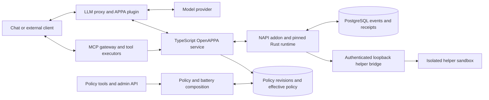
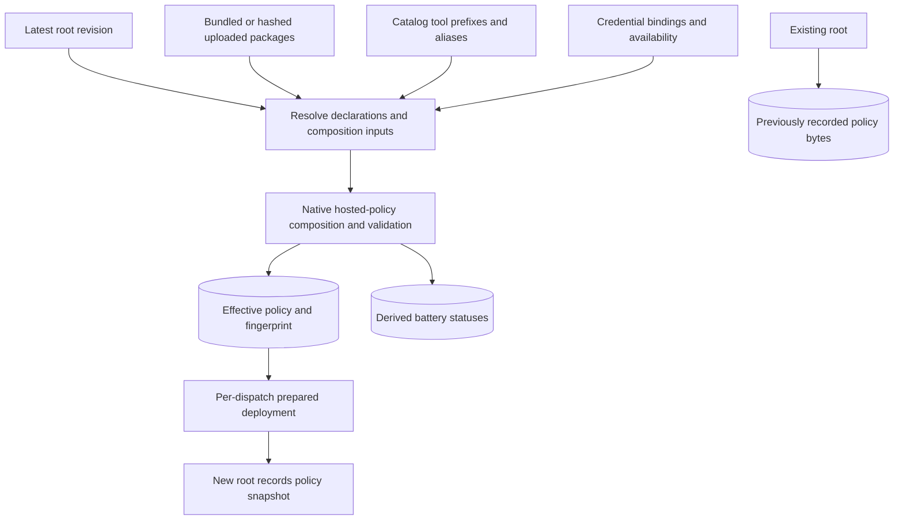
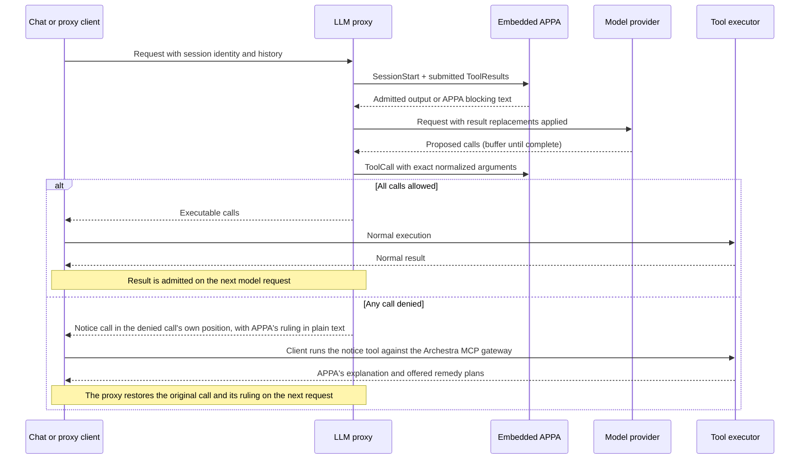

# Archestra × OpenAPPA

OpenAPPA evaluates tool calls and tool results at the LLM proxy. The proxy detects session identity from client headers or an explicit `X-Appa-Session-ID`. External client sessions are scoped to the authenticated credential (`user:<id>`, `app:<id>`, or `virtual-key:<id>`). This prevents callers from accessing another user's session by guessing its ID. Two MCP tools manage remedies: `archestra__get_remedy_plans` and `archestra__execute_remedy_plan`.

Session state is keyed by session ID. Internal requests over loopback use shared session IDs. Chat requests require an authenticated user who owns the conversation. External requests require platform credentials. Uncredentialed loopback is the platform trust boundary. Requests without a session header share a fallback session per credential and agent (`<caller-id>@<agent-id>`), which couples their policy history and offer lifetimes.

```mermaid
flowchart LR
  Client[Chat or external client] <--> Proxy[LLM proxy and APPA plugin]
  Proxy <--> Provider[Model provider]
  Client <--> Gateway[MCP gateway and tool executors]
  Proxy <--> Host[TypeScript OpenAPPA service]
  Gateway --> Host
  Host <--> Native[NAPI addon and pinned Rust runtime]
  Native <--> Ledger[(PostgreSQL events and receipts)]
  Admin[Policy tools and admin API] --> Composer[Policy and battery composition]
  Composer <--> PolicyDB[(Policy revisions and effective policy)]
  Host --> PolicyDB
  Native --> Bridge[Authenticated loopback helper bridge]
  Bridge --> Sandbox[Isolated helper sandbox]
```

## Startup configuration

OpenAPPA follows the `ARCHESTRA_BETA` master switch and has no flag of its own. `ARCHESTRA_BETA=true` enables the OpenAPPA UI, registers the proxy plugin, and mounts the policy API.
The **Enable Guardrails v2** switch on `/openappa` controls APPA enforcement across every organization and agent in the deployment. It defaults to off and is stored in the database (`guardrails_deployment.enabled`). Both the server flag and this shared switch must be on for APPA to enforce policies. Each request reads the shared switch, so replicas do not rely on a process-local setting.
Policy editing and GitHub sync remain available while enforcement is off. The plugin list alone does not activate them.
The OpenAPPA editor stores organization policy revisions in PostgreSQL. Restart the backend when changing `ARCHESTRA_BETA`; toggling the database switch requires no restart.

Existing invocation guardrails always remain active. When APPA is enabled, rewritten tool calls pass existing invocation checks before APPA reserves them. An unconditional block or approval rule still fires.

The server flag hands the trusted-data decision over rather than layering it. With `ARCHESTRA_BETA=true`, the pre-APPA trusted-data guardrail stands down: it marks no tool result untrusted, runs no dual-LLM sanitization, reports no sensitive-context boundary, and an agent's own "consider context untrusted" setting stops applying on the proxy. Every proxied request then reads as trusted context, so an existing invocation policy that only restricts untrusted context no longer fires on the proxy. Note that the flag alone enforces nothing on the APPA side: until the deployment switch is also on, a deployment with the flag set has neither guardrail judging context trust. The MCP gateway independently uses `!agent.considerContextUntrusted` for its invocation checks.

The legacy Guardrails page, Security settings tab, and navigation entries are hidden when beta is on, and deep links redirect to OpenAPPA. Clearing `ARCHESTRA_BETA` restores both the legacy pages and trusted-data evaluation, with every policy row intact.

| Boundary | Beta off | Beta on, switch off | Both on |
| --- | --- | --- | --- |
| Incoming tool results | Legacy result policies | Stood down (treated as trusted) | APPA admission and saved output |
| Outgoing calls | Legacy invocation policies | Legacy invocation policies | Legacy invocation policies, then APPA decision |
| Denied call | Legacy adapter refusal | Legacy adapter refusal | Notice call carrying APPA ruling and remedies |
| Session header | No APPA wiring | Observes unenforced sessions | Stable conversation identity and trajectory |
| Special MCP tools | Hidden and unavailable | Hidden and unavailable | Notice reading and embedded remedy execution |
| Runtime | Not loaded | Lazy native init, observation only | Lazy native init, call reservation, receipt commits |

The HTTP API and agent read/validate/update tools share validation and revision checks. Edits compile without executing external services. The next dispatch loads the latest saved revision under the native runtime lock. New conversations use it; existing conversations retain their recorded policy snapshot.

The editor accepts `[policy]`, `[server_aliases]`, `[credentials]`, and URL bindings in `[externals]`. The only `include` entries admitted are battery declarations; any other include, local command, or runtime-owned setting is rejected with the line that carries it. Tokens are referenced through `token_env`; policy documents must not contain raw secrets.

Revision `0` is an unsaved starter template (`initialPolicy()` in [`guardrails-policy.ts`](../platform/backend/src/services/guardrails-policy.ts)). It includes the bundled Archestra battery, an Archestra server alias, `internal = ["archestra:members"]`, `context_control = true`, and a local no-op wildcard annotator (`noop`). The wildcard annotator adds no restrictions to uncovered tools. Explicit tool rules take precedence over the wildcard.

Saving revision `1` through MCP local publication can auto-enable enforcement if the caller has `organization:update`. Direct HTTP PUT saves and GitHub imports do not auto-enable. The explicit deployment toggle API checks `organizationSettings:update`.

Tool names match exactly, or as the `*` catch-all. Partial namespace globs do not exist, so a rule named `grain__*` matches nothing. Globs live in argument selectors (`shell(command:*publish*)`). Unmatched tools are refused.

## GitHub policy sync

Open **OpenAPPA** (`/openappa`) and select **Connect GitHub** below the policy editor, or configure it under **Settings → OpenAPPA**. With APPA enabled, organization administrators can choose an `owner/repository`, branch or tag (blank uses the default branch), and a repository-relative TOML file. Public repositories need no credential; private repositories use an existing organization token or GitHub App credential, with `credential:read` permission required to select one.

Saving the source queues the first pull. Choose every 15 minutes, every hour, or once a day; **Sync now** requests an immediate pull. The panel shows the last check, accepted commit, and any error. The scheduler checks for due sources every minute and deduplicates queued/running pulls per organization.

Each pull resolves a commit before downloading the file, limits the policy to 1 MiB of UTF-8, and runs the native policy validator. Accepted changes atomically create an organization policy revision and record source metadata. Unchanged bytes create no additional revision. Failed pulls preserve the active policy; a source edit or disconnect prevents an in-flight stale pull from publishing.

While connected, the policy editor and the Batteries panel are read-only and direct HTTP PUT updates return 409. Calling `update_guardrails_policy` via MCP opens a pull request on the repository instead of saving directly. PR publication requires a GitHub App, `credential:read`, and a synced source commit matching the branch head. A merged PR takes effect on the next scheduled sync pull.

Stopping sync preserves the accepted policy and permits local publication again. Existing conversations retain their opening policy regardless of which path produced a newer revision.

A pull is *held* rather than published when the repository text would drop a battery this deployment declared (only while `declarations_pending_publish` is set, i.e. until the deployment's own declarations have been published once) or would add or rekey a `[credentials]` grant. The sync row stores the held content, its hash, the source commit, and the reasons (`drops_batteries`, `changes_credentials`). To publish held text, call `POST /api/openappa/github-sync/accept-held`. This requires `openappaPolicy:update`, plus `credential:update` when credentials changed.

An invalid download preserves the accepted revision. A failed composition on an accepted revision keeps serving the previous effective policy bytes.

## Batteries

A battery is an OpenAPPA policy package for one provider: a policy file that names tools by their canonical namespace (`mcp/github/get_file_contents`), optional helper scripts the policy consults over the externals protocol, and the `APPA_PROVIDER_*` credentials each helper reads. The addon exposes bundled batteries from the pinned OpenAPPA commit and validates uploaded packages with native marketplace checks: a `command` external is rewritten to the sandbox helper bridge, and a `url` external is refused. The Archestra adapter maps spelled tool names onto canonical identities and back ([`adapter.rs`](../platform/archestra-rs/openappa-rs/src/adapter.rs)).

### Declarations

The organization's policy text owns battery declarations:
- `include`: names bundled batteries (`batteries/<name>/appa.toml`) or uploaded packages (`batteries/<name>@sha256-<64 hex>/appa.toml`).
- `[server_aliases]`: maps battery namespaces to catalog tool prefixes.
- `[credentials]`: maps `APPA_PROVIDER_*` variables to runtime credential keys.

Resolution is exact: bundled names always resolve to bundled packages, and uploads never shadow them. A name may be included once; duplicate includes fail validation. Discovery can recommend newer uploads of the same name, but declared bundled includes stay bundled.

Install rows in `openappa_battery_installs` are a derived read model. Recomposition replaces rows while preserving IDs. Every declared battery is enabled; removing its `include` line deletes the battery. Removing an alias keeps the include and leaves the battery in `server_missing`.

Mutating batteries through API routes rewrites policy text and increments the revision. Routes require `openappaPolicy:update`. Adding or rekeying credentials requires `credential:update`. Installing an MCP catalog does not activate its battery; catalog match suggestions are advisory.

Attaching to a catalog without synced tools, or one with an ambiguous `__` prefix, returns 409. Detaches that do not change declarations also return 409. `DELETE /api/openappa/battery-includes/:name` drops the include and its aliases. A credential variable can have several battery readers; rebinding must not unset a variable another included battery reads.

Unresolved includes produce errors if new, or warnings if unchanged. Catalog batteries held back by missing credentials, missing servers, or naming conflicts compose as empty stubs. Organization-wide annotator batteries compose even when `unrouted` or `missing_credentials`. Calls to a helper with missing credentials return no answer and fail closed.

`GET /api/openappa/policy-declarations` returns declaration details, statuses, helpers, and held pulls for UI panels and MCP inspection tools.

### Statuses

Each derived row carries one status, evaluated in precedence order:
- `unavailable`: entry resolves to no battery, or the name is included twice.
- `missing_credentials`: unbound variable, non-organization credential definition, or missing organization connection. Personal connections are insufficient.
- `naming_conflict`: catalog prefix contains `__` (adapter splits at the last `__`), or multiple catalogs share a prefix.
- `server_missing`: namespace has no alias target, or target names no catalog.
- `unrouted`: organization-wide battery has no rules routing to its annotators.
- `active`: battery is ready and enforcing rules.

A composition error marks rows as `refused`. Stored effective content becomes `accepted ?? previousContent ?? root.content`. `getEffectivePolicy` returns this row without throwing, and the dispatch facade serves `.content` even when `lastError` is set. Retained prior content continues to be served. If the native runtime cannot open those bytes, dispatch fails at execution time. Unchanged errors are cached to avoid repeated work.

A battery can cover multiple catalogs; each catalog row shares the battery status. The oldest install row owns the helper URL.

### Composition

The runtime evaluates the composed *effective policy*, not the raw root text. The composer combines the root revision, declarations, and catalog tool names into alias mappings. Composed text is stored per organization with a fingerprint of its inputs.

Recomposition triggers on policy saves, GitHub imports, battery changes, package uploads, credential updates, catalog renames, tool syncs, and an hourly cron job. Before dispatch, the backend compares the stored root revision with the database and recomposes on mismatch. Concurrent runs coalesce; contention beyond three jittered attempts returns 503.

```mermaid
flowchart TD
  Root[Latest root revision] --> Plan[Resolve declarations and composition inputs]
  Packages[Bundled or hashed uploaded packages] --> Plan
  Catalog[Catalog tool prefixes and aliases] --> Plan
  Credentials[Credential bindings and availability] --> Plan
  Plan --> Native[Native hosted-policy composition and validation]
  Native --> Effective[(Effective policy and fingerprint)]
  Native --> Status[(Derived battery statuses)]
  Effective --> Dispatch[Per-dispatch prepared deployment]
  Dispatch --> NewRoot[New root records policy snapshot]
  OldRoot[Existing root] --> Snapshot[(Previously recorded policy bytes)]
```

Dispatch freshness checks root revisions and the revision-0 starter hash. Declarations and coverage reads also check the fingerprint. A catalog match marked `available` is a discovery suggestion, not an active install.

### Helpers

Helper scripts run inside an isolated sandbox container, never on the backend host. The composer rewrites `command` externals to loopback URLs: `POST /api/openappa/helpers/<installId>/<externalName>`, authenticated by the process bearer `APPA_ARCHESTRA_BRIDGE_TOKEN`. Neither roots nor batteries can use `APPA_ARCHESTRA_*` in `token_env`.

The bridge rejects non-loopback calls and invalid tokens. It mounts battery files read-only under `/skills/<battery>`, sends the request on stdin, injects credentials as sandbox secrets, and reads JSON from stdout. Execution timeout is 4 seconds; wall deadline is 4.5 seconds.

Helper concurrency is capped at `max(1, floor(sandbox maxConcurrent / 2))`. Error responses: 404 for missing helpers, 502 for execution errors, 503 for capacity limits, 504 for timeouts. The runtime treats non-200 responses as no answer, not a policy denial. Because consults hold PostgreSQL connections, slow helpers can exhaust connection pools.

The bundled Archestra audience battery runs in-process without sandbox overhead. Its `members`, `team/<team>`, and `user/<user>` selectors resolve directly against the database.

### Packages and persistence

Uploaded packages are content-addressed: `(organization, content_hash)` is unique and insert-only. Packages support up to 64 files. Manifest names must match package names. Uploading packages with credentials or externals requires `credential:update`. Deleting packages in active use returns 409.

Startup calls `declareExistingInstalls()` in [`declare-installs.ts`](../platform/backend/src/openappa/declare-installs.ts) to backfill declarations for legacy rows. Run it manually with `pnpm --dir backend db:openappa-declare-installs` if startup migration fails.

## Tool calls and results

```mermaid
sequenceDiagram
  participant C as Chat or proxy client
  participant P as LLM proxy
  participant A as Embedded APPA
  participant L as Model provider
  participant T as Tool executor
  C->>P: Request with session identity and history
  P->>A: SessionStart + submitted ToolResults
  A-->>P: Admitted output or APPA blocking text
  P->>L: Request with result replacements applied
  L-->>P: Proposed calls (buffer until complete)
  P->>A: ToolCall with exact normalized arguments
  alt All calls allowed
    P-->>C: Executable calls
    C->>T: Normal execution
    T-->>C: Normal result
    Note over C,P: Result is admitted on the next model request
  else Any call denied
    P-->>C: Notice call in the denied call's own position, with APPA's ruling in plain text
    C->>T: Client runs the notice tool against the Archestra MCP gateway
    T-->>C: APPA's explanation and offered remedy plans
    Note over C,P: The proxy restores the original call and its ruling on the next request
  end
```

The proxy replaces denied calls with `archestra__get_remedy_plans`. The notice retains the original call index and provider ID. Notice arguments pass the target tool name, arguments, and plain-text ruling. The client runs the notice tool, and the model reads offered remedy plans in the same turn.

A `run_tool` dispatch is ruled on as the tool it targets. The runtime receives the target's name and its own `tool_args`, so named rules, annotator bindings, and the wildcard catch-all apply to the tool that executes, not the wrapper. A denial presents the target identity: the notice names the target and carries its arguments, and history restores the target call with the ruling. A released call stays the wrapper the client declared.

On later requests, the proxy restores notice calls back to original tool calls and injects the ruling as their result. Restoration is a stateless pure function of the request body. It requires no database lookup, surviving restarts and replica changes. The runtime withholds results for call IDs it never released.

### Streaming boundary

Tool calls are held until stream completion so the proxy can evaluate the full batch. Stream adapters hold calls by omitting `sseData`. Text streams immediately for parents. Child runs and client compaction buffer the entire response up to 10 MiB (413 on overflow).

On unbuffered streams, adapters that emit chunks containing both text and tool calls (like Gemini, MiniMax, or OpenAI delta content) can release calls before policy validation runs. Responses terminal frames can do the same. Audit your stream adapter before relying on pre-execution guarantees ([`llm-proxy-handler.ts` lines 2823-2837](../platform/backend/src/routes/proxy/llm-proxy-handler.ts#L2823-L2837)).

Provider-hosted tools (like server-side web search) run inside the model provider before Archestra sees them. The proxy can withhold or alter their output, but cannot prevent their execution.

### What reaches the provider

The provider never receives what the proxy writes for the client and the gateway. On forwarded requests, with or without an OpenAPPA session (deployment switch off, bypassed client, delegated run), the proxy:
- restores notices, control calls, and `ask_user` calls on supported wire families;
- removes proxy metadata: notice records, signed JWS offers, execution frames, and `ask_user` offers;
- removes proxy-only parameters from remedy and `ask_user` declarations;
- restores trajectory stamps in text to real provider IDs.

A call is rewritten only when the request's gateway identity resolves it to a platform tool, or when it carries proof that only the proxy writes: a notice record that names its own call, or JWS signed with this deployment's key. The catch-all routes (`/v1/messages/count_tokens` and similar) apply the same cleanup with proof-only matching.

Restoration ensures previous turns remain byte-stable for models that enforce strict cache keys. However, the plugin appends guidance to `system` between turns for active remedies or questions. This can invalidate prefix caches on providers that reject modified system prompts.

Native questions use signed `aq1` IDs (`<prefix>_aq1_<nonce>_<tag>`). These IDs are preserved in conversation history so earlier turns do not change bytes.

Model-facing remedy text states who decides: the organization's policy, and the user when the policy requires approval. It must not tell the model to skip the user or treat a proposed remedy as already authorized.

## Remedies

Two MCP tools handle remedies:
1. `archestra__get_remedy_plans`: returns the ruling and available plans from notice arguments. It runs no code and changes no state.
2. `archestra__execute_remedy_plan`: runs the selected remedy plan through the OpenAPPA runtime.

The gateway advertises only model-written arguments. It strips internal fields (`offers`, `execution`, `protected`, `payload`, `signature`) from the public tool schema. The proxy injects them during dispatch.

The model selects each remedy. The proxy releases the model's `execute_remedy_plan` call to the client for execution.

If a client rejects a remedy call (like a user rejecting a permission prompt), the proxy returns the error to the model with an explanation that the plan was not applied. Any other result without a runtime record remains withheld.

Remedy tokens use flattened JWS with HS256 and unencoded payloads (RFC 7515/7797). They provide integrity, not encryption. Unknown algorithms fail closed. Tokens do not expire because the runtime ledger validates whether an offer is still spendable. Tokens cannot be reused across conversations.

Session receipts belong to authorized users within an organization. A personal offer requires its original user. Spent, unknown, or unauthorized offers return terminal feedback without executing.

Interactive approval uses the client's native question tool or gateway `ask_user` elicitation. The ruling is recorded under the offer's signed session. Approval in a parent session does not authorize a separate child offer.

Review state lives in PostgreSQL Keyv cache with a 10-minute TTL. `consumeHitlRuling` uses `DELETE ... RETURNING` for atomic consumption. Denials take priority over approvals.

The gateway correlates calls using `_meta["com.archestra/logicalToolCallId"]` or the frame's `call_id`, not the JSON-RPC ID. Reusing an ID with different arguments returns 400.

## Identity, child lineage, and peer messages

Adapters match in strict order: Claude Code, Codex, OpenCode, then Chat. An explicit `X-Appa-Session-ID` overrides native extraction. `X-Appa-Parent-ID` overrides native parent claims.

| Client | Match Rule | Session Source | Notes |
| --- | --- | --- | --- |
| Claude Code | User agent or session header | `x-claude-code-session-id`, else `metadata.user_id` | Native `AskUserQuestion`, spawn, and teammate paths. |
| Codex | User agent or turn metadata | `thread_id` from metadata | Contradictory claims return 400. Code mode (`exec`) is refused. |
| OpenCode | User agent or session header | `x-opencode-session` | Gateway tools use `<label>_<name>` without distinct delimiter. |
| Archestra Chat | Internal loopback source | Conversation ID | Validates user ownership. Active encrypted chats return 409. |
| Other | Explicit APPA headers or wire fallback | Header value or wire metadata | Unsupported clients trigger `unsupported_client_action` (default bypass). |

External sessions are scoped as `<caller-id>|<session-id>`. Caller IDs identify `user:`, `app:`, or `virtual-key:` credentials. Platform loopback requests can use unscoped sessions.

Notice restoration and turn accounting run on Anthropic Messages (including Bedrock InvokeModel), OpenAI Responses, and OpenAI Chat Completions. Other protocols evaluate calls and results, but notices stay in history. Deferred tools (`tool_search`), `local_shell`, computer-use tools, and conflicting APPA declarations fail validation immediately.

Allowed child spawns receive signed delegation markers binding caller, organization, and prompt. Child model responses buffer completely before crossing. `endChild` can admit, block, or require a return echo. Parents verify returns against `loadChildReturns` records.

Root forks inherit results only from before the fork timestamp. The engine walks at most 32 ancestor forks; deeper chains inherit nothing.

Sending and reading peer messages are separate operations. Sending saves a message; reading evaluates stored trust and audience rules before delivering content. Senders must target actors in the same family. Peer reads skip the family pending-receipt fence in [`peer.rs`](../platform/archestra-rs/openappa-rs/src/peer.rs#L95-L115). Unenforced teammates cannot read governed messages.

## Persistence and current limits

The Rust binding stores event batches, content-addressed policy snapshots, sessions, operations, and receipts in PostgreSQL.

Execution follows three steps under a family advisory lock: insert pending receipt, run native hook and append events, and mark receipt complete. A crash after event commit leaves a pending receipt, which fails future operations closed across the family (except peer reads).

Completed receipts return saved decisions without re-evaluating the engine. Changed arguments on reused IDs are refused. The event log enforces sequence ordering using transaction advisory locks.

The host acquires an in-process root lock before leasing a database connection. A PostgreSQL advisory lock (`pg_advisory_lock`) serializes the family across instances. Roots can run concurrently; siblings in a root run sequentially.

The connection pool defaults to 4 connections (max 64). Calls wait up to 30s for a connection. Connections use 30s lock timeouts and 60s statement timeouts. Pool exhaustion usually comes from slow external consults. Dead connections are replaced automatically. Changing pool size requires a backend restart.

Permissions use `openappaPolicy`, `openappaDiagnostics`, and `organizationSettings`. Older `toolPolicy` permissions are deprecated.

| Endpoint | Role | Permission |
| --- | --- | --- |
| `GET /api/guardrails-policy` | Read current policy revision and content. | `openappaPolicy:read` |
| `PUT /api/guardrails-policy` | Save full policy text with expected revision. | `openappaPolicy:update` (+ `credential:update` if grants change) |
| `POST /api/guardrails-policy/validate` | Validate policy text without saving. | `openappaPolicy:update` |
| `GET /api/guardrails-deployment` | Read deployment enforcement status. | `organizationSettings:read` |
| `PUT /api/guardrails-deployment` | Toggle enforcement or set unsupported client action. | `organizationSettings:update` |
| `/api/openappa/batteries/*` | Inspect and manage batteries, packages, and aliases. | `openappaPolicy:read` / `update` |
| `/api/openappa/github-sync/*` | Configure sync, inspect commits, accept held pulls. | `organizationSettings:read` / `update` (accept: `policy:update`) |
| `GET /api/openappa/coverage/*` | View static tool coverage summary. | `openappaPolicy:read` |
| `GET /api/openappa/external-consults` | View helper consult logs. | `openappaDiagnostics:read` (`admin` views all users) |
| `/api/openappa/yells/*` | View diagnostic reports and download archives. | `openappaDiagnostics:read` / `update` |
| `GET /api/chat/conversations/:id/openappa-status` | Read chat conversation governance status. | `chat:read` |

Start new conversations after enabling OpenAPPA. Tool results from before activation have no receipts and are refused.

There is no automated cleanup API for pending receipts. Do not delete pending rows or truncate tables; investigate the cause and check external effects first. `pnpm --dir backend db:reset-openappa` is a development utility that wipes organization policy data; never use it to repair stuck sessions.

## Build and deployment

The addon is compiled alongside Archestra's existing native addons and packaged inside the normal platform image. Cargo fetches OpenAPPA at the commit pinned in `openappa-rs/Cargo.toml` (`c7c1e1ef36aa07604b421c48be266d7397557656`) and `archestra-rs/Cargo.lock`. Archestra's existing release workflow stays unchanged. There is no separate addon release.

| Setting | Default | Notes |
| --- | --- | --- |
| `ARCHESTRA_BETA` | `false` | Enables OpenAPPA when set to `"true"`. Requires restart. |
| `ARCHESTRA_LLM_PROXY_PLUGINS` | Empty | Automatically appends `appa` when beta is enabled. |
| `guardrails_deployment.enabled` | `false` | Database row switch. Effective immediately without restart. |
| `guardrails_deployment.unsupported_client_action` | `bypass` | Action for unknown clients (`bypass` or `block`). |
| `ARCHESTRA_OPENAPPA_OFFER_SIGNING_SECRET` | Auto-derived | Secret for signing offers and tokens. Min 32 chars if explicit. |
| `ARCHESTRA_OPENAPPA_POSTGRES_MAX_CONNECTIONS` | `4` | Max native pool connections (cap 64). Requires restart. |
| `ARCHESTRA_OPENAPPA_YELL_ENABLED` | `true` | Enables yell diagnostic reporting when beta is on. |
| `ARCHESTRA_ANALYTICS` | `enabled` | Controls forwarding of yell archives to cloud receiver. |
| `ARCHESTRA_DATABASE_URL` | None | Database connection string. Strips `schema` parameter on init. |
| `ARCHESTRA_CODE_RUNTIME_ENABLED` | `false` | Required for sandbox helper script execution. |

Helm manages `offer-signing-secret` inside the auth Secret. Never delete the auth Secret to rotate tokens. Rotate secrets intentionally across all pods, then restart them. Existing signed tokens will invalidate.

Native PostgreSQL TLS uses system certificates and URL parameters. The addon does not support custom CA flags.
