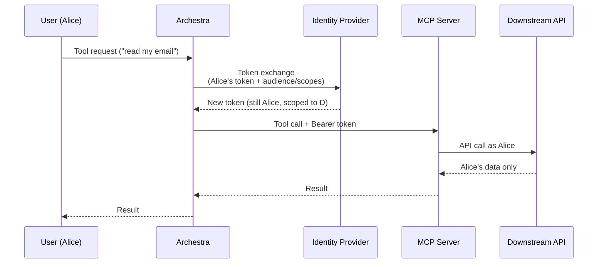

<!-- Renaming/deleting this file? Add a redirect in docs/redirects.json. -->

Enterprise-Managed Auth exchanges a user's identity-provider token for a downstream API token. MCP tools then call that API with the user's identity and permissions.

> **Enterprise feature** — see [Pricing Model](/docs/get-started/pricing-model).

## How Token Exchange Works

A shared service-account secret makes every user's downstream call arrive as the same account. Audit logs cannot attribute the call to the user, and the downstream system cannot apply that user's own permissions.

Enterprise-Managed Auth exchanges the user's identity-provider token at call time. Archestra hands the user's token back to the IdP and requests a new token scoped to the API the tool needs. The downstream call carries the user's identity, so the downstream system enforces that user's permissions and the audit trail records the user.

## Strategies

Choose a strategy supported by your identity provider and downstream API.

| Strategy | What it does | Best for | Setup guide |
| --- | --- | --- | --- |
| **Microsoft Entra OBO** | Exchanges the user's Entra access token for a Graph (or other Entra-protected API) token | Microsoft 365 environments — Outlook, Teams, SharePoint, OneDrive, your own Entra-protected APIs | [Microsoft Entra ID SSO + OBO](/docs/admin/identity/entra-obo) |
| **Okta-managed token exchange** | Exchanges the user's Okta ID token for a downstream API token, signing the request with `private_key_jwt` | Okta tenants and Okta-fronted APIs | [Okta SSO + Token Exchange](/docs/admin/identity/okta) |
| **RFC 8693 token exchange** | Generic OAuth 2.0 token exchange ([RFC 8693](https://datatracker.ietf.org/doc/html/rfc8693)) | Keycloak, Auth0 actions, custom OIDC providers that expose a token-exchange endpoint | This page (default for any non-Okta, non-Entra OIDC issuer) |
| **ID-JAG / Cross-App Access (XAA)** | Identity Assertion Authorization Grant — your IdP issues a signed assertion that a *third-party* app can swap for that app's token | Cross-app integrations where an external SaaS accepts ID-JAG (for example [motd.xaa.rocks](https://motd.xaa.rocks)) | This page |

The provider form selects a strategy from the issuer URL. Override it when your provider requires a different exchange.

## Configuration

To use Enterprise-Managed Auth on a given MCP server, configure three places:

1. **Identity Provider** — In **Settings > Identity Providers**, open the OIDC provider and complete the **Enterprise-Managed Credentials** section. The main fields are **Exchange Client ID**, **Exchange Client Secret**, **Exchange Token Endpoint**, **Exchange Client Authentication**, and **User Token To Exchange**.
2. **MCP catalog item** — In the server's **Multitenant Authorization** settings, choose **Identity Provider Token Exchange**. Set the **Requested Credential**, **Injection Mode**, and the **Managed Resource Identifier** for the downstream API.
3. **Tool assignment** — Assign the tool with **Resolve at call time** so Archestra resolves the downstream credential for the caller every time the tool runs.

Per-provider pages walk through each of these steps with concrete field values for that provider.

## Linked Downstream IdPs

Users can sign in with one provider while a tool uses another. Configure the downstream provider in **Settings → Identity Providers** and turn off **Use for Single Sign-On**. Its role mapping and team sync do not run when it is used only for downstream authentication.

If the user has no usable linked token, the tool returns an SSO link. Completing that flow links the downstream account to the current Archestra user and returns them to the chat to retry. Installation can request the same link before discovering tools. The downstream email need not match the primary email.

Request `openid`, `profile`, and `email` for linking. Add `offline_access` if the provider supports refresh tokens. For Entra OBO, also request the delegated scope exposed by the Archestra app, such as `api://<archestra-client-id>/access_as_user`. This makes Archestra the access token's audience.

Configure downstream permissions on each MCP catalog item, not in the IdP login scopes. For Entra, set **Managed Resource Identifier** to `https://graph.microsoft.com` or your API's `api://<client-id>`. Archestra requests that resource's `/.default` permissions, which must already be delegated and consented in Entra.

If linking succeeds but Entra exchange fails with `AADSTS50013`, check the access token audience. A Graph-audience token cannot serve as the OBO assertion. Add Archestra's exposed delegated scope, then reconnect the downstream provider; refreshing the old token preserves its audience.

## ID-JAG and Cross-App Access

ID-JAG lets a downstream application exchange an identity-provider assertion for its own access token. Both the identity provider and downstream resource must support this flow.

1. Configure the provider to issue ID-JAG assertions for the downstream application's audience.
2. In the MCP catalog item, choose **ID-JAG** as **Requested Credential** and enter **Managed Resource Identifier**.
3. Set the protected-resource token endpoint audience and client credentials when required by the resource.
4. Run a tool as a linked user and confirm the downstream application authorizes that user's request.

## Credential Fields

The Enterprise-Managed Credentials form on each OIDC provider has these fields:

| Field | What it is |
| --- | --- |
| **Exchange Client ID** | The OAuth client Archestra uses when calling the IdP's token-exchange endpoint. Defaults to the main OIDC client ID. |
| **Exchange Client Secret** | The matching secret. Only used when client authentication is `client_secret_post` or `client_secret_basic`. |
| **Exchange Token Endpoint** | The IdP's token endpoint. For Entra: `https://login.microsoftonline.com/<TENANT_ID>/oauth2/v2.0/token`. For Okta: `https://<your-org>.okta.com/oauth2/v1/token`. |
| **Exchange Client Authentication** | How Archestra authenticates to the token endpoint. Options: `Private key JWT` (Okta default), `Client secret POST` (Entra OBO and RFC 8693 default), `Client secret Basic`. |
| **Private Key PEM** | PKCS#8 private key matching the registered public key. Required for `private_key_jwt`. |
| **Signing Key ID** | The `kid` of the public key registered with the IdP. Only used with `private_key_jwt`. |
| **Client Assertion Audience** | Optional override for the `aud` claim of the client assertion. Defaults to the exchange token endpoint. |
| **User Token To Exchange** | Which token Archestra should hand back to the IdP for exchange. `Access token` (Entra default), `ID token` (Okta default), or generic `JWT`. |

For OAuth protected resources that accept ID-JAG, the MCP catalog item can also override the resource app's client ID and secret. Use these overrides when the requesting app registered with the IdP is different from the client that authenticates to the resource authorization server.

### Strategy Defaults

When the strategy is inferred from the issuer URL, Archestra pre-fills defaults:

| Strategy | Client authentication | User token type |
| --- | --- | --- |
| **Microsoft Entra OBO** | Client secret POST | Access token |
| **Okta-managed** | Private key JWT | ID token |
| **RFC 8693** | Client secret POST | Access token |

You can override any of these in the form.

## Limitations

- Per-user identity required. Token exchange only works when Archestra knows which user is calling. Gateway auth methods that carry per-user identity work: **Identity Provider JWT / JWKS**, **OAuth 2.1**, and personal user bearer tokens. Team and organization bearer tokens do not — they don't resolve to a single user.
- HTTP transport only for local MCP servers. Per-request token exchange and injection require the **streamable-http** transport. Local **stdio** MCP servers cannot do this — Archestra has no way to inject a fresh per-call header into a stdio process.
- The user must have a linked IdP session. OAuth 2.1 gateway auth works when the authenticated Archestra user has a usable token for the IdP configured on the tool. This can be the same provider used for Archestra login, or a linked downstream provider used only for downstream MCP auth. JWKS-based gateway auth can use the incoming JWT directly when the gateway IdP and tool IdP match.
- SAML providers are not supported. Token exchange is OIDC-only. SAML doesn't have an equivalent flow.
