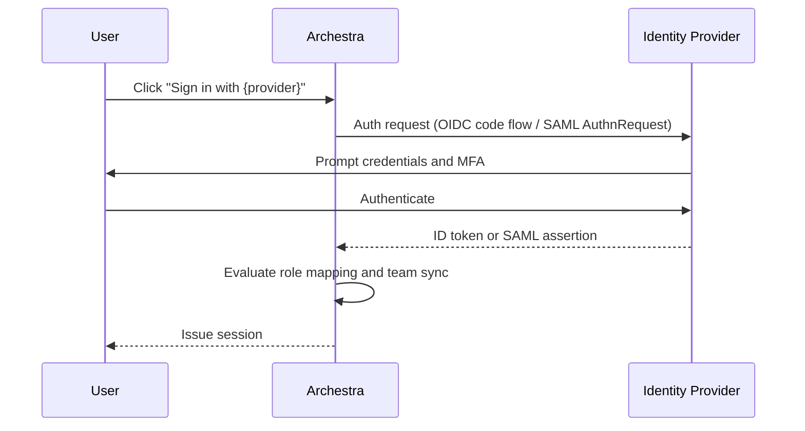

<!-- Renaming/deleting this file? Add a redirect in docs/redirects.json. -->

Sign users in to Archestra with their workplace identity provider (IdP) and manage access permissions directly from your directory.

Single Sign-On (SSO) automates onboarding: users authenticate through your IdP, and Archestra provisions accounts and assigns roles and team memberships from directory claims.

Identity providers are an enterprise feature. See [Pricing Model](/docs/get-started/pricing-model).

## Supported Protocols

Archestra supports two SSO protocols:

- **OIDC (OpenID Connect):** Modern OAuth 2.0 + OIDC for Microsoft Entra ID, Okta, Google, GitHub, GitLab, Auth0, and Keycloak.
- **SAML 2.0:** Legacy enterprise identity providers that require SAML assertions.

## Callback URLs

Configure the callback URL in your identity provider before enabling SSO in Archestra. The `{ProviderId}` path segment is case-sensitive and must match the Archestra provider ID (`Okta`, `EntraID`, `Google`, `GitHub`, `GitLab`, or your custom ID).

| Protocol | Production Callback URL | Local Development URL |
| --- | --- | --- |
| **OIDC** | `https://<domain>/api/auth/sso/callback/{ProviderId}` | `http://localhost:3000/api/auth/sso/callback/{ProviderId}` |
| **SAML (ACS URL)** | `https://<domain>/api/auth/sso/saml2/sp/acs/{ProviderId}` | `http://localhost:3000/api/auth/sso/saml2/sp/acs/{ProviderId}` |

## Sign-In Boundaries

Limit which accounts can sign in through an identity provider:

- **Allowed Email Domains:** Enter comma-separated domains (such as `company.com, subsidiary.com`). Subdomains match automatically (`eng.company.com` matches `company.com`).
- **Downstream-only providers:** Uncheck **Use for Single Sign-On** to use a provider solely for MCP tool token exchange. The provider remains hidden from the sign-in screen, and its role mapping rules never apply.

## Role Mapping

Map directory attributes and groups to Archestra roles at each sign-in using [Handlebars](https://handlebarsjs.com/) templates.

When a user signs in, Archestra tests the token claims against your mapping rules in order. The first rule whose template returns a non-empty string assigns its roles.

1. In **Settings → Identity Providers**, edit your provider and select **Role Mapping**.
2. Add one or more **Mapping Rules** with a template and target roles.
3. Set **Default Roles** for new users who match no rule.
4. Optional: Turn on **Strict Mode** to block sign-in for users who match no rule.
5. Optional: Turn on **Skip Role Sync** to evaluate roles only on first sign-in, leaving subsequent role changes to manual administration.

### Template Helpers

| Helper | Purpose | Example |
| --- | --- | --- |
| `includes` | Check if an array contains a value (case-insensitive) | `{{#includes groups "admins"}}true{{/includes}}` |
| `equals` | String equality check | `{{#equals role "admin"}}true{{/equals}}` |
| `and` / `or` | Boolean logic | `{{#and dept title}}{{#equals dept "IT"}}true{{/equals}}{{/and}}` |
| `json` | Parse JSON string or serialize value | `{{#with (json roles)}}{{#each this}}{{#equals this.name "admin"}}true{{/equals}}{{/each}}{{/with}}` |

For OIDC providers, ensure the ID token includes the groups claim. Many providers omit groups unless the `groups` scope is requested during authorization.

## Team Sync

Automatically add and remove users from Archestra teams based on directory group memberships.

Sync creates direct membership in the mapped team, while preserving members added manually in Archestra.

1. In the provider's **Team Sync** tab, verify **Enable Team Sync** is on.
2. If your IdP uses custom group claim paths, set **Groups Handlebars Template** (e.g. `{{#each groups}}{{this}},{{/each}}`). Otherwise, Archestra checks `groups`, `group`, `memberOf`, `roles`, and `teams` in order.
3. Go to **Settings → Teams**, click **Edit** on target team, and open **External Group Sync**.
4. Enter the external group identifier (such as an Entra group object ID or Okta group name) and click **Add**.

## Enforcing SSO

Lock down authentication to your identity provider once SSO sign-in is tested and verified:

1. **Disable password sign-in:** Set [`ARCHESTRA_AUTH_DISABLE_BASIC_AUTH=true`](/docs/reference/configuration#ARCHESTRA_AUTH_DISABLE_BASIC_AUTH) in the backend environment and restart. This hides the email/password form and requires SSO.
2. **Disable invitations:** Set [`ARCHESTRA_AUTH_DISABLE_INVITATIONS=true`](/docs/reference/configuration#ARCHESTRA_AUTH_DISABLE_INVITATIONS) to disable manual user invite workflows.

If SSO fails while password authentication is disabled, recover via the command line with [Account Security](/docs/admin/identity/account-security#reset-a-password-from-the-cli).

## Troubleshooting

| Symptom | Cause | Fix |
| --- | --- | --- |
| `state_mismatch` | Cookies blocked or mismatched callback URL | Enable browser third-party cookies and verify the IdP redirect URI matches the case-sensitive `{ProviderId}`. |
| `account not linked` | Mismatched or unverified email | Confirm the user signs in with the email address registered on Archestra, and verify the email in the IdP. |
| `account_not_found` (SAML) | Missing user attributes | Configure your SAML IdP to include `NameID` in `emailAddress` format, plus `email`, `firstName`, and `lastName`. |
| `signature_validation_failed` | Expired or rotated SAML certificate | Re-download your IdP SAML metadata and update the certificate in Archestra. |
| User missing team membership | Group claim omitted or identifier typo | Confirm the IdP sends the group claim in the ID token and that the group name in **Settings → Teams** matches verbatim. |
