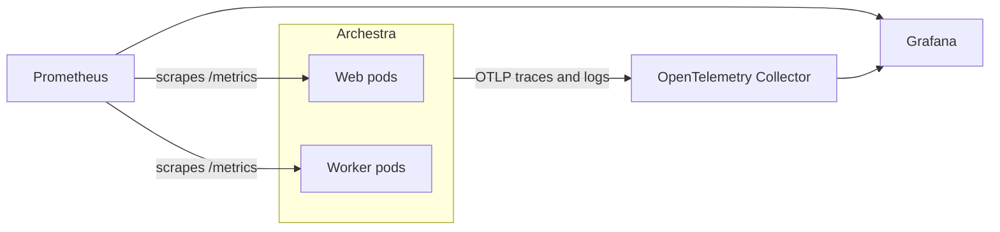

<!-- Renaming/deleting this file? Add a redirect in docs/redirects.json. -->

Archestra exports telemetry to your own monitoring stack: Prometheus metrics, OpenTelemetry traces and logs, and product-usage events from the web UI. The telemetry covers LLM cost, latency, and tokens per agent and model, every tool call, and the health of background jobs. For per-request records inside the product, use [LLM Proxy logs](/docs/llm-proxy) and [Costs and Limits](/docs/llm-proxy/costs-and-limits) instead.

| Signal | Protocol | How Archestra Sends It | Turned On By |
| --- | --- | --- | --- |
| [Metrics](/docs/admin/observability/metrics) | Prometheus (OpenMetrics) | Your Prometheus scrapes a `/metrics` endpoint | Always on |
| [Traces and logs](/docs/admin/observability/tracing) | OTLP over HTTP | Archestra pushes to your OpenTelemetry collector | [`ARCHESTRA_OTEL_EXPORTER_OTLP_ENDPOINT`](/docs/reference/configuration#ARCHESTRA_OTEL_EXPORTER_OTLP_ENDPOINT) |
| [Real User Monitoring](/docs/admin/observability/real-user-monitoring) | OTLP over HTTP (logs) | Archestra forwards browser events to your collector | [`ARCHESTRA_RUM_EXPORTER_OTLP_ENDPOINT`](/docs/reference/configuration#ARCHESTRA_RUM_EXPORTER_OTLP_ENDPOINT) (Enterprise) |



## Metrics

Each Archestra process serves Prometheus metrics. Scrape both kinds of pods:

- **Web pods:** `http://<pod>:9050/metrics`. Change the port with [`ARCHESTRA_METRICS_PORT`](/docs/reference/configuration#ARCHESTRA_METRICS_PORT).
- **Worker pods:** `http://<pod>:9000/metrics`. The Helm chart runs a separate worker Deployment by default. Knowledge Base sync and task queue metrics come only from worker pods.

The endpoint is open by default. Set [`ARCHESTRA_METRICS_SECRET`](/docs/reference/configuration#ARCHESTRA_METRICS_SECRET) to require `Authorization: Bearer <secret>` on every scrape. To check the endpoint, run `curl -s http://<pod>:9050/metrics | grep "# HELP llm_tokens_total"`. It prints the metric's description line.

## Distributed Tracing

Point Archestra at an OpenTelemetry collector that accepts OTLP over HTTP:

```bash
ARCHESTRA_OTEL_EXPORTER_OTLP_ENDPOINT=http://otel-collector:4318
```

Archestra sends traces to `/v1/traces` and backend logs to `/v1/logs` under the service name `Archestra`. Every LLM call, MCP tool call, and agent run becomes a span, tagged with the agent, user, team, model, token counts, and cost. Prompts and tool results are captured as span events unless you turn content capture off.

## Real User Monitoring

[Real User Monitoring](/docs/admin/observability/real-user-monitoring) exports how people use the web UI — sessions, page views, feature use, and page performance — as OTLP log records. It never sends chat content or personal data. It is an Enterprise feature. Turn it on by setting [`ARCHESTRA_RUM_EXPORTER_OTLP_ENDPOINT`](/docs/reference/configuration#ARCHESTRA_RUM_EXPORTER_OTLP_ENDPOINT) to your collector.

## Grafana Dashboards

Archestra publishes five [Grafana dashboards](/docs/admin/observability/grafana-dashboards). They cover LLM usage and cost, MCP tool calls, agent sessions, application health, and Knowledge Base operations. With a Grafana service account token, one command installs them:

```bash
GRAFANA_URL=https://grafana.example.com GRAFANA_TOKEN=glsa_xxx \
  bash <(curl -sL https://raw.githubusercontent.com/archestra-ai/archestra/main/platform/dev/grafana/install-dashboards.sh)
```

The dashboards appear under **Dashboards → Archestra** in Grafana.
