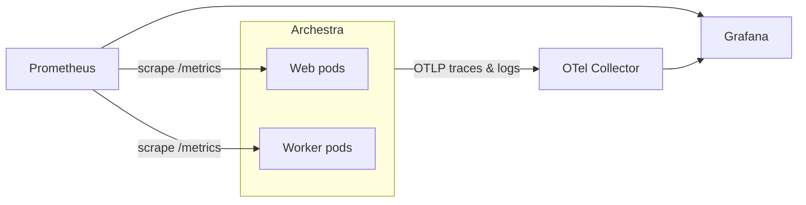

<!-- Renaming/deleting this file? Add a redirect in docs/redirects.json. -->

Export production telemetry to your existing monitoring stack: Prometheus metrics, OpenTelemetry distributed traces and logs, and web UI user sessions.

Archestra tracks model token usage, latency, execution costs, tool call failures, and background worker queues across every agent run.

| Signal | Protocol | Destination | Configuration |
| --- | --- | --- | --- |
| [Metrics](/docs/admin/observability/metrics) | Prometheus | Scraped from `/metrics` | Enabled by default |
| [Traces and Logs](/docs/admin/observability/tracing) | OTLP HTTP | Pushed to OpenTelemetry collector | [`ARCHESTRA_OTEL_EXPORTER_OTLP_ENDPOINT`](/docs/reference/configuration#ARCHESTRA_OTEL_EXPORTER_OTLP_ENDPOINT) |
| Real User Monitoring | OTLP HTTP | Browser events forwarded to collector | [`ARCHESTRA_RUM_EXPORTER_OTLP_ENDPOINT`](/docs/reference/configuration#ARCHESTRA_RUM_EXPORTER_OTLP_ENDPOINT) (Enterprise) |



## Scraping Prometheus Metrics

Each Archestra process serves Prometheus metrics on a dedicated port:

- **Web pods:** `http://<pod>:9050/metrics`. Port configurable with [`ARCHESTRA_METRICS_PORT`](/docs/reference/configuration#ARCHESTRA_METRICS_PORT).
- **Worker pods:** `http://<pod>:9000/metrics`. Knowledge sync and background queue metrics emit from worker pods.

To require authentication on metric scrapes, set [`ARCHESTRA_METRICS_SECRET`](/docs/reference/configuration#ARCHESTRA_METRICS_SECRET) to require an `Authorization: Bearer <secret>` header. See the full list in the [Metrics Reference](/docs/admin/observability/metrics).

## Distributed Tracing and Logs

Export distributed spans and structured logs to any OpenTelemetry collector:

```bash
ARCHESTRA_OTEL_EXPORTER_OTLP_ENDPOINT=http://otel-collector:4318
```

Archestra pushes traces to `/v1/traces` and backend logs to `/v1/logs` under service name `Archestra`. Every LLM generation and tool call forms a span containing model names, token counts, costs, and caller identity. See [Tracing](/docs/admin/observability/tracing).

## Grafana Dashboards

<span id="grafana-dashboards"></span>

Archestra publishes five prebuilt Grafana dashboards covering LLM consumption, tool executions, agent sessions, and platform health.

| Dashboard | Key Visualizations | Data Sources |
| --- | --- | --- |
| GenAI Observability | Token rates, request costs, latency, active models | Prometheus, Tempo |
| MCP Monitoring | Tool call rates, error counts, execution duration | Prometheus, Tempo |
| Agent Sessions | Individual session timeline, tool invocations, span logs | Prometheus, Tempo, Loki |
| Application Metrics | HTTP throughput, Node.js memory, event loop lag, DB pool | Prometheus |
| Knowledge Base Operations | Connector sync duration, document indexing, embeddings | Prometheus |

### Installing Dashboards

Import dashboards into Grafana using a service account token with editor permissions:

```bash
GRAFANA_URL=https://grafana.example.com GRAFANA_TOKEN=glsa_xxx \
  bash <(curl -sL https://raw.githubusercontent.com/archestra-ai/archestra/main/platform/dev/grafana/install-dashboards.sh)
```

<span id="exemplars"></span>

For external databases, specify the PostgreSQL exporter provider with `--postgres-provider otel` (or `cloudsql`, `azure`). To link metric spikes directly to Tempo traces, enable Prometheus exemplars with `--enable-feature=exemplar-storage`.

## Real User Monitoring (RUM)

<span id="real-user-monitoring"></span>

Export frontend user session activity, page load timings, and feature usage to your collector as OTLP log records.

RUM is an enterprise feature. See [Pricing Model](/docs/get-started/pricing-model).

1. Set the collector endpoint in your environment:
   ```bash
   ARCHESTRA_RUM_EXPORTER_OTLP_ENDPOINT=http://otel-collector:4318
   ```
2. If your collector requires authentication, set [`ARCHESTRA_RUM_EXPORTER_OTLP_AUTH_BEARER`](/docs/reference/configuration#ARCHESTRA_RUM_EXPORTER_OTLP_AUTH_BEARER), or both [`ARCHESTRA_RUM_EXPORTER_OTLP_AUTH_USERNAME`](/docs/reference/configuration#ARCHESTRA_RUM_EXPORTER_OTLP_AUTH_USERNAME) and [`ARCHESTRA_RUM_EXPORTER_OTLP_AUTH_PASSWORD`](/docs/reference/configuration#ARCHESTRA_RUM_EXPORTER_OTLP_AUTH_PASSWORD).
3. Restart the backend to initialize the telemetry pipeline.

Browser events route securely through the Archestra backend and arrive at your collector under the service name `Archestra Web`. Events never contain prompt text, messages, email addresses, or secrets.

Control ingest volume with [`ARCHESTRA_RUM_SAMPLE_RATE`](/docs/reference/configuration#ARCHESTRA_RUM_SAMPLE_RATE) (0.0 to 1.0) and [`ARCHESTRA_RUM_INGEST_MAX_BATCHES_PER_MINUTE`](/docs/reference/configuration#ARCHESTRA_RUM_INGEST_MAX_BATCHES_PER_MINUTE).
