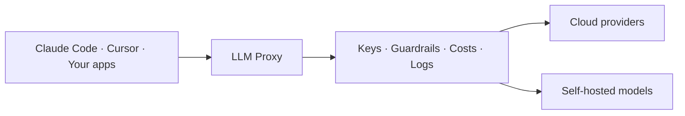

<!-- Renaming/deleting this file? Add a redirect in docs/redirects.json. -->

See every model call your company makes: who made it, which model, what it cost, and what the model tried to do. A developer's Claude Code session, a support bot, and a nightly job show in one log. Each has its cost, per person.

The LLM Proxy sits between your clients and your model providers. Clients keep their usual API. Archestra adds:

- Guardrails on every tool call the model asks for. Archestra blocks the calls your policy does not allow. See [Guardrails](/docs/agents/guardrails).
- No provider keys in your apps. An app gets a [virtual key](/docs/llm-proxy/authentication#standard-virtual-keys). Archestra holds the real key, and you can revoke one app's access alone.
- One URL for every provider. The [Model Router](/docs/llm-proxy/model-router) sends `anthropic:claude-sonnet-4-6` to Anthropic and `openai:gpt-5.4` to OpenAI.
- Cost per person, team, and app, with budgets that block requests when spend reaches them. Claude and ChatGPT subscription traffic shows separately, at $0 billed. See [Costs & Limits](/docs/llm-proxy/costs-and-limits).
- A log of every request, with the model, the caller, tokens, and cost. See [Logs and Auditing](/docs/admin/logs).

## Start Using It

An app or agent uses the proxy when you change two things: its base URL and its API key. Its code stays the same.

- **Coding agents:** set up Claude Code, Codex, Cursor, or another agent through [Connect](/docs/get-started/connect). Connect sets both for you. The agent keeps your own subscription or key.
- **Your own app:**
  1. Go to **LLM Proxy** and copy the URL for your provider.
  2. Create a credential for the app. For most apps, this is a [standard virtual key](/docs/llm-proxy/authentication#standard-virtual-keys).
  3. Put the URL and the credential where the app expects the provider's base URL and API key.
  4. Send a request, and check that it shows in the [logs](/docs/admin/logs).

## Label Requests

Add headers to group requests by app, run, or session in logs and costs. Headers are labels only. They do not prove who the caller is.

| Header | Groups requests by | Example |
| --- | --- | --- |
| `X-Archestra-Agent-Id` | The calling app | `workflow-service` |
| `X-Archestra-User-Id` | The Archestra user, by user ID | A member's user ID |
| `X-Archestra-Session-Id` | Session | `research-123` |
| `X-Archestra-Run-Id` | Run, for metrics | `run-456` |
| `X-Archestra-Meta` | All three, as `<agent-id>/<run-id>/<session-id>` | `workflow-service/run-456/research-123` |

In `X-Archestra-Meta`, a segment can be empty, but no value can contain `/`. A single header wins over the same value in `X-Archestra-Meta`.

To tie a request to a person for certain, use a credential that names them. See [Attribution in Logs](/docs/llm-proxy/authentication#attribution-in-logs).

For Guardrails, send a session ID too. Claude Code, Codex CLI, and OpenCode send it by themselves. Any other client adds `X-Appa-Session-ID`. See [Session Headers](/docs/agents/guardrails/clients#session-headers).

## What to Know

- Add your providers first. The proxy uses the keys and subscriptions on **Model Providers**. See [Model Providers](/docs/llm-proxy/providers).
- Self-hosted models work too, such as Ollama, vLLM, or any OpenAI-compatible server. See [supported providers](/docs/llm-proxy/providers#supported-providers).
