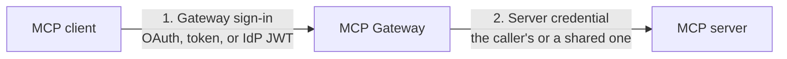

<!-- Renaming/deleting this file? Add a redirect in docs/redirects.json. -->

Sign in to Archestra once, and every tool call runs as you, in every app. Ask Claude Code to file a Jira ticket and comment on a GitHub pull request. With your own accounts installed, Jira and GitHub both show your name. You never pasted a token into Claude Code.

Every MCP server signs in its own way, and most clients cannot do it for a whole team. Archestra does it for them:

- One sign-in for the client. Coding agents sign in through the browser. Scripts, apps, and your identity provider have their own ways. See [Gateway Sign-In](/docs/mcp/authentication/gateway).
- The right account for each call. The person's own, a shared bot account, or their company identity, exchanged at call time. See [Server Credentials](/docs/mcp/authentication/servers).
- Credentials stay in Archestra. It stores them, and refreshes OAuth tokens when the provider allows it. Clients never see them.
- Every call is traceable. The [MCP Gateway logs](/docs/admin/logs) show which account each call used.

