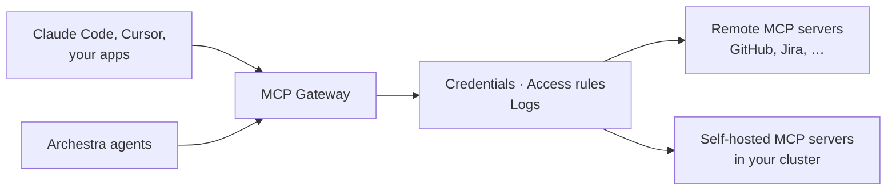

<!-- Renaming/deleting this file? Add a redirect in docs/redirects.json. -->

[MCP](https://modelcontextprotocol.io/specification) (Model Context Protocol) is the open standard that gives AI agents tools. An MCP server offers tools, such as "create a GitHub issue". An MCP client, such as Claude Code or Cursor, calls them.

Add an MCP server once, and every agent and MCP client can use its tools. Archestra does the hard parts for you:

- Runs servers in your cluster. Give Archestra a command or a Docker image. It deploys the server on Kubernetes, restarts it, shows its logs, and can sleep it when idle. See [Self-Hosted Servers](/docs/mcp/servers/self-hosted).
- Signs in for each person. A tool call can use the caller's own account, a shared service account, or the caller's company identity through your identity provider. OAuth tokens refresh by themselves when the provider allows it. See [Authentication](/docs/mcp/authentication).
- Keeps credentials out of clients. Archestra stores each server's credential. Clients sign in to the gateway and never see it.
- Checks who can call what. Each call must pass your access rules for the server, the tool, and the credential.
- [Logs each call](/docs/admin/logs), with the caller, the account it used, and the result.
- Gives each client only its tools. An [MCP Gateway](/docs/mcp/gateway) offers the set you choose. By default, the client sees only two tools: one to search the set, and one to run a tool it finds. This keeps the model's context small. See [Load Tools When Needed](/docs/mcp/gateway#load-tools-when-needed).

## Give a Client Tools

Install a server, and your coding agent can use its tools. No gateway to set up. A client set up through [Connect](/docs/get-started/connect) picks up new servers by itself.

1. Go to **MCP Registry** and find the server. Not there? [Add it](/docs/mcp/servers/adding).
2. Click **Install**, then enter your credential or sign in.
3. Ask your agent to use the new tools. Each call shows in [Logs](/docs/admin/logs).

For a team, an app, or a script that needs a fixed set of tools, [create a gateway](/docs/mcp/gateway#create-a-gateway).

## What to Know

- **Environments:** a gateway or agent reaches only the servers in its own [environment](/docs/admin/environments). The environment also sets where self-hosted servers run, and which hosts any server can reach.
- Guardrails run in the [LLM Proxy](/docs/llm-proxy), not here. They check a tool call when the model asks for it. Connect the client to both. See [Guardrails](/docs/agents/guardrails/clients).
- **Metrics and traces:** tool calls produce [MCP metrics](/docs/admin/observability/metrics#mcp-metrics) and [tool call spans](/docs/admin/observability/tracing#mcp-tool-call-spans).
