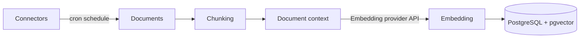
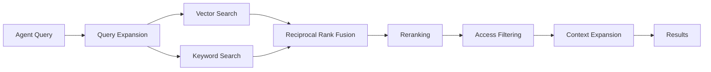
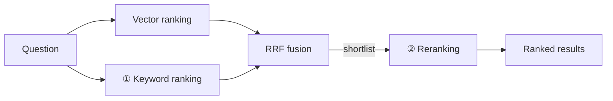

<!-- Renaming/deleting this file? Add a redirect in docs/redirects.json. -->

A Knowledge Base contains connectors that index data for retrieval. Connectors get data from Jira, Confluence, GitHub, Notion, SharePoint, Google Drive, Salesforce, and M-Files. An agent with a Knowledge Base can query that data to answer questions.

> **Enterprise feature** (team-scoped access control) — see the [Pricing Model](/docs/platform-pricing-model).


## How Retrieval Works

Archestra runs the complete pipeline on PostgreSQL with pgvector. You do not operate an external vector database or a separate retrieval service.

### Indexing

Connectors run on a cron schedule. Each document uses these four steps.

1. **Extract.** Archestra gets text from the source. Format-specific extractors read Office documents and PDFs. PDF text comes from the document text layer. Archestra skips a PDF without a text layer, such as a scan. The sync run details count skipped PDFs. A configured multimodal embedding model embeds images directly.
2. **Chunk.** Archestra divides the document into passages of about 512 tokens. It uses paragraph and sentence boundaries. Each chunk includes its document title and metadata. The system can match each chunk independently. It can divide each passage into smaller chunks. See [Multi-Granularity Indexing](#multi-granularity-indexing).
3. **Add context.** You can add document-wide or passage-specific context before indexing each chunk. See [Contextual Retrieval](#contextual-retrieval).
4. **Embed.** The configured embedding model vectorizes each chunk. Archestra stores the vector with a keyword index of the same text.

Archestra skips documents unchanged since the last sync. You pay only for changed content during a re-sync.



### Querying

A search runs semantic and keyword passes. It then narrows the results.

1. **Expand the query.** The reranking model changes the question into semantic wording and keyword queries. This finds documents that use different words. The system keeps identifiers, ticket numbers, and error codes unchanged.
2. **Search both ways.** Each query variant searches the vector index and keyword index in parallel.
3. **Fuse.** Reciprocal Rank Fusion merges the results. It favors chunks that rank well in several variants.
4. **Rerank.** The reranking model scores each remaining chunk against the original question. It removes irrelevant chunks. See [Query Results Ranking](#query-results-ranking).
5. **Filter by access.** Archestra removes chunks the asking user cannot read. This filter applies to every result at every stage.
6. **Widen.** Archestra adds neighboring chunks to each hit. The agent receives the surrounding text when a passage starts mid-sentence. See [Context Expansion](#context-expansion). A child-chunk hit expands to its parent passage.



### Query Results Ranking

This section defines the settings terms. Each search runs these stages in order. All stages except reranking are enabled by default.

- **RAG (retrieval-augmented generation).** The agent does not contain your documents. For each question, it retrieves relevant passages and answers from them. Retrieval quality limits answer quality. The ranking determines what the agent reads.
- **Vector ranking (semantic search).** During sync, the embedding model converts each chunk into a vector. At query time, it converts the question the same way. Archestra ranks chunks by vector similarity. Similar vectors can use different words. Configure this under [Embedding Configuration](#embedding-configuration). pgvector performs the calculation.
- **Keyword ranking.** Archestra ranks passages that contain the question words by match quality. This finds identifiers, error codes, and product names that embeddings can blur. Configure it under [Keyword Ranking](#keyword-ranking).
- **BM25.** BM25 is the standard keyword scoring function. Lucene, Elasticsearch, most search engines, and Archestra use it. Rare words have more weight than common words. Repeated words have less added weight. Long passages have less weight. A short direct answer can rank above a long repeated match. Archestra calculates BM25 in SQL. It works on any PostgreSQL without an extension.
- **Hybrid search.** Vector and keyword ranking run together. Each method finds matches that the other misses. Archestra always runs both. Set `ARCHESTRA_KNOWLEDGE_BASE_HYBRID_SEARCH_ENABLED=false` to disable keyword ranking.
- **Reciprocal Rank Fusion (RRF).** Vector and keyword scores use different scales. RRF merges lists by rank position, not score. A chunk near the top of both lists ranks higher. This stage needs no configuration.
- **Cross-encoder reranking.** A model reads the question and one chunk together. It scores that pair. This is more accurate than vector comparison. It also costs more. It runs only on the fused shortlist. Archestra uses a chat model or a Cohere Rerank model, which is a purpose-built cross-encoder. Configure this optional feature under [Search Ranking Configuration](#search-ranking-configuration).

A search uses this order: question → [query expansion](#querying) → vector ranking and keyword ranking in parallel → RRF → reranking → [access filtering](#querying) → [context expansion](#context-expansion). Keyword ranking and reranking are stages in one search. Keyword ranking selects chunks for the shortlist. Reranking sets the final shortlist order. Both settings appear under **Settings > Knowledge > Search Ranking Configuration**, in that order.



BM25 orders keyword matches better than PostgreSQL's built-in `ts_rank`. Archestra uses it as the keyword ranker, not as an option. SQL calculation lets it work on managed PostgreSQL without an extension. Reranking stays disabled until you select a model because it uses one model call per search.

#### Keyword Ranking

This is step 1 of search ranking. BM25 scores passages that contain the question words. Archestra merges them with passages that match by meaning. No setup is required. Two factors under **Settings > Knowledge > Search Ranking Configuration** tune the result. Changes apply to the next search. Archestra does not re-index documents. The defaults suit most knowledge bases.

- **Term Saturation** (`k1`, 0–10, default 1.2) — sets how much repeated words help a passage. Lower it if long repeated documents displace concise answers. Raise it if the best passages repeat an important term.
- **Length Normalization** (`b`, 0–1, default 0.75) — sets how much Archestra reduces long-passage scores. Lower it if long detailed passages need equal ranking. Raise it if short focused passages should rank higher.

Each field shows the deployment default until you change it. Resetting a field to its default makes it follow that default again. `ARCHESTRA_KNOWLEDGE_BASE_BM25_K1` and `_B` set the defaults. See [Deployment](/docs/platform-deployment#knowledge-base-configuration).

Archestra rebuilds BM25 statistics in the background after startup and then hourly. The statistics cover the deployment, not one organization. Before the first build, keyword matches use PostgreSQL built-in full-text ranking. The Keyword ranking section shows the status. The status is ready, building, updating, no indexed documents, or failed. The building status shows the next update time.

#### Reranking

This is step 2 of search ranking. The reranking model reads each shortlisted chunk with the question. It scores the chunk and reorders the list. It removes irrelevant chunks. This removes a word match that has the wrong context.

Reranking is optional. Without it, results use fused order. Query expansion and [contextual retrieval](#contextual-retrieval) use the same model. Archestra also disables them. Reranking uses one model call per search. [LLM cost statistics](/docs/platform-llm-proxy) records this as "Knowledge - Reranker". Configure it under [Search Ranking Configuration](#search-ranking-configuration).

### Citations

Each result includes the document title, source-system URL, connector, and chunk position. An agent that answers from a Knowledge Base cites these sources. Readers can open the original document.

In the built-in chat, the agent marks each claim with a numbered reference. It lists a short verbatim quote for each claim in a Sources section. Each quote names its source chunk. Archestra checks each quote against the cited chunk. It logs a quote absent from all returned chunks as a likely fabrication. The check only applies to the built-in chat. It does not block or change an answer. Set `ARCHESTRA_KNOWLEDGE_BASE_QUOTE_VERIFICATION_ENABLED` to `false` to disable it.

### Contextual Retrieval

Chunking separates a passage from its context. For example, "the limit was raised to 5,000 per minute" does not name the billing API. It is a poor match for "what is the rate limit on the billing API".

Under **Settings > Knowledge > Search Ranking Configuration**, select the context generation mode:

- **Disabled** — index each chunk without generated context.
- **Per document — lower cost** — generate one document-wide context. Index it with every chunk. This uses one model call per changed document.
- **Per passage — higher recall** — generate context for each chunk. A passage can name its own section or subject. It does not use only a broad document summary. Archestra processes long documents in batches of up to eight passages. Documents with fewer than six chunks use the lower-cost document mode. Passage-specific calls rarely add enough value for these documents.

Generated context affects matching only. It is not included in the text the agent reads. Per-passage generation reuses a stable document prefix. Providers with prompt caching can discount later batches. [LLM cost statistics](/docs/platform-llm-proxy) records calls and cache-token costs as "Knowledge - Contextual Retrieval".

Both enabled modes require a reranking model that generates text. A dedicated Cohere Rerank model only scores results. Archestra skips contextual retrieval when you configure one. `ARCHESTRA_KNOWLEDGE_BASE_CONTEXTUAL_RETRIEVAL_ENABLED` sets the default for organizations without a saved mode. `true` selects **Per document**.

### Context Expansion

Search ranks chunks. A chunk boundary can occur mid-sentence or in a table.

After ranking, Archestra adds neighboring chunks to each hit. This does not change ranking. It only expands the passage the agent reads. Expansion stops at a chunk the user cannot read. It cannot bypass access control. Set the radius with `ARCHESTRA_KNOWLEDGE_BASE_CONTEXT_EXPANSION_RADIUS`.

### Multi-Granularity Indexing

One chunk size suits one type of question. A small chunk can show a port number but omit its purpose. A large chunk can explain the port but hide the number in more text.

Multi-granularity indexing divides each passage again into smaller child chunks. It indexes only the children. Search matches a child. The agent reads the full parent passage. The same corpus supports precise lookups and broad questions.

Set the child size with `ARCHESTRA_KNOWLEDGE_BASE_CHILD_CHUNK_SIZE_TOKENS`. The feature is disabled by default. `0` disables it.

Several children from one passage can match. Archestra keeps only the highest-ranked child. A result set never returns the same passage twice. [Context expansion](#context-expansion) does not apply to these hits. The result already contains the parent passage.

This increases index size instead of embedding cost. Children cover the same text as passages. A sample document used 4% more embedding tokens. The number of stored vectors increases by roughly the size ratio. Contextual retrieval remains unchanged. Archestra still generates context once per passage.

Like chunk size, this setting applies during ingest. Indexed documents keep their existing form until the connector re-syncs. Until then, search uses both forms.

### Keyword Search Language

The keyword index stems words so different forms match. Stemming is language-specific. "Katzen" and "Katze" match only under German rules.

Set each connector language under **Advanced > Keyword Search Language**. Use the language of its documents. Select **Simple** to disable stemming. This suits source code and mixed-language sources. One deployment can index English and German sources correctly at the same time. The setting applies on the next connector sync.

### Tuning

These settings apply across the deployment. See [Deployment](/docs/platform-deployment#knowledge-base-configuration) for the full reference.

| Setting | Default | Controls |
| --- | --- | --- |
| `ARCHESTRA_KNOWLEDGE_BASE_HYBRID_SEARCH_ENABLED` | `true` | Whether keyword search runs alongside vector search |
| `ARCHESTRA_KNOWLEDGE_BASE_CHUNK_SIZE_TOKENS` | `512` | Size of one chunk. Smaller is more precise, larger carries more context |
| `ARCHESTRA_KNOWLEDGE_BASE_CHILD_CHUNK_SIZE_TOKENS` | `0` | Size of one child chunk. `0` indexes passages only |
| `ARCHESTRA_KNOWLEDGE_BASE_CONTEXT_EXPANSION_RADIUS` | `1` | How many neighbouring chunks are stitched onto a hit |
| `ARCHESTRA_KNOWLEDGE_BASE_CONTEXTUAL_RETRIEVAL_ENABLED` | `false` | Default contextual retrieval mode for organizations without a saved choice (`true` = per document) |

Chunk sizes and contextual retrieval apply during ingest. A normal sync updates changed documents. Force a connector re-sync to rebuild context for unchanged source documents.

## Configuration

Open **Settings > Knowledge**. Set an embedding model before you use Knowledge Bases. Document OCR, a reranking model, and [contextual retrieval](#contextual-retrieval) are optional. Keyword ranking needs no setup. You can tune two factors. See [Keyword Ranking](#keyword-ranking).

### Embedding Configuration


Select the API key and embedding model. The model vectorizes ingested documents for semantic queries. Archestra uses the same model for indexing and queries. It locks the model after you save it.

- **Key** — this list shows only keys with synced models that have configured embedding dimensions. If your key is missing, go to **LLM Providers > Models**. Sync the provider. Set the embedding model dimensions. Supported dimensions are 384, 768, 1024, 1408, 1536, and 3072. Subscription sign-in keys, such as an X Premium login, do not appear. Knowledge requires an API key.
- **Model** — any embedding-capable model available through the selected key.

To change the embedding model, select **Drop** to clear the index. The next connector sync re-embeds every document. The lock also applies in **LLM Providers > Models**. You cannot edit the configured model embedding dimensions or input modalities until you drop the configuration.

### Image Embedding

Connectors index image files only if the configured embedding model accepts image input. The models below accept image input.

| Provider    | Model                                                                 | Image formats                |
| ----------- | --------------------------------------------------------------------- | ---------------------------- |
| Gemini      | `gemini-embedding-2`                                                  | PNG, JPEG                    |
| Gemini      | Multimodal Embedding (`multimodalembedding@001`, Vertex AI mode only)  | PNG, JPEG, BMP, GIF, WebP    |
| AWS Bedrock | Amazon Titan Multimodal Embeddings G1 (`amazon.titan-embed-image-v1`) | JPEG, PNG, WebP, GIF         |
| AWS Bedrock | Cohere Embed English v3 and Multilingual v3                           | JPEG, PNG, WebP, GIF         |
| Cohere      | Cohere Embed v4 (`embed-v4.0`)                                        | JPEG, PNG, WebP, GIF         |
| Cohere      | Cohere Embed English v3, Multilingual v3, and their Light variants    | JPEG, PNG, WebP, GIF         |

Archestra treats unlisted embedding models as text-only. A provider can offer an unsupported multimodal variant. You cannot mark these models as image-capable in **LLM Providers > Models**. Connectors skip unsupported image formats, such as SVG. Archestra skips images ingested under an earlier configuration during embedding. The document completes without those images. The run shows the skipped count.

Titan Multimodal G1 accepts 256 text tokens per input. Cohere Embed v3 accepts 512 text tokens per input. On Bedrock, it accepts 2048 characters. Archestra truncates longer text chunks before embedding. Only the chunk start enters the vector. Use a text embedding model or Cohere Embed v4 for mostly document-based corpora.

Vertex AI `multimodalembedding@001` is available with [Vertex AI mode](/docs/platform-supported-llm-providers#using-vertex-ai). It uses 1408 dimensions. Archestra trims text above the API 1024-byte limit. The model then shortens text after 32 tokens internally. It embeds one input per request under a per-project rate limit. Large document backfills are slower than with `gemini-embedding-2`.

Cohere embedding models appear in the Cohere key model list under **LLM Providers > Models**. Their dimensions are preset. Embed v4 uses 1536 dimensions, or 256, 512, or 1024 on request. v3 uses 1024. Light variants use 384.

With a text-only embedding model, Archestra skips image files. The connector page reports this. [Document OCR](#document-ocr) handles scanned PDF pages separately. It transcribes these pages regardless of the embedding model. It does not read standalone image files.

### Search Ranking Configuration


This card configures both ranking stages. [Query Results Ranking](#query-results-ranking) describes each stage.

**Keyword ranking** is always enabled. [Keyword Ranking](#keyword-ranking) explains Term Saturation and Length Normalization. These fields show defaults until you change them.

**Reranking** selects the model that scores and reorders results by relevance. It is optional. Without it, results use fused order.

- **Key** — any LLM provider API key. Subscription sign-ins do not appear here.
- **Model** — any chat model from that provider. Cohere Rerank models also work with Cohere keys and Azure AI Foundry keys. Archestra calls their native rerank API.

A chat model also performs query expansion and [contextual retrieval](#contextual-retrieval). A Cohere Rerank model only scores results. Archestra skips both features when you configure one.

A chat reranker scores passages by returning a JSON object. Archestra asks the endpoint to constrain output to that form. **Test connection** verifies the constraint. If the test says the model returned no JSON object, the endpoint does not apply the constraint. Enable structured outputs. A self-hosted vLLM server requires them. You can also select a model that supports them.

### Document OCR


A scanned PDF has no text layer. Connectors cannot index it. The run reports it as "No text extracted". Configure Document OCR to transcribe these pages with a vision model during sync. The transcribed text becomes searchable like other documents.

- **Key** — an API key for a provider that accepts PDF input: Anthropic, OpenAI, Gemini, Bedrock, Azure, OpenRouter, or vLLM.
- **Model** — a vision-capable model from that provider. Self-hosted models, such as a vLLM server, sync without modality metadata. Mark the model image or PDF input modality in **LLM Providers > Models** to select it. **Test connection** sends a synthetic PDF page to verify the pair.

OCR runs only on pages that yield no text. A mixed document keeps its digital text. For example, OCR transcribes the scanned signature page in a contract. Each transcribed page uses one metered model call. [LLM cost statistics](/docs/platform-llm-proxy) records it as "Knowledge - OCR". One document is limited to `ARCHESTRA_KNOWLEDGE_BASE_OCR_MAX_PAGES_PER_DOCUMENT` pages. The default is 100. Pages after the limit remain untranscribed. The run reports them.

The first configuration save resets every connector sync checkpoint. The next sync reads all sources again. It can index documents that were previously unreadable. A run also has an overall transcription budget. Archestra indexes a document whose pages exceed that budget with a warning. The warning names omitted pages. It revisits untranscribed pages only after a source change or another full re-sync.

## Creating a Knowledge Base

A Knowledge Base is a set of connectors. Create one on the **Knowledge** page. Assign connectors that supply its data. You can reuse one Knowledge Base with multiple agents and MCP Gateways.

## Knowledge Files

Knowledge Files stores documents that you upload directly. For example, upload a signed contract that arrived by email. A connector gets files from a source system. Knowledge Files lets you add the file. Open **Knowledge > Files**.

Upload PDF, Word, Markdown, CSV, JSON, HTML, or plain text files. Archestra reads text during upload. It rejects unreadable files. A configured [Document OCR](#document-ocr) accepts scanned PDFs. It transcribes their pages during indexing.

Directories group documents. They do not support sub-directories. Each document and directory has an audience: **Organization**, **Teams**, or **Only me**. Retrieval uses document visibility. Sharing a Knowledge Base with an agent does not expand document access.

Uploading stores a document. Indexing makes it retrievable. Select documents or directories. Select **Add to knowledge base**. Select an existing base or create one from the selection.

A chat attachment belongs to that conversation. Save it to the repository to keep it. Save it from the message attachment or the Files panel. The Files panel supports multiple selections. Select the name, directory, and visibility when you save it. You can index it in the same step.

### Chat, Project, and Knowledge Files

Files can exist in three locations. Each location supports a different need.

|                   | Chat attachments | Project files | Knowledge Files |
| ----------------- | ---------------- | ------------- | --------------- |
| Scope             | One conversation | Every chat in the project | The whole organization |
| Who can read them | You              | Everyone in the project | The audience you set — organization, teams, or only you |
| How agents use them | Sent to the model with your message | Read on demand by any chat in the project | Retrieved from a Knowledge Base, with citations |
| Use them for      | A one-off question about a file | Working files for one piece of work | Reference documents agents should answer from |

You can save a chat attachment to the repository. You can then index it in a Knowledge Base.

### Use Case: Vendor Security Reviews

A security analyst reviews vendor documents received by email.

1. Upload questionnaires and SOC 2 reports to the **Vendor contracts** directory. Set the audience to the security team.
2. Select the directory. Add it to the **Vendor security review** Knowledge Base.
3. Assign the base to the review agent.
4. Ask which vendors store customer data outside the EU. Each answer cites its source document.

## Assigning to an Agent

An agent or [MCP Gateway](/docs/platform-mcp-gateway) accesses knowledge through **Tools & Knowledge Sources**. This dialog has two modes:

- **Auto** — the agent can search every Knowledge Base and connector the chatting user can access within the agent's environment. You do not assign sources. The reachable sources follow user visibility.
- **Custom** — the agent searches only Knowledge Bases and connectors that you assign. Select them under **Knowledge sources**. The selector stays disabled until you set an embedding model. See [Configuration](#configuration).

Both modes use the chatting user visibility. An agent cannot show a source that the user cannot read. An agent with at least one reachable source gets the `query_knowledge_sources` tool. This tool searches those sources and returns the most relevant documents.

Archestra treats `query_knowledge_sources` output as sensitive by default. This can affect use of later tools. See [Archestra MCP Server](/docs/platform-archestra-mcp-server#auth) and [AI Tool Guardrails](/docs/platform-ai-tool-guardrails).


Connectors get external-tool data into Knowledge Bases. You can assign one connector to multiple Knowledge Bases.

## Narrowing a Search

A search covers every document in sources an agent can access. Some questions concern only a subset. For example, use the documents for the current release.

`query_knowledge_sources` accepts an optional `documentFilter`. It matches documents using connector metadata, such as `spaceKey`, `labels`, `repo`, or `state`.

The filter combines keys with AND. It combines multiple values for one key with OR.

```json
{
  "query": "how do we roll back a deploy?",
  "documentFilter": { "spaceKey": "DEV", "labels": ["release-2.0"] }
}
```

This searches only DEV space pages with the `release-2.0` label. One agent can answer for the current release. Another can answer for the archive. Both can use the same connector.

A filter handles single values and lists the same way. Confluence stores one `spaceKey` per page and many `labels`. The example syntax matches both.

Filtering does not expand access. [Visibility](#visibility) applies separately. A filter only removes documents you could otherwise read.

If a filter matches nothing, the reply lists existing values for the keys. The agent retries with an existing value. It does not report an empty result immediately.

Name the required subset in your instructions or question. The agent filters only when the request names a subset. It does not infer one from the topic.

## Sync Runs

Open a connector to review document sync runs and progress. You can cancel a running document sync from its **Actions** column. Cancellation stops new source batches. It keeps documents already ingested by the run. A later sync continues from the saved connector checkpoint.

Open run details to review warnings and connector errors. Logs name documents whose content exceeded an indexing limit. The run counts unsupported file types as skipped. A document that produces no chunks ends with an error.

## Visibility

Each connector has a visibility setting. It determines which users can retrieve data through `query_knowledge_sources`. The UI filters connectors and Knowledge Bases by visibility. Users see only accessible sources. They can assign only accessible sources to agents and MCP Gateways.

| Mode                      | Behavior                                                                          |
| ------------------------- | --------------------------------------------------------------------------------- |
| **Org-wide**              | All documents accessible to every user in the organization.                       |
| **Team-scoped**           | Documents accessible only to members of the assigned teams.                       |
| **Auto-sync permissions** | Per-document ACLs synced from the source system, so each user sees only what they can see upstream. See [Auto-Sync Permissions](#auto-sync-permissions). |

Users with `knowledgeSource:admin` bypass document ACLs during queries. This permission does not allow auto-sync connector management.

Auto-sync connectors use `knowledgeSourceAutoSync` permissions for read, create, update, and delete actions. Admin and Platform Admin roles receive all four actions by default. Grant them to other users with a [custom role](/docs/platform-access-control). Users without management actions can still query documents allowed by synced ACLs.

> **Enterprise feature** (team-scoped visibility and auto-synced ACLs) — see the [Pricing Model](/docs/platform-pricing-model).

### Auto-Sync Permissions

> **Beta feature** — off by default. Set `ARCHESTRA_KNOWLEDGE_BASE_AUTO_SYNC_PERMISSIONS_ENABLED=true` (or the `ARCHESTRA_BETA` master switch) to show the visibility option and its Users and Groups tabs. See [Deployment](/docs/platform-deployment).

Auto-sync permissions mirrors source-system access control in Archestra. Each query returns only documents allowed by the latest permission snapshot. Users with `knowledgeSource:admin` bypass this filter.

The option appears when the beta flag and Knowledge enterprise feature are enabled. It also requires a supported connector. You need `knowledgeSourceAutoSync:create` or `update`.

Auto-sync permissions works with connectors marked *Supported* below. *Limited* means Archestra mirrors source access with a coarser audience model. The table states that model. Other connectors do not yet support it.

| Connector    | Auto-sync permissions                                                                                     |
| ------------ | --------------------------------------------------------------------------------------------------------- |
| Asana        | Supported ([setup](#asana-auto-sync-permissions))                                                         |
| Confluence   | Supported ([setup](#confluence-auto-sync-permissions))                                                    |
| Dropbox      | Limited: stored access tokens cannot refresh ([details](#dropbox-auto-sync-permissions))                  |
| GitHub       | Supported ([setup](#github-auto-sync-permissions))                                                        |
| GitLab       | Supported ([setup](#gitlab-auto-sync-permissions))                                                        |
| Google Drive | Limited by authentication mode ([details](#google-drive-auto-sync-permissions))                            |
| Jira         | Jira Cloud only. Issue security is unsupported ([details](#jira-auto-sync-permissions))                    |
| Linear       | Supported ([setup](#linear-auto-sync-permissions))                                                        |
| M-Files      | Supported with the VAF Add On ([setup](#m-files-auto-sync-permissions))                                   |
| Notion       | Limited: every synced page is visible to all workspace members ([details](#notion-auto-sync-permissions)) |
| OneDrive     | Supported ([setup](#onedrive-auto-sync-permissions))                                                      |
| Outline      | Supported ([setup](#outline-auto-sync-permissions))                                                       |
| Perforce     | Supported with the Kubernetes orchestrator ([setup](#perforce-auto-sync-permissions))                     |
| Salesforce   | Supported ([setup](#salesforce-auto-sync-permissions))                                                    |
| ServiceNow   | Supported ([setup](#servicenow-auto-sync-permissions))                                                    |
| SharePoint   | Supported ([setup](#sharepoint-auto-sync-permissions))                                                    |
| Web Crawler  | Not supported                                                                                             |

#### Credentials and Email Resolution

Permission sync uses the connector's upstream identity. That identity must read content and permission settings. Unreadable permission data fails closed. Affected documents grant no access.

Archestra matches external accounts to users by email. A hidden or empty email leaves an account unassigned. It removes that account from resolved audiences. You can manually assign accounts listed under **Users**. Fix an empty group roster in the source system. Manual assignment cannot add group members.

Each connector section lists credential type, required scopes, and source-system setup. Use a dedicated identity that can access every configured source. **Test connection** validates authentication. It cannot prove access to every project or permission table.

**Editing a connector.** Saving settings or credentials stops the old permission sync. That run ends as **Superseded**. A replacement run starts immediately. You do not wait for the next scheduled run.

#### Atlassian Organization Admin API Key

An organization admin API key reads managed account emails through Atlassian admin APIs. Add it to a Jira or Confluence Cloud connector. Permission sync can resolve managed users with private profile emails.

Create the key in [Atlassian administration](https://admin.atlassian.com) under **Settings → API keys**:

1. Select **Create API key**. Enter a name.
2. Leave the key **without scopes**. Permission sync uses classic admin APIs. Scopes do not cover these APIs.
3. Copy the key to the connector **Organization admin API key** field.

The API token is still required. Atlassian does not accept admin API keys for Jira and Confluence APIs.

Changing **Cloud Instance** on an existing Jira or Confluence connector changes authentication. Enter the token or password again. Switching to Cloud also requires the Atlassian account email. Switching from Cloud removes the stored organization admin key. For Server or Data Center, leave **Username** empty when entering a personal access token. This selects PAT authentication. Enter the username again when changing a Basic-auth password.

## Deleting and Restoring Knowledge Bases and Connectors

Deleting a knowledge base or connector moves it to trash. The record is hidden but retained. Deleting a knowledge base unlinks its connectors. It does not delete them. They continue syncing. Deleting a connector stops its syncs. It destroys the stored credential.

Users with `knowledgeSource:delete` select **Deleted** in the status filter to open trash. **Restore** returns the entry to active. A restored knowledge base immediately works for previously assigned agents. A restored connector is disabled. Authenticate it again. Then enable it to resume syncs.

Global admins can select **Delete permanently** in trash. This permanently deletes the entry. For a knowledge base, this deletes the record and agent and connector assignments. Its connectors remain. For a connector, this deletes indexed documents, run history, and access mappings. You cannot restore either type.

## Supported Connectors

Archestra includes these connector types. Go to **Settings → Knowledge → Available connectors** to remove types your organization does not allow. A removed type disappears from selectors. The API refuses its configuration. Existing connectors continue syncing until you delete them.

A sync that indexes nothing from an empty connector ends as **No documents**, not as success. The run names the likely cause. Causes include content not shared with the credential, an inaccessible folder, or a file-type filter that excludes all content. A later sync with no changes ends as a normal success.

### Jira

Sync issues and discussions from Atlassian Jira.

**Indexed:** issue descriptions, comments, and metadata from Jira Cloud or Server.

**Authentication:** Jira Cloud uses an Atlassian account email and API token. Jira Server and Data Center use a personal access token with an empty Username field. On releases without personal access tokens, enter the account username and password for Basic authentication.

| Field                   | Description                                                        |
| ----------------------- | ------------------------------------------------------------------ |
| Base URL                | Your Jira instance URL (e.g., `https://your-domain.atlassian.net`) |
| Cloud Instance          | Toggle on for Jira Cloud, off for Jira Server/Data Center          |
| Project Keys            | Comma-separated project keys to include (optional)                 |
| JQL Query               | Custom JQL to filter issues (optional)                             |
| Comment Email Blacklist | Comma-separated emails whose comments are excluded (optional)      |
| Labels to Skip          | Comma-separated issue labels to exclude (optional)                 |

#### Jira Auto-Sync Permissions

For Jira Cloud, use a dedicated Jira administrator:

1. Create an API token in [Atlassian account security](https://id.atlassian.com/manage-profile/security/api-tokens). Select an unscoped token for the connector site URL.
2. Grant **Administer Jira** and **Browse users and groups** global permissions to the account.
3. Grant **Browse Projects** for each synced project. Add the account to every required issue-security level.
4. Create a separate [organization admin API key](#atlassian-organization-admin-api-key) to resolve private managed-account emails.

The product API token reads Jira data. The organization key reads only managed-account profiles. External accounts still need public profile emails or [manual assignment](#credentials-and-email-resolution).

Jira Server and Data Center content sync remains supported. Auto-sync permissions does not. Its permission APIs differ from Jira Cloud. Jira has no equivalent REST API for issue-security membership. Personal access tokens require Jira Core or Software 8.14+, or Jira Service Management 4.15+. On older releases, enter the username in **Username**. Enter the password in **API Token / Personal Access Token**. This uses Basic authentication.

Do not enable auto-sync permissions for Jira Cloud projects that use issue security. Jira requires **Browse Projects** and issue-security membership. The connector cannot enforce both requirements together. It also does not support Browse Projects through Project Lead or user/group custom fields. It does not support dynamic issue-security holders such as Reporter and Assignee.

### Confluence

Sync wiki pages from Atlassian Confluence.

**Indexed:** pages from Confluence Cloud or Server.

**Authentication:** Confluence Cloud uses an Atlassian account email and API token. Confluence Server and Data Center 7.9+ use a personal access token with an empty Username field. On older releases, enter the account username and password for Basic authentication.

| Field          | Description                                                                   |
| -------------- | ----------------------------------------------------------------------------- |
| URL            | Your Confluence site root (e.g., `https://your-domain.atlassian.net`)         |
| Cloud Instance | Toggle on for Confluence Cloud, off for Server/Data Center                    |
| Space Keys     | Comma-separated space keys to sync (optional)                                 |
| Page IDs       | Comma-separated specific page IDs to sync (optional)                          |
| CQL Query      | Custom CQL to filter content (optional)                                       |
| Labels to Skip | Comma-separated labels to exclude (optional)                                  |
| Batch Size     | Pages per batch (default: 50)                                                 |

#### Confluence Auto-Sync Permissions

For Confluence Cloud, use a dedicated account with product access:

1. Create an unscoped API token in [Atlassian account security](https://id.atlassian.com/manage-profile/security/api-tokens).
2. Enter the site root without `/wiki`, such as `https://example.atlassian.net`.
3. Grant **View** for each synced space. Add the account to required page and ancestor restrictions.
4. Grant **Confluence Administrator** if you require audit-based incremental permission reads.
5. Create a separate [organization admin API key](#atlassian-organization-admin-api-key) to resolve private managed-account emails.

A Cloud administrator does not automatically bypass page restrictions through the API. Unreadable pages do not enter the index.

For Confluence Server or Data Center 7.9+, create a token under **Profile > Personal access tokens**. Leave **Username** empty. On older releases, enter the username in **Username**. Enter the password in **API Token / Personal Access Token**. The `confluence-administrators` group has the broadest space and restricted-page visibility.

### GitHub

Sync issues, pull request discussions, and repository files from GitHub.

**Indexed:** issues, pull requests, comments, and selected text files from GitHub.com or GitHub Enterprise Server. Repository file indexing defaults to Markdown and YAML files.

**Authentication:** a [personal access token](https://docs.github.com/en/authentication/keeping-your-account-and-data-secure/managing-your-personal-access-tokens) or a GitHub App. Archestra stores GitHub App credentials once as an organization-level configuration under **Settings -> GitHub**. These credentials include App ID, installation ID, and private key. The connector references the saved configuration. It does not store its own credentials. One App can support many connectors and skill imports.

| Field                 | Description                                                                                     |
| --------------------- | ----------------------------------------------------------------------------------------------- |
| GitHub API URL        | API endpoint (e.g., `https://api.github.com` for GitHub.com, or your GHE API URL)               |
| Owner                 | GitHub organization or username that owns the repositories                                      |
| Authentication Method | Personal access token or GitHub App                                                            |
| GitHub App Configuration | Saved configuration to authenticate with when using GitHub App auth (managed in **Settings -> GitHub**) |
| Repositories          | Comma-separated repository names to sync (optional -- leave blank to sync all org repositories) |
| Include Issues        | Toggle to sync issues and their comments (default: on)                                          |
| Include Pull Requests | Toggle to sync pull requests and their comments (default: on)                                   |
| Include Repository Files | Toggle to sync repository files (default: off)                                               |
| File Types            | Comma-separated file extensions to index when repository files are enabled (defaults to `.md`, `.mdx`, `.yaml`, `.yml`) |
| Folders               | Comma-separated folders to index, relative to the repository root (optional -- leave blank to index the whole repository) |
| Labels to Skip        | Comma-separated labels to exclude (optional)                                                    |

#### GitHub Auto-Sync Permissions

A GitHub App is the preferred credential. Create one under **Settings > Developer settings > GitHub Apps**. Grant these read-only permissions:

| Permission type | Read permission |
| --- | --- |
| Repository | Administration, Issues, Pull requests, and Metadata |
| Repository, when files are indexed | Contents |
| Organization | Members |

Install the App on each target repository. Generate a private key. Copy its PEM value. Save the App ID, installation ID, API URL, and private key under **Settings > GitHub**. Select this configuration in the connector.

A fine-grained personal access token needs the same repository and organization permissions. Select each target repository. The token owner needs write, maintain, or admin access to list collaborators. A classic token needs `repo` and `read:org`. Authorize it for SAML SSO if the organization requires SSO.

GitHub exposes only public profile emails. No App or token permission reveals a private email. These users need [manual assignment](#credentials-and-email-resolution).

### GitLab

Sync issues and merge request discussions from GitLab.

**Indexed:** issues, merge requests, comments, and optional Markdown files from GitLab.com or self-hosted GitLab. Archestra filters system-generated notes such as assignment changes and label updates.

**Authentication:** a [personal access token](https://docs.gitlab.com/user/profile/personal_access_tokens/).

| Field                  | Description                                                                        |
| ---------------------- | ---------------------------------------------------------------------------------- |
| GitLab URL             | Instance URL (e.g., `https://gitlab.com` or your self-hosted URL)                  |
| Group                  | GitLab group ID or path to scope project discovery (optional)                      |
| Project IDs            | Comma-separated specific project IDs to sync (optional -- leave blank to sync all) |
| Include Issues         | Toggle to sync issues and their comments (default: on)                             |
| Include Merge Requests | Toggle to sync merge requests and their comments (default: on)                     |
| Include Markdown Files | Toggle to sync `.md` and `.mdx` files from the repository (default: off)           |
| Labels to Skip         | Comma-separated labels to exclude (optional)                                       |

#### GitLab Auto-Sync Permissions

Create a personal access token under **Edit profile > Access > Personal access tokens**. Grant only `read_api`. Set an expiry. The token user needs **Reporter** or higher for each private project. Use an **Owner** of the configured top-level group for broad project discovery.

A regular token receives only `public_email`. In self-managed GitLab, an instance administrator token can read private email. Add `admin_mode` when Admin Mode is enabled. GitLab.com users without public email need [manual assignment](#credentials-and-email-resolution).

Each project is one permission scope. Its audience includes project members with **Reporter** or higher. This includes direct members, ancestor-group members, and invited-group members at their effective access level. Guests are excluded. GitLab does not allow them to read code or confidential issues. **Public** and **internal** projects are readable by all users in your Archestra organization.

Each sync saves one member roster per project. The connector **Users** and **Groups** tabs show it as `<project path> members`. A member with a hidden source email remains unresolved. Assign them to an Archestra user in the Users tab. You can also ask them to set a public GitLab profile email.

### Asana

Sync project tasks and discussions from Asana.

**Indexed:** tasks and their user comments from selected Asana projects.

**Authentication:** a [personal access token](https://developers.asana.com/docs/personal-access-token).

| Field         | Description                                                                                   |
| ------------- | --------------------------------------------------------------------------------------------- |
| Workspace GID | Your Asana workspace GID (found in the URL when viewing your workspace)                       |
| Project GIDs  | Comma-separated project GIDs to sync (optional -- leave blank to sync all workspace projects) |
| Tags to Skip  | Comma-separated tag names to exclude (optional)                                               |

#### Asana Auto-Sync Permissions

Create a token in the [Asana Developer Console](https://app.asana.com/0/my-apps). Personal access tokens have no selectable scopes and inherit the user's visibility. Add that user to every private project and team the connector syncs.

Asana Enterprise organizations can use a service account. A super admin creates it under **Admin console > Apps > Service accounts**. Grant **Full Permissions**. Standard task and membership APIs require this level.

Both credentials expose workspace member emails. A missing email still needs [manual assignment](#credentials-and-email-resolution).

Each project is one permission scope. A workspace-wide project grants all workspace members except guests. Other projects grant explicit members. This includes direct users and teams through team rosters. A task in several projects is readable through any project. Its scope combines these audiences. Task collaborators receive direct task grants.

Each permission sync saves workspace-member and team rosters. The connector **Users** and **Groups** tabs show each member and assignment status. You can manually assign an account with a hidden source email in the Users tab. Direct project users, including guests, appear under **Direct project members**. Limited-access team members receive only explicitly assigned projects. Guests receive only explicit project and task grants.

Permission reads use the token user. A project or roster that the token cannot read fails closed. Use a token for a user who can read every synced project. A task removed from every synced project remains hidden until a sync finds it again.

### ServiceNow

Sync ITSM records from a ServiceNow instance.

**Indexed:** incidents, change requests, change tasks, problems, business applications, and published knowledge articles. Incidents are enabled by default. Select the other entities to include them.

**Authentication:** the connector form uses basic authentication. Create a dedicated user under **User Administration > Users**. Enable **Web service access only**. Set a password. API-created connectors can leave Email empty. Store a pre-issued OAuth bearer token in the API Token field. The connector does not refresh this token.

**Required roles.** Use a dedicated service account. **Web service access only** is acceptable. The account needs roles that can read each synced table:

| Role | Grants read on |
| --- | --- |
| `itil` | Incidents, changes, change tasks, problems, and business applications |
| `knowledge` | Knowledge articles |
| `user_criteria_admin`, `user_admin` | User criteria definitions and the user, group, and role tables auto-sync reads |

The Can Read / Cannot Read criteria mappings (`kb_uc_can_read_mtom`, `kb_uc_cannot_read_mtom`) have no default role-based read access. Built-in roles such as `knowledge_admin` do not grant this access. Auto-sync permissions requires explicit access control lists (ACLs) on both tables.

Creating ACLs requires the `security_admin` role. ServiceNow grants it by elevation for the current session. It hides the ACL-list **New** button until you elevate. Open the profile menu. Select **Elevate role**. Select **security_admin**. Then complete these steps:

1. Go to **System Security → Access Control (ACL)**. Select **New**. Set Type to `record`. Set Operation to `read`. Set Name to `kb_uc_can_read_mtom`. Leave the field as `--None--`. Under **Requires role**, add a service-account role. Submit.
2. Create another ACL for this table. Set its field to `*`. This grants read access to the fields.
3. Repeat both ACLs for `kb_uc_cannot_read_mtom`.

An account without required roles can fail in two ways. The result depends on instance ACLs. The sync can return HTTP 403 "Insufficient rights to query records". ServiceNow can also filter rows silently. The sync then succeeds with no ingested content. Test the account before connecting. `curl -u '<user>:<password>' 'https://<instance>.service-now.com/api/now/table/incident?sysparm_limit=1'` must return a record. It must not return an error or empty result.

| Field                         | Description                                                                                                                   |
| ----------------------------- | ----------------------------------------------------------------------------------------------------------------------------- |
| Instance URL                  | Your ServiceNow instance URL (e.g., `https://your-instance.service-now.com`)                                                  |
| Include Incidents             | Sync incidents from the `incident` table (default: on)                                                                        |
| Include Changes               | Sync change requests from the `change_request` table (default: off)                                                           |
| Include Change Tasks          | Sync change tasks from the `change_task` table (default: off)                                                                 |
| Include Problems              | Sync problems from the `problem` table (default: off)                                                                         |
| Include Business Applications | Sync business applications from the `cmdb_ci_business_app` CMDB table (default: off)                                          |
| Include Knowledge Articles    | Sync published knowledge articles from the `kb_knowledge` table (default: off)                                                |
| Role audiences                | Per-table ServiceNow role names for auto-sync permissions — see below (optional)                                              |
| States                        | Comma-separated state values to filter by (e.g. `1, 2`). Applies to incidents, changes, change tasks, and problems (optional) |
| Assignment Groups             | Comma-separated assignment group sys_ids to filter by. Does not apply to business applications (optional)                     |
| Batch Size                    | Records per batch (default: 50)                                                                                               |

#### ServiceNow Auto-Sync Permissions

ServiceNow uses ACL rules for record access. Its REST API cannot read these rules. For ITSM records and business applications, the connector instead grants each record to participants. Participants include assignment-group members, the caller, the opener, and the assignee. Custom ACL conditions can produce a different ServiceNow audience. To expand a table audience, add role names under **Role audiences**. For example, add `itil`. Do this only if every role holder can read every synced record in the table.

Knowledge articles use ServiceNow **Can Read** and **Cannot Read** criteria at knowledge-base and article level. The connector expands each criterion to users, groups, roles, companies, departments, and locations. The API cannot evaluate script-based advanced criteria. An allow path grants no users. A deny path hides the affected knowledge base or article from all users. A knowledge base without criteria follows `glide.knowman.block_access_with_no_user_criteria`. It is open to the whole Archestra organization when `false`. It is hidden when `true` or unreadable.

**Required access.** The connector account needs read access to these tables:

| Tables | Used for |
| --- | --- |
| `incident`, `change_request`, `change_task`, `problem`, `cmdb_ci_business_app`, `kb_knowledge` | Content sync of the enabled entities. Reading the ITSM tables needs the `itil` role on most instances |
| `sys_user`, `sys_user_group`, `sys_user_grmember`, `sys_user_has_role` | Resolving participants, group rosters, and role audiences to user emails |
| `user_criteria`, `kb_uc_can_read_mtom`, `kb_uc_cannot_read_mtom`, `sys_properties` | Knowledge-article audiences |
| `core_company`, `cmn_department`, `cmn_location` | Expanding criteria that reference them |

The [Required roles](#servicenow) section lists these roles. It includes required explicit ACLs for criteria mapping tables.

**Misconfiguration behaves silently.** ServiceNow filters rows that an account cannot read. It does not return an error. An under-privileged account can look like missing data. Content sync ingests nothing from unreadable tables. An unreadable permission table makes affected audiences fail closed. The documents exist, but no user can retrieve them. Each permission sync run reports unreadable audience counts. Check run details when documents are missing or hidden. Knowledge bases in the HR Service Delivery scope (`sn_hr_core`) also need `sn_hr_core.content_reader`. Without it, criteria are empty and articles fail closed.

Direct record grantees appear in the connector **Users** tab under `direct-grants`. A user with an empty `sys_user` email remains unresolved. Assign this account manually in the Users tab.

### Notion

Sync pages and databases from a Notion workspace.

**Indexed:** pages from a Notion workspace.

**Authentication:** an internal connection installation access token. A Workspace Owner creates the connection in the [Notion Developer portal](https://app.notion.com/developers/connections). Copy the token from its **Configuration** tab.

| Field        | Description                                                                                        |
| ------------ | -------------------------------------------------------------------------------------------------- |
| Database IDs | Comma-separated Notion database IDs to sync (optional -- leave blank to sync all accessible pages) |
| Page IDs     | Comma-separated specific Notion page IDs to sync (optional -- takes precedence over Database IDs)  |

#### Notion Auto-Sync Permissions

Create the credential in the [Notion Developer portal](https://app.notion.com/developers/connections):

1. As a Workspace Owner, create an internal connection in the target workspace.
2. Enable **Read content** and **User information with email addresses**.
3. Copy the installation access token to **Integration Token**.
4. Under **Content access**, connect each page or database root to sync. Child pages inherit access.

Support is *Limited*. Notion API does not identify page viewers. It has no sharing endpoint. It does not expose teamspaces. Archestra cannot mirror per-page access. Each synced page uses one workspace-wide audience:

- A synced page is visible to each workspace member whose Notion email matches an Archestra user email.
- Each permission sync updates the member roster from the Notion users API. The connector page shows a **Workspaces** tab instead of Groups. It has one connector row named for the Notion workspace.
- Notion member listings exclude guests. Guests cannot gain access through Archestra.
- Member emails require **"read user information including email addresses"** in integration settings under **Capabilities**. A member without a readable email remains unresolved and fails closed. Assign them from the Users tab.

A Notion private or teamspace-restricted page shared with the integration becomes readable by every workspace member through Archestra. Configure integration access with this effect in mind:

- Share only workspace-appropriate content with the integration. For example, share a company wiki teamspace.
- Do not share private pages or restricted teamspaces with the integration.
- Use a separate connector with **Team-scoped** visibility for a smaller audience.

This is stricter than an org-wide connector. Access ends at the workspace-member roster, not the full Archestra organization. It updates when members join or leave.

### SharePoint

Sync documents and site pages from SharePoint Online.

**Indexed:** SharePoint Online documents and site pages. Supported document types are `.txt`, `.md`, `.csv`, `.json`, `.xml`, `.html`, `.htm`, `.yaml`, `.log`, `.docx`, `.pdf`, and `.pptx`. A configured multimodal embedding model also indexes image files (`.jpg`, `.jpeg`, `.png`, `.gif`, `.webp`) up to 4 MB.

**Authentication:** an Azure AD app registration with OAuth2 client credentials. The app requires Microsoft Graph `Sites.Read.All` application permission. Grant admin consent.

| Field         | Description                                                                                       |
| ------------- | ------------------------------------------------------------------------------------------------- |
| Tenant ID     | Your Azure AD (Entra ID) tenant ID or domain                                                      |
| Site URL      | Your SharePoint site URL (e.g., `https://your-tenant.sharepoint.com/sites/your-site`)             |
| Client ID     | Azure AD app registration Application (client) ID                                                 |
| Client Secret | Azure AD app registration client secret value                                                     |
| Drive IDs     | Comma-separated document library IDs to sync (optional -- leave blank to sync all site libraries) |
| Folder Path   | Restrict sync to a specific folder path within each drive (optional)                              |
| Recursive     | Traverse subfolders within each drive or Folder Path (default: on)                                |
| Include Pages | Toggle to sync site pages and their web part content (default: on)                                |

Find values here:

- **Tenant ID** — **Microsoft Entra ID > App registrations > <your app> > Overview > Directory (tenant) ID**.
- **Client ID** — Application (client) ID on the same page.
- **Client Secret** — the secret **Value** from **Certificates & secrets** (not the secret ID).
- **Site URL** — the exact SharePoint site web URL, not the display name.

#### SharePoint Auto-Sync Permissions

Create one single-tenant application under **Microsoft Entra ID > App registrations**. Add a client secret under **Certificates & secrets**. Copy its **Value**. Under **API permissions**, add these application permissions. Select **Grant admin consent**:

| API | Application permission | Purpose |
| --- | --- | --- |
| Microsoft Graph | `Sites.Read.All` | Site content, libraries, items, and permission lists |
| Microsoft Graph | `User.Read.All` | User grants, emails, and organization-link audiences |
| Microsoft Graph | `GroupMember.Read.All` | Microsoft 365 and Entra group rosters |
| Microsoft Graph | `Sites.FullControl.All` | Sharing-aware delta permission scans |

Each document library is one permission scope. A file or folder that breaks permission inheritance becomes its own scope. A document inherits its nearest scope ancestor. Site pages use the site default library audience. Archestra does not model unique per-page sharing. Anonymous sharing links grant all users in your Archestra organization. "people in your organization" links grant active tenant users.

Microsoft 365 and Entra group grants include the group identity. Each permission sync saves their member rosters. Direct grantees appear under `direct-grants`. Roster sync does not discover a group granted only on one item. This grant fails closed until the group also appears on a library root.

Archestra cannot currently expand SharePoint site groups. The connector accepts a client secret. SharePoint Online requires certificate authentication for app-only REST calls. Site-group grants fail closed until certificate credentials are supported.

`Sites.Read.All` covers library and item grants. Extra permissions add capabilities in stages:

| Extra permission | Unlocks |
| ---------------- | ------- |
| `User.Read.All` | User grants expand to emails, and organization-wide links expand to the tenant's active users. |
| `GroupMember.Read.All` | Microsoft 365 / Entra group member rosters (the Users and Groups tabs, and group-based document access). |
| Microsoft Graph `Sites.FullControl.All` | Permission sync switches to cheaper sharing-aware delta runs. |

Archestra detects each tier at runtime. Without a tier, its grants or rosters are omitted and fail closed. The remaining sync continues.

### OneDrive

Sync files from specified OneDrive for Business personal drives through the Microsoft Graph API. Archestra extracts text from `.txt`, `.md`, `.csv`, `.json`, `.xml`, `.html`, `.htm`, `.yaml`, and `.log` files. It also extracts text from `.docx`, `.pdf`, and `.pptx` documents. A configured multimodal embedding model also directly ingests and embeds image files (`.jpg`, `.jpeg`, `.png`, `.gif`, `.webp`) up to 4 MB. See [Image Embedding](#image-embedding).

| Field         | Description                                                                                                          |
| ------------- | -------------------------------------------------------------------------------------------------------------------- |
| Tenant ID     | Your Azure AD (Entra ID) tenant ID or domain (e.g., `xxxxxxxx-xxxx-xxxx-xxxx-xxxxxxxxxxxx`)                        |
| Client ID     | Azure AD app registration Application (client) ID                                                                    |
| Client Secret | Azure AD app registration client secret value                                                                        |
| User IDs      | Comma-separated list of user principal names or object IDs whose OneDrive to sync (e.g., `user@company.com`)       |
| Folder ID     | Restrict sync to a specific OneDrive folder (optional -- find the ID from the Graph API or a drive item URL)         |
| File Types    | Comma-separated file extensions to include, e.g. `.pdf, .docx` (optional -- leave blank for all supported types)  |
| Recursive     | Traverse subfolders within each user's drive (default: on)                                                          |

Authentication uses an Azure AD app registration with OAuth2 client credentials. The app registration requires Microsoft Graph `Files.Read.All` application permission. Grant admin consent.

Configure the connector:

- Get `Tenant ID` from **Microsoft Entra ID > App registrations > <your app> > Overview > Directory (tenant) ID**.
- Get `Client ID` from **Application (client) ID** on the same page.
- Use the secret **Value** from **Certificates & secrets** for `Client Secret`. Do not use the secret ID.
- Set `User IDs` to user principal names (UPNs, such as `user@company.com`) or Azure AD object IDs for drives to sync.

Incremental sync uses `lastModifiedDateTime`. It gets only items changed since the last run.

#### OneDrive Auto-Sync Permissions

Create one single-tenant application under **Microsoft Entra ID > App registrations**. Add a client secret. Copy its **Value**. Add these Microsoft Graph application permissions. Then grant tenant-wide admin consent:

- `Files.Read.All` reads drive content and item permissions.
- `User.Read.All` resolves owners and direct user grants to emails.
- `GroupMember.Read.All` expands Microsoft 365 and Entra groups.
- `Sites.FullControl.All` enables sharing-aware delta permission scans.

Each configured user drive is one permission scope. A file or folder that breaks permission inheritance becomes its own scope. A document inherits its nearest scope ancestor. The drive owner is always in its audience. Anonymous sharing links grant all users in your Archestra organization. "people in your organization" links grant active tenant users.

Archestra expands only groups granted on drive roots. A Microsoft 365 or Entra group granted only on a uniquely shared item has no roster. It fails closed. Manual assignment cannot repair it. Direct grantees appear under `direct-grants`. SharePoint site groups on personal drives also resolve no members and fail closed.

`Files.Read.All` covers drive and item grants. Three more application permissions add capabilities in stages:

| Extra permission | Unlocks |
| ---------------- | ------- |
| `User.Read.All` | User and owner grants expand to emails, and organization-wide links expand to the tenant's active users. |
| `GroupMember.Read.All` | Microsoft 365 / Entra group member rosters (the Users and Groups tabs, and group-based document access). |
| `Sites.FullControl.All` | Permission sync switches to cheaper sharing-aware delta runs. |

Archestra detects each tier at runtime. Without a tier, its grants or rosters are omitted and fail closed. The remaining sync continues.

#### Known Limitations

- Archestra supports only OneDrive for Business work or school accounts. It does not support consumer OneDrive.
- It syncs the personal drive (`/drive`) of each specified user. It does not traverse shared libraries.

### Google Drive

Sync files from Google Drive, including My Drive and Shared Drives.

**Indexed:** My Drive and Shared Drive files. Supported document types are `.txt`, `.md`, `.csv`, `.json`, `.xml`, `.html`, `.htm`, `.yaml`, `.log`, `.docx`, `.pdf`, and `.pptx`. Archestra also indexes Google Workspace Docs, Sheets, and Slides. A configured multimodal embedding model also indexes image files (`.jpg`, `.jpeg`, `.png`, `.gif`, `.webp`). It skips files larger than 10 MB.

**Authentication:** select one of three modes. The mode selects the Google identity for the connector. This determines what it can index.

| Mode                        | What it indexes                                                    | Who signs in to Google    | The catch                                                              |
| --------------------------- | ------------------------------------------------------------------ | ------------------------- | ---------------------------------------------------------------------- |
| **Google Workspace domain** | Every shared drive, plus every user's My Drive, across your domain | Nobody                    | A super admin has to authorize delegation once, in the Admin console   |
| **One Google account**      | Whatever that one person can already see in Drive                  | That person, once         | Everyone the Knowledge Base reaches sees whatever that person can see  |
| **Service account only**    | Only content shared with the key address                            | Nobody                    | A user must share every folder with it manually                         |

Use Workspace domain mode for a Workspace tenant. Its coverage updates with the organization. Use one Google account when a single person's Drive is the corpus. Use it when no user can change Admin console settings. Service account only suits a small fixed folder set that someone maintains.

#### Google Workspace Domain

A service account with domain-wide delegation impersonates domain users. Coverage follows the organization. The next sync includes a drive created next week. No user must share it manually.

In the [Google Cloud Console](https://console.cloud.google.com/), create a service account. Enable the Google Drive API and Admin SDK API. Download the JSON key. Copy the service account client ID from **Advanced settings**.

In the [Google Admin console](https://admin.google.com/), open **Security > Access and data control > API controls > Domain-wide delegation**. Add the client ID with these base scopes:

```
https://www.googleapis.com/auth/drive.readonly
https://www.googleapis.com/auth/admin.directory.user.readonly
```

Paste the JSON key into the connector. Enter a Workspace admin address as **Delegated admin email**. A Folder ID or Drive IDs limits the sync to those locations. The connector then acts as that admin.

#### One Google Account

A user authorizes their Google Drive. The connector indexes content they can see. Archestra stores a refresh token. The sync continues after the first hour.

Only the person who sets up the connector authorizes access. Other users do not sign in to Google. There is no per-user prompt. Everyone who shares the Knowledge Base can read content visible to that account. Select an account whose Drive visibility matches the intended audience.

This mode requires a Google OAuth client on the deployment. Create a **Web application** client in Cloud Console. Enable the Google Drive API. Register the redirect URI shown by the connector form. Set `ARCHESTRA_KNOWLEDGE_BASE_GOOGLE_DRIVE_OAUTH_CLIENT_ID` and `ARCHESTRA_KNOWLEDGE_BASE_GOOGLE_DRIVE_OAUTH_CLIENT_SECRET` to the client credentials.

Saving the connector redirects you to Google. The connector page then shows the connected account and **Reconnect**. Use **Reconnect** if the account revokes access.

#### Service Account Only

The connector sees only content shared with the service account email address. Create the service account and key as above. Share each target folder or drive with that address.

| Field                 | Description                                                                                                                                                 |
| --------------------- | ----------------------------------------------------------------------------------------------------------------------------------------------------------- |
| Delegated admin email | Workspace admin the service account impersonates (Google Workspace domain mode)                                                                             |
| Drive IDs             | Comma-separated shared drive IDs to sync (optional -- Drive IDs enable shared-drive API access automatically. Leave blank to sync from My Drive) |
| Folder ID             | Restrict sync to a specific folder (optional -- find the ID in the folder's Google Drive URL)                                                               |
| File Types            | Comma-separated file extensions to include, e.g. `.pdf, .docx` (optional -- leave blank for all)                                                            |
| Recursive Traversal   | Sync files from all nested subfolders when a Folder ID is set (default: on)                                                                                 |

**Test connection** checks the setup, not only the credential. It verifies delegated-admin impersonation. It verifies directory access if the sync lists a directory. It verifies each named folder or shared drive. The result identifies failures.

#### Google Drive Auto-Sync Permissions

Use **Google Workspace domain** mode to resolve users and Google Groups. Also authorize `https://www.googleapis.com/auth/admin.directory.group.readonly` for group and group-member reads. The delegated account needs directory privileges for users, groups, and group members. **Test connection** checks base scopes. It does not validate the group-directory scope.

Domain mode currently indexes every user's Drive. Permission sync lists files only as the delegated admin. Files visible only through another user impersonation fail closed. Do not use domain-wide auto-sync permissions until Archestra supports per-user permission enumeration.

For files visible to the delegated admin, direct user grants resolve from permission-list emails. Group grants expand through the Admin SDK directory. Parent rosters do not inherit nested groups. Flatten the parent group in the source system. You can also grant the child group or users directly.

**One Google account** and **Service account only** cannot read the Workspace directory. Their direct user grants work. Google Group grants remain unresolved and fail closed.

### Dropbox

Sync text and source files from a Dropbox account or team folder.

**Indexed:** Dropbox account or team-folder files. This includes text and source files (`.md`, `.txt`, `.ts`, `.js`, `.py`, `.json`, `.yaml`, `.yml`, `.html`, `.css`, `.csv`, `.xml`, `.sh`, `.toml`, `.ini`, `.conf`). It includes documents (`.pdf`, `.docx`, `.pptx`, `.xlsx`). Archestra reads every workbook sheet. A configured image-capable embedding model indexes images (`.png`, `.jpg`, `.jpeg`, `.gif`, `.webp`). The run reports files that the connector cannot extract as skipped.

**Authentication:** a Dropbox access token from the [Dropbox App Console](https://www.dropbox.com/developers/apps). The connector stores this token directly. It does not refresh it.

| Field      | Description                                                                                              |
| ---------- | -------------------------------------------------------------------------------------------------------- |
| Root Path  | Folder path to scope the sync (e.g., `/team-docs`). Leave blank to sync the entire account.              |
| File Types | Comma-separated file extensions to include (e.g., `.md, .txt`). Leave blank to sync all supported types. |

#### Dropbox Auto-Sync Permissions

Create a scoped app with **Full Dropbox** access. Add `account_info.read`, `files.metadata.read`, `files.content.read`, and `sharing.read`. Generate a member token if direct user and shared-folder grants are sufficient.

Group expansion requires a Dropbox Business team app. Add `team_info.read`, `team_data.member`, and `groups.read`. Have an active team administrator authorize the app. Paste the resulting team-linked token into **Access Token**.

App Console access tokens are short-lived test credentials. The connector stores only the access token. It cannot refresh the token. Scheduled content and permission sync stop after expiration. Reconnect with a new token. Durable background sync requires an offline OAuth flow. Archestra does not yet support this flow.

Each shared folder is one permission scope. A file uses its nearest containing shared folder. Files outside shared folders are visible only to the token account. Shared-folder members resolve directly to email addresses. Pending invitees are excluded until acceptance. A directly shared file adds direct grantees. A file directly shared with a group does not add that group. Archestra mirrors only shared-folder group grants.

A team-linked token expands granted groups to active members. This includes the automatic team-wide group. A member token leaves group rosters empty and fail-closed. Manual assignment cannot populate them. Direct grantees appear under `direct-grants`.

Archestra does not mirror shared links. A file shared only by link remains visible only to the audiences above.

### Linear

Sync issues, projects, and cycles from a Linear workspace.

**Indexed:** issues by default, with optional projects (and recent updates) and cycles.

**Authentication:** a Linear personal API key. Create it under **Settings > Security & access > Personal API keys** in Linear. Paste it into the connector **Personal Access Token** field.

| Field            | Description                                                                |
| ---------------- | -------------------------------------------------------------------------- |
| Linear API URL   | GraphQL API base URL (default: `https://api.linear.app`)                   |
| Team IDs         | Comma-separated team IDs to scope sync (optional)                          |
| Project IDs      | Comma-separated project IDs to scope sync (optional)                       |
| Issue States     | Comma-separated issue state names (e.g. `Todo, In Progress, Done`)         |
| Include Comments | Include issue comments in indexed content (default: on)                    |
| Include Projects | Sync projects and recent project updates as documents (default: off)       |
| Include Cycles   | Sync cycles as documents (default: off)                                    |
| Batch Size       | Items fetched per request (optional, defaults to connector implementation) |

#### Linear Auto-Sync Permissions

Create a personal API key under **Settings > Account > Security & Access > Personal API keys**. Select **Read** and each team that the connector syncs. Use a dedicated workspace owner or administrator in each private team. The role alone does not grant private-team access.

Linear returns member emails through the same key. No additional scope is required.

Linear uses the team as its access unit. Issues and cycles use the team audience. A public team grants all workspace members. A private team grants only listed members. Guests receive access only through invited teams. A project audience includes its team members and listed users. Each sync saves each team roster. The connector **Users** and **Groups** tabs show members and assignment status. Suspended accounts belong to no audience.

The API key can see only content visible to its owner. A private team outside the owner membership syncs no content. It grants no access. Use a key whose owner can access the required content.

### Outline

Sync published documents from an [Outline](https://www.getoutline.com/) workspace.

**Indexed:** published documents. Both Outline cloud (`https://app.getoutline.com`) and self-hosted instances are supported.

**Authentication:** an Outline API key. Create it under **Settings > API & Apps** in the Outline workspace. The connector syncs only documents that the key can access.

| Field          | Description                                                                                            |
| -------------- | ------------------------------------------------------------------------------------------------------ |
| Instance URL   | The base URL of your Outline workspace (e.g. `https://app.getoutline.com` or your self-hosted URL).    |
| API Key        | Your Outline API key (starts with `ol_api_`).                                                          |
| Collection IDs | Optional comma-separated list of collection IDs to sync. Leave blank to sync all accessible documents. |

#### Outline Auto-Sync Permissions

Create an API key under **Settings > API Keys**. An unscoped key inherits the creator endpoint and collection access. For a scoped key, grant `auth.info`, `documents.list`, `users.list`, `groups.list`, `groups.memberships`, `collections.list`, `collections.info`, `collections.memberships`, `collections.group_memberships`, and `shares.list`.

Use a dedicated admin that belongs to each private target collection. Admin status does not automatically reveal a private collection. `users.list` returns user emails. An account that cannot list users leaves all members unresolved.

Each collection is one permission scope. Its audience includes individual members and granted groups. A collection with workspace-wide default access includes all active workspace members except guests. Guests see only directly granted collections or collections granted through a group.

Each permission sync saves group member rosters. The connector **Users** and **Groups** tabs show members and assignment status. Individual collection members appear under `direct-grants`. Workspace-wide default access appears as a group named for the workspace. It includes every active non-guest member.

Published share links are the only public surface. A published document share grants that document to everyone in your Archestra organization. It also grants included child documents. A published collection share grants the full collection.

A collection with unreadable permissions hides its documents from all users until a later sync reads them. Archestra does not carry over documents that an Outline user reaches only through a direct per-document share. This does not apply to public links. These documents remain limited to the collection audience.

### Salesforce

Sync CRM records from a Salesforce org.

**Indexed:** CRM records from a Salesforce org. By default, the connector syncs `Account`, `Contact`, `Opportunity`, and `Case`. List other object API names in **Objects**. You can use **Advanced Object Config JSON** to select fields and associations for each object.

**Authentication:** a Salesforce username, password, and security token. The password field must contain the password immediately followed by the security token. Do not use a separator. Sign in to Salesforce to get the token. Select **User Avatar > Settings**. Open **My Personal Information > Reset My Security Token**. Check your email.

| Field                          | Description                                                                                                  |
| ------------------------------ | ------------------------------------------------------------------------------------------------------------ |
| Login URL                      | Salesforce login endpoint (default: `https://login.salesforce.com`). Use `https://test.salesforce.com` for sandbox orgs. |
| Email                          | Your Salesforce username (e.g., `user@company.com`)                                                          |
| Password + Security Token      | Your Salesforce password concatenated with your security token (e.g., `MyPassword123XXYYZZ`)                 |
| Objects                        | Comma-separated Salesforce object API names to sync (e.g., `Account, Contact, Opportunity, Case`). Leave blank for the defaults. |
| Advanced Object Config JSON    | Optional JSON for precise field and association control. Overrides the Objects field when set.               |

Example advanced config:

```json
{
  "Lead": {
    "fields": ["FirstName", "LastName", "Company", "Email"],
    "associations": { "Account": ["Name"] }
  },
  "Case": {
    "fields": ["Subject", "Status", "Priority", "Description"]
  }
}
```

Archestra always includes `Id`, `Name`, and `LastModifiedDate`.

#### Salesforce Auto-Sync Permissions

Use a dedicated Salesforce integration user. The same username, password, and security token authenticate content and permission reads. Configure the profile or permission sets with:

- **API Enabled**. In **Setup > User Interface**, enable **SOAP API login()**. If SOAP login restrictions apply, also grant **Use Any API Auth**. Salesforce retires this authentication method in Summer '27. Archestra must migrate to External Client App OAuth before then.
- **Read** object and field permissions for every configured field and association.
- Read access to each object's owner fields and share object.
- Read access to `User`, `Group`, and `GroupMember`.
- **View All Users** for grant-holder email resolution.
- **View All Records** on every synced object, or **View All Data**, for complete ingestion.
- **Modify Metadata Through Metadata API Functions**, or **Modify All Data**, for organization-wide defaults.

Each object is one permission scope. Its organization-wide default determines the scope. A public object grants every Archestra organization user. A private object resolves records from owners and modeled share rows. A contact inherits its parent account audience.

Archestra does not model restriction rules, territory hierarchies, high-volume portal shares, object CRUD access, or field-level visibility. Restriction rules can narrow source access. Do not sync restricted objects with auto-sync permissions. Private objects in large organizations resolve per record. Use a longer permission-sync interval.

Every permission sync saves organization groups and queues with recursively expanded memberships. It adds record owners and per-user share grantees under `direct-grants`. The connector **Users** and **Groups** tabs show grant holders and assignment status. You can manually assign an account with a hidden email or unmatched Archestra email in the Users tab. Inactive users remain in the roster. They never resolve to access.

### Web Crawler

Crawl static HTML pages from a documentation site or public web property.

**Indexed:** HTML pages on the start URL host. The crawler discovers these pages from the start URL. It extracts page text. It removes common navigation and layout elements. It stores each page with its canonical URL when available.

**Authentication:** none in the initial version. The crawler fetches only pages available over HTTP(S).

The crawler blocks private and internal network addresses. Start URLs and discovered pages cannot resolve to loopback, link-local, RFC 1918 private ranges, cloud metadata endpoints, or other reserved ranges. It checks hosts before each fetch. DNS records can change after validation and before the final request.

If the start URL is a site root such as `https://example.com/`, the crawler can discover same-host pages. This applies when no include path prefixes are set. It uses configured depth and page limits.

| Field                 | Description                                                                                              |
| --------------------- | -------------------------------------------------------------------------------------------------------- |
| Start URL             | First page to crawl. Crawling stays on the same host.                                                    |
| Include Path Prefixes | Comma-separated paths to crawl, such as `/docs/` or `/guides/`. Defaults to the start URL path.          |
| Exclude Path Patterns | Comma-separated regular expressions matched against path and query, such as `/search` or `/archive/.*`. |
| Content Selector      | CSS selector for the page content root. Leave blank to use default document selectors.                   |
| Exclude Selectors     | Comma-separated CSS selectors to remove before extracting text, such as `.sidebar` or `.toc`.           |
| Max Pages             | Maximum pages to crawl in one sync (default: `250`).                                                     |
| Max Depth             | Maximum link depth from the start URL (default: `3`).                                                    |
| Batch Size            | Documents yielded per sync batch (default: `25`).                                                        |
| Request Delay         | Optional delay between requests, in milliseconds.                                                        |
| User Agent            | Optional custom User-Agent header for crawl requests.                                                    |

### Perforce (Helix Core)

Sync text files from Perforce Helix Core depot paths.

**Indexed:** latest submitted files under configured depot paths that match configured extensions. The defaults are `.md`, `.yaml`, and `.yml`. Archestra skips non-text Perforce filetypes, including binary and symlink files. It skips files larger than 2 MB regardless of extensions. You can safely add `.txt`, `.json`, or `.xml` in depots with binary assets. Optional exclude paths omit subtrees, such as generated or vendored directories.

**Authentication:** a Perforce username and login ticket sent with HTTP basic authentication. The ticket applies to all hosts. Generate it with `p4 login -a -p`. For long-lived access, use a service account in a group with unlimited ticket timeout. The account needs read access to configured depot paths.

The connector uses the [P4 REST API](https://help.perforce.com/helix-core/server-apps/p4sag/current/Content/P4SAG/p4-rest-api.html) served by the built-in P4 web server. An administrator starts the web server on P4 Server with `p4 webserver start -p <port>`. It serves HTTPS automatically if the server has an SSL certificate. The REST API is a Perforce Technology Preview feature introduced with P4 Server 2025.2. Its behavior can change between releases. No `p4` client binary or client workspace (`P4CLIENT`) is required. The connector lists and reads files in depot syntax over HTTP. For self-signed certificates, add the CA through Node.js trust configuration (`NODE_EXTRA_CA_CERTS`).

Incremental syncs use submitted changelist numbers. After the initial sync, Archestra re-indexes only files changed since the last synced changelist. Incremental syncs do not propagate file deletions. Use **Force re-sync** to rebuild the index after a large depot restructuring.

Each depot path and extension combination uses a separate REST API request. On large depots, server `maxresults` limits or response bounds can reject a listing. Configure narrower depot paths if the initial sync fails during file listing.

| Field         | Description                                                                                            |
| ------------- | ------------------------------------------------------------------------------------------------------ |
| Server URL    | Base URL of the P4 REST API served by the P4 web server (e.g., `https://perforce.example.com:8080`)    |
| Depot Paths   | Comma-separated depot paths to sync recursively, in depot syntax (e.g., `//depot/docs`)                |
| Username      | The Perforce user (P4USER) the connector authenticates as                                               |
| Login Ticket  | An all-hosts ticket from `p4 login -a -p`                                                               |
| File Types    | Comma-separated file extensions to index (defaults to `.md`, `.yaml`, `.yml`)                           |
| Exclude Paths | Optional comma-separated depot paths skipped within the synced paths (e.g., `//depot/docs/generated`)  |

#### Perforce Auto-Sync Permissions

Use two dedicated Perforce identities:

1. Grant the content user `read` access to each configured depot path. Generate an all-host ticket with `p4 login -a -p`.
2. Grant the permission user `admin` access with `dm.protects.allow.admin=1`, or `super` access. Set a password. This identity runs `p4 protects -a`, reads groups, and reads every user specification.
3. Fill each Perforce user `Email` field. Missing emails require [manual assignment](#credentials-and-email-resolution).

The connector supports [auto-sync permissions](#auto-sync-permissions). The REST API cannot read the protections table. Permission sync runs the `p4` CLI in a dedicated in-cluster p4 shim pod. This requires the Kubernetes orchestrator. The shim pod accepts connections only from platform pods. It connects only to the Perforce server. For `ssl:` targets, the first use trusts the server certificate fingerprint, like `p4 trust`. The image has no Perforce software. The backend downloads the pinned `p4` binary when it creates the pod. See [Deployment](/docs/platform-deployment#perforce-permission-sync-p4-shim) for image and binary-source variables. Air-gapped installations point these variables to an internal mirror.

Selecting auto-sync-permissions visibility adds three fields to the form:

| Field              | Description                                                                       |
| ------------------ | --------------------------------------------------------------------------------- |
| Admin Username     | The Perforce user permission sync authenticates as                                |
| Admin Password     | That account's password                                                            |
| P4 Port            | Wire-protocol address of the server, when that is not the Server URL's host        |

The permission user needs `admin` access with the server setting `dm.protects.allow.admin=1`, or `super` access. This reads the full protections table with `p4 protects -a`. Group and user-list reads require only `list` access.

Leave P4 Port empty on a normal server. The P4 web server runs in the Perforce server. Archestra connects to the Server URL host on port 1666. It detects the transport by trying plain and SSL. Enter P4 Port only if another service serves the REST API. For example, use it for an ingress before the web server.

Test Connection checks the complete path. It reaches the server at the wire address. It signs in the admin user. It reads the protections table. It reports a wrong address or under-privileged account before the first permission sync.

Permission sync uses one pod per connector. The pod exists while the connector syncs permissions. Archestra removes it when the connector stops. This includes deletion, disabling, or visibility changes. Changing the server, admin user, or credential replaces the pod. A revoked credential stops working immediately.

A document audience contains users with effective read access to its depot path. Archestra evaluates protection-table exclusion lines. It evaluates access from an unnamed host. Host-restricted lines do not apply. Audiences always contain individual users. A group grant resolves to members because an exclusion line can remove a member from a granted group.

Archestra matches users to accounts through the `Email` field in the Perforce user specification. A user without a resolvable email is removed from audiences and fails closed. Assign this account from the connector Users tab.

### M-Files

Sync versioned files and source permissions from an M-Files vault.

> **Beta feature** — off by default. Set `ARCHESTRA_KNOWLEDGE_BASE_MFILES_CONNECTOR_ENABLED=true` (or the `ARCHESTRA_BETA` master switch) to show the connector type. See [Deployment](/docs/platform-deployment).

**Indexed:** supported files attached to configured M-Files object types. The default object type is `0` for documents. Archestra indexes text, Markdown, CSV, JSON, XML, HTML, YAML, Office documents, and PDFs. A configured multimodal embedding model indexes supported images. It skips files larger than 25 MB.

**Authentication:** a dedicated M-Files login account. You can use an Application Account when `ARCHESTRA_KNOWLEDGE_BASE_MFILES_OAUTH_ENABLED` is enabled. Login accounts exchange a username and password for short-lived MFWS tokens. Application Accounts use OAuth client credentials.

| Field | Description |
| --- | --- |
| M-Files Web Service URL | Classic Web/MFWS base URL. `/REST` is appended automatically (for example, `https://mfiles.example.com/m-files`) |
| Vault GUID | GUID of the vault to index |
| Username | Dedicated M-Files login account for the connector |
| Password | That account's password. Archestra exchanges it for a short-lived MFWS token. |
| Windows Domain | Optional, under Advanced — only for domain-authenticated accounts |

The connector configuration has three additional API-only settings. `objectTypeIds` selects managed object types. Its default is `0`. `batchSize` sets documents per indexing batch. Its default is `50`. `permissionExtensionMethod` sets the installed VAF extension-method name. Its default is `ArchestraKnowledgePermissionSnapshot`. Leave these settings unset to use backend defaults.

#### M-Files Auto-Sync Permissions

Install the VAF Add On below before you create the connector. In M-Files Admin, add a dedicated login account to the vault. Grant **Change full control of vault**. Grant read access to each configured object, version, and file. The administrative role permits add-on calls. It does not independently grant content visibility.

For Application Account authentication, create an [M-Files Application Account](https://userguide.m-files.com/user-guide/manage/latest/eng/application_accounts.html). Map it to a vault user with identical access. Configure an identity-provider application for client credentials. Enter its token endpoint, client ID, client secret, token audience, M-Files authentication configuration name, scope, and Application Account username.

The add-on returns user and group rosters. Accounts without an email remain unresolved. They need [manual assignment](#credentials-and-email-resolution).

#### M-Files VAF Add On

The Archestra VAF Add On is a vault application for M-Files Server. Syncing requires it. MFWS does not expose change tracking, exact permission reads, or group membership. The add-on supplies them inside the vault. File content does not flow through it. Each call requires **Change full control role**. M-Files enforces this role. Unreadable permissions fail closed.

Install it once for each connected vault from the connector form:

- **Installation script** — copy the one-line command. Run it in PowerShell on the M-Files server as a system administrator. It downloads the add-on. It installs it in the selected vault. It restarts the vault.
- **Manual installation** — download the `.mfappx` package. In M-Files Admin, right-click the vault. Select Applications. Select Install.

Pre-built packages are published as `m-files-vaf-add-on-v<version>` [releases on GitHub](https://github.com/archestra-ai/archestra/releases). The source is in [`integrations/m-files-vaf-add-on`](https://github.com/archestra-ai/archestra/tree/main/integrations/m-files-vaf-add-on). Its README explains source builds and the add-on contract. For development deployments, two variables change where the installation script gets the package. See [Deployment](/docs/platform-deployment).

## Environments

You can assign a connector to a deployment environment. Only agents and gateways in that environment can use its knowledge. A "dev" agent cannot query a "prod" connector. Unassigned connectors use the Default environment. See [Environments](/docs/platform-environments).

## Adding New Connector Types

See [Adding Knowledge Connectors](/docs/platform-adding-knowledge-connectors) for a developer guide that explains how to add new connector types.

## Adding Retrieval Backends

See [Adding Knowledge Retrieval Backends](/docs/platform-adding-knowledge-retrieval-backends) for a developer guide that explains how to add a search index.
