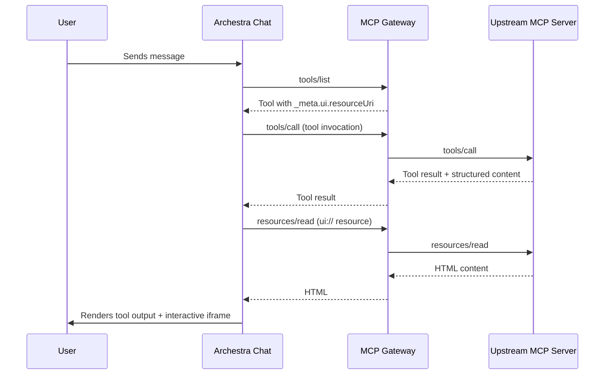

<!--
Check ../docs_writer_prompt.md before changing this file.

This page covers MCP Apps: how MCP servers expose interactive UIs through the `_meta.ui` convention, and how Archestra renders them in the Chat UI.
-->

MCP Apps are interactive user interfaces served by MCP servers and rendered inside Archestra's Chat UI. When an MCP tool declares a `_meta.ui.resourceUri` in its metadata, Archestra treats it as an MCP App — the tool result appears alongside a sandboxed iframe that loads the HTML content from the referenced resource.

## How it works



1. During `tools/list`, Archestra detects tools with `_meta.ui.resourceUri` and stores the metadata in the `meta` column on the tools table.
2. When the LLM invokes such a tool, the result is rendered as usual.
3. The Chat UI fetches the referenced `ui://` resource via the MCP Gateway's `resources/read` endpoint, which proxies the request to the upstream MCP server.
4. The returned HTML is loaded into a sandboxed iframe (`sandbox="allow-scripts"`).

## AppBridge protocol

The iframe communicates with the host page through `window.postMessage` using a JSON-RPC protocol:

| Method | Direction | Description |
|--------|-----------|-------------|
| `resize` | iframe → host | Requests iframe height adjustment. Payload: `{ height: number }` |
| `getToolOutput` | iframe → host | Requests the tool's output data. Host responds with the tool result. |

## MCP server requirements

For an MCP server to expose an MCP App, it must:

1. **Declare `_meta.ui.resourceUri`** on the tool definition in `tools/list`:
   ```json
   {
     "name": "create-workflow",
     "_meta": {
       "ui": { "resourceUri": "ui://my-server/workflow-editor" }
     }
   }
   ```

2. **Serve the resource** via `resources/list` and `resources/read` using the `ui://` URI scheme. The resource content must be HTML with MIME type `text/html`.

## Catalog entries

Two MCP App vendors are pre-seeded in the catalog:

- **n8n-mcp** — Workflow automation with interactive workflow editor. Requires `N8N_API_KEY` and `N8N_BASE_URL` secrets.
- **excalidraw-mcp** — Collaborative whiteboard drawing. No authentication required.

Install them from **MCPs → Catalog**.

## Security

MCP App iframes are sandboxed with `sandbox="allow-scripts"` only. They cannot:

- Navigate the parent page or open popups
- Access cookies or local storage from the parent origin
- Submit forms or use the same origin as the host

Content is loaded via blob URLs to avoid CSP conflicts with external sources.
