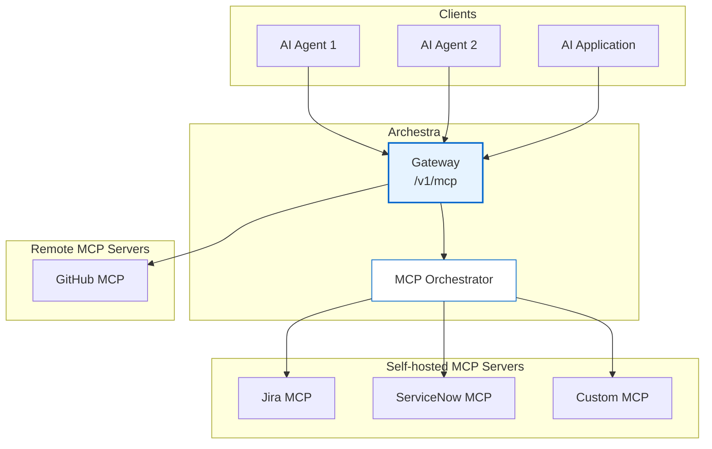
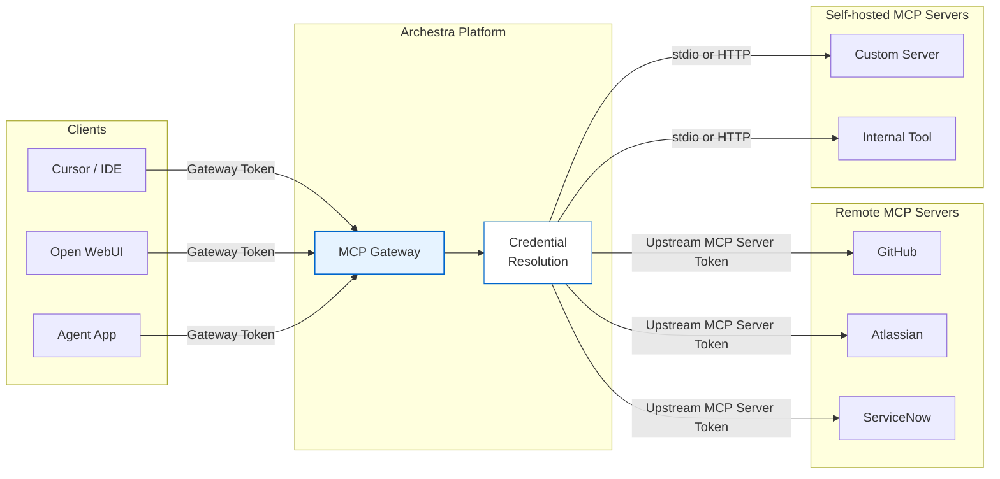

<!--
Check ../docs_writer_prompt.md before changing this file.

This document is human-built, shouldn't be updated with AI. Don't change anything here.

Exception:
- Screenshot
-->

MCP Gateway is the unified access point for MCP clients. It gives Cursor, Claude Desktop, Open WebUI, custom agents, and other MCP clients one endpoint for discovering and calling tools from remote MCP servers, self-hosted MCP servers, knowledge sources, and built-in Archestra tools.

Each gateway has its own tool assignments, team scope, authentication settings, custom header passthrough, logs, metrics, and traces. This lets teams expose only the tools a client should use without exposing every installed MCP server.

## How It Fits

## Creating A Gateway

A gateway is ready when it has at least one tool assignment and one supported authentication path.

Start from **MCPs > Gateways**, create or open a gateway, then assign tools from installed MCP servers, knowledge sources, or the built-in Archestra MCP server. Use **Connect** to copy client-specific connection details for Cursor, Claude Desktop, Open WebUI, or direct API usage.

Gateway tool assignments can point to a specific installed MCP server connection or use **Resolve at call time**. Static assignments are useful for shared team credentials. Resolve-at-call-time is useful when each caller should use their own upstream credential.

## Authentication

Gateway authentication and upstream MCP server authentication are separate. The client authenticates to Archestra first. When a tool runs, Archestra resolves the credential needed by that specific upstream MCP server.

MCP Gateways support four client authentication paths:

- **OAuth 2.1**: MCP-native clients authenticate through the [MCP Authorization spec](https://modelcontextprotocol.io/specification/2025-11-25/basic/authorization). Archestra supports Authorization Code + PKCE, DCR, CIMD, and standard well-known discovery.
- **ID-JAG**: Enterprise-managed MCP clients exchange an identity assertion JWT for an Archestra-issued MCP access token scoped to the gateway.
- **Identity Provider JWKS**: Clients send an external IdP JWT directly to the gateway. Archestra validates it against the IdP's JWKS and matches the caller to an Archestra user.
- **Bearer Token**: Direct integrations send `Authorization: Bearer arch_<token>`. Legacy `archestra_<token>` values remain valid. Tokens can be scoped to a user, team, or organization.

Use OAuth 2.1 for standard MCP clients, ID-JAG or JWKS for enterprise-managed identity, and bearer tokens for direct service integrations or simple local setup.

See [MCP Authentication](/docs/mcp-authentication) for gateway auth flows, upstream credential resolution, OAuth refresh, and enterprise IdP token exchange.
