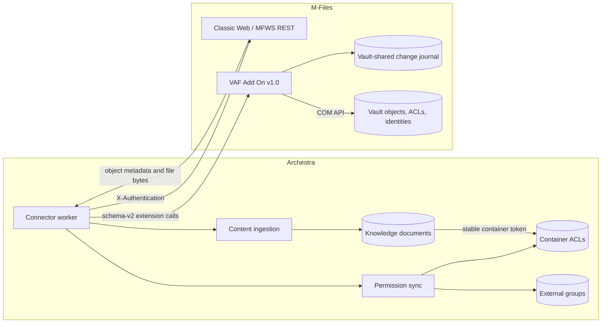
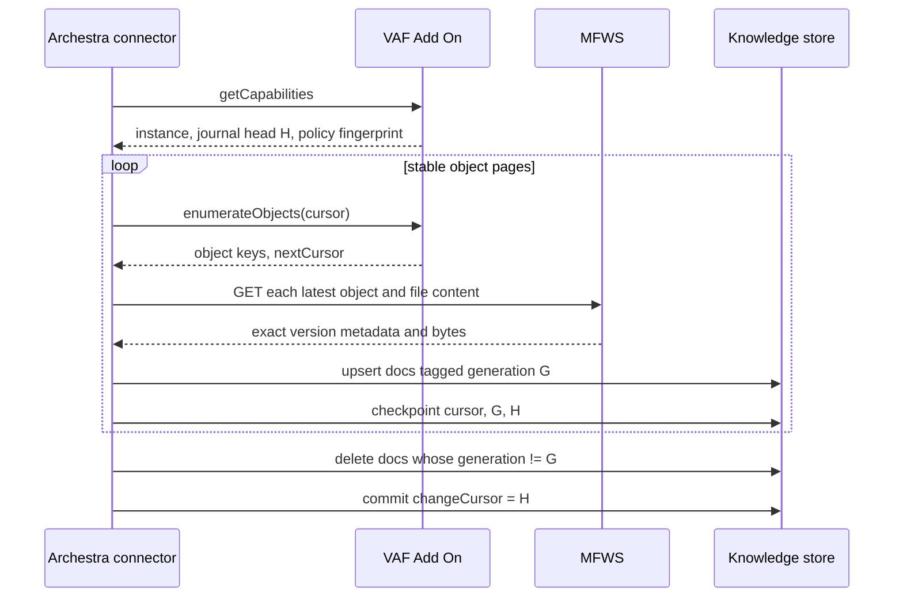
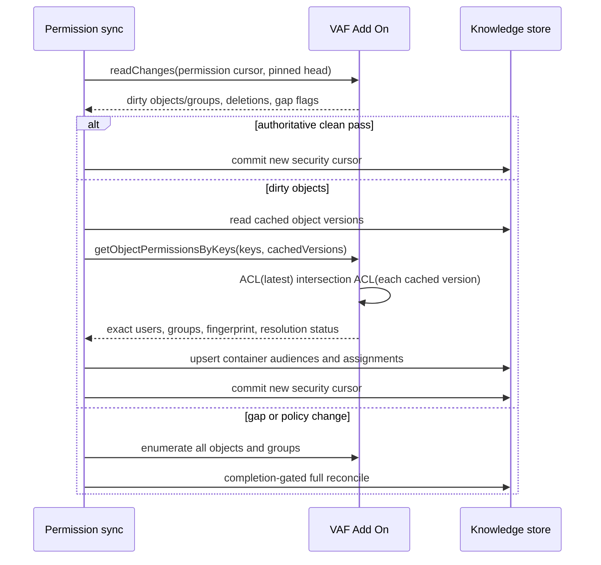

<!-- Renaming/deleting this file? Add a redirect in docs/redirects.json. -->

The M-Files connector is in beta. Set `ARCHESTRA_KNOWLEDGE_BASE_MFILES_CONNECTOR_ENABLED=true` (see [Deployment](/docs/platform-deployment)) to show the connector type and its install endpoints.

The M-Files connector indexes files from a vault and mirrors the source read audience into Archestra. Content travels through the M-Files Web Service (MFWS); the Archestra VAF Add On, a narrow Vault Application Framework application, supplies durable change tracking and the administrative permission APIs that MFWS does not expose.

The connector and add-on use the schema-v2 / add-on-v1.0 contract. It supports resumable baselines, content and permission deltas, deletions, exact cached-version permission checks, group display names, empty groups, Multi-Server Mode routing, and password-derived MFWS tokens. All security ambiguity fails closed.

## M-Files mental model

An M-Files **vault** stores typed, versioned business objects rather than a filesystem tree. A logical object is identified by `objectTypeId + objectId`; one immutable revision adds `objectVersion`. An object can contain zero or more files, each with a stable `fileId` and a version.

Archestra indexes every supported attached file as a separate knowledge document:

```text
mfiles:<objectTypeId>:<objectId>:file:<fileId>
```

The ID is stable across object and file revisions. Every indexed file also stores `mfilesObjectKey = <objectTypeId>:<objectId>`, so an object-level permission result can secure all of its files.

## Architecture



This boundary keeps Archestra cross-platform while permission evaluation stays beside the vault. The add-on returns only object keys, effective read principals, groups, and change records; file content never flows through it.

## Required M-Files API configuration

The connector requires **Classic Web with MFWS REST enabled**. It appends `/REST` to the configured base URL. The following M-Files clients and APIs may coexist, but they are not alternative connector transports:

| M-Files surface | Connector requirement |
| --- | --- |
| Classic Web / MFWS REST | Required for authentication, extension calls, object metadata, and file downloads |
| New Web | Optional; it may be enabled alongside Classic Web, but New Web alone does not provide MFWS |
| Mobile API/client | Optional and unrelated to connector traffic |
| Windows desktop client | Not required on the Archestra host |

M-Files Server and Server Tools are Windows products. Use a supported Windows Server release for production. Windows 11 is useful for development and the documented Community Edition verification environment, but there is no native M-Files Server deployment for Linux or macOS. Archestra itself can run on Linux because it communicates over HTTPS.

## Authentication

Use a dedicated machine identity that can read every configured object type. Every add-on call requires the M-Files **Change full control role**; M-Files itself authenticates the caller and enforces that access. The add-on keeps no caller configuration of its own.

The connector authenticates with a dedicated M-Files login account. Store its username and password in the connector credential fields. Archestra exchanges them at `/REST/server/authenticationtokens` for an explicit one-hour token with a unique session ID. Content and add-on requests carry only `X-Authentication`; the password is not sent again until renewal.

The connector retains authentication response cookies, including Multi-Server Mode routing cookies such as `mfilesmsm`. A `401` or `403` clears the token, authenticates once, and retries once. A persistent error stops the run without advancing its cursor.

Always use TLS. Store secrets only in the connector credential fields, rotate them according to the identity-provider or M-Files login policy, and do not log tokens or ACL payloads.

## VAF Add On installation and access

A pre-built `archestra-m-files-vaf-add-on.mfappx` is published on its own release track, `m-files-vaf-add-on-v<version>`. Platform releases are immutable once published, so the package cannot be attached to them. The connector form's Manual installation tab links the newest published package — the server verifies it exists first. It is produced in CI with the official M-Files VAF project packaging — `dotnet build` of the add-on project zips the build output into the `.mfappx`, with all M-Files assemblies coming from the MIT-licensed [`MFiles.VAF` NuGet package](https://www.nuget.org/packages/MFiles.VAF) — so no M-Files installation is involved in the build. Install it like any vault application: M-Files Admin, Document Vaults, right-click the vault, Applications, Install, and restart the vault when prompted.

The connector create/edit form surfaces a one-command guided installer (`irm '<your instance>/api/mfiles-vaf-add-on/script' | iex`); run it in PowerShell on the Windows machine hosting M-Files Server as an M-Files system administrator. The command is identical for every caller: the served bootstrap fetches the static installer (`/scripts/install-m-files-vaf-add-on.ps1`) and passes it the package source the server resolved for this installation. The script downloads the pre-built package (or compiles from source with `-BuildFromSource` against the locally installed M-Files assemblies), installs it into the chosen vault over the M-Files COM API, and restarts the vault — the logged-on Windows user is the only credential it needs. Every step can be skipped and re-run (`-PackagePath`, `-SkipBuild`, `-SkipInstall`); if the COM install step cannot run, install the printed `.mfappx` manually in M-Files Admin — nothing else remains to configure.

For a fully manual build, the reference source is in [`integrations/m-files-vaf-add-on/`](https://github.com/archestra-ai/archestra/tree/main/integrations/m-files-vaf-add-on). Build on Windows against the exact installed M-Files Server or Server Tools assemblies:

```powershell
./build-package.ps1 -Configuration Release
```

Install the resulting `archestra-m-files-vaf-add-on.mfappx` on the target vault and restart the vault. The minimum declared M-Files version is 25.3; the compatibility build target is M-Files 26.6.

Grant the connector identity the **Change full control of vault** administrative access; M-Files enforces it on every add-on call.

The connection test calls `/REST/session` and `getCapabilities`, then verifies schema version, add-on instance, capabilities, caller, and vault GUID. A connection is not healthy merely because token acquisition succeeded.

## Content synchronization

### Authoritative baseline

The add-on enumerates managed objects in stable zero-padded object-key order. It recursively bisects bounded object-ID ranges when a native search page is full, so there is no fixed 10,000-object safety ceiling and no accepted partial result. External-repository object types are rejected because their native change and version guarantees differ.

At baseline start, the connector captures the add-on journal head and creates a generation UUID. Every stored document is tagged with that generation. Page cursors, generation, add-on instance, and captured head are checkpointed after each durable batch. Only the final page:

1. deletes connector documents not tagged with the completed generation;
2. clears the baseline continuation fields; and
3. commits the captured journal head as the delta cursor.

An interrupted baseline never runs its deletion sweep. It resumes from the stored object cursor and generation.



### Delta pass

Object creation, check-in, property change, permission change, deletion, group change, and security-configuration change append a sequence to a vault-shared journal. Head allocation and event creation use compare-and-swap storage, so multiple application servers cannot allocate the same sequence. The add-on retains 20,000 events.

A read pins the current head. Later pages use that same head, preventing an endless moving target. Missing entries, a cursor below the retention floor, a new add-on instance, configuration drift, or an incompatible policy fingerprint promote the run to a full baseline/reconcile.

For `object-upsert`, Archestra reads the exact current object, upserts its supported files, and deletes stored files missing from the authoritative `seenSourceIds`. For `object-delete` or an MFWS `404`, it reconciles the object scope to an empty set. A clean journal pass advances its cursor with zero object metadata or content reads.

The cursor is written only after every document and scope reconciliation in that page succeeds.

## Permission synchronization

Permission sync uses the same journal but owns a separate state. A clean authoritative pass reads no ACLs or groups, and dirty object keys are refreshed exactly. The add-on flattens M-Files groups while calculating effective users; a group membership change can therefore affect any object that references that group. Group events deliberately promote permission sync to a completion-gated full reconcile until M-Files exposes a safe reverse ACL index. This is a security boundary: a revocation is never deferred to an eventually consistent group-only update.

For each object, Archestra sends the versions currently cached in its document metadata. The add-on evaluates the latest version and every cached version, then intersects their read audiences. This prevents newly broadened source permissions from exposing older content that Archestra still has cached.



M-Files permission components restrict one another; the add-on intersects active custom and automatic components instead of unioning allows. Explicit denies remove principals within a component. Vault groups and supported pseudo-users are expanded to concrete enabled vault users. A single grantee that Archestra cannot map — a principal without either a manual Archestra mapping or a verified email — is dropped from the audience, never the whole object: under-granting a co-grantee only ever narrows who can read, so it can never over-grant, and the resolvable readers keep their access. The dropped account surfaces as an unassigned user in the connector's Users view, where an admin can map it. The whole object is fail-closed to an empty audience only when the add-on itself cannot read the ACL — an unsupported component, missing identity, group cycle, or COM error sets `audienceResolutionFailed`.

Changed content under automatic permission sync is immediately assigned `acl=[]`. It becomes readable only after the matching source revision's exact permission pass succeeds.

Group authorization uses stable numeric vault group IDs. A separate catalog stores display names and empty groups for the UI. Names are never used as authorization identifiers and may change safely.

## VAF Add On schema-v2 operations

All calls use the extension method `ArchestraKnowledgePermissionSnapshot`, a UTF-8 JSON body sent as `text/plain`, and strict schema validation.

| Operation | Purpose |
| --- | --- |
| `getCapabilities` | Preflight schema, instance, vault, caller, journal bounds, and policy fingerprint |
| `readChanges` | Read a pinned, gap-detecting content/security journal page |
| `enumerateObjects` | Enumerate managed object keys for a baseline or full permission pass |
| `getObjectPermissionsByKeys` | Return exact latest-plus-cached-version effective audiences |
| `listGroups` | Return stable group IDs, names, flattened membership, and per-group resolution status |

Requests are bounded to 250 objects/groups per page, unknown fields and operations are rejected, and add-on calls never return file content or arbitrary metadata.

## Deployment matrix

| Deployment | Status and guidance |
| --- | --- |
| On-premises M-Files on Windows Server + IIS Classic Web | Production target; install the add-on in every vault, use a dedicated connector login account, and put IIS/MFWS behind trusted TLS |
| Windows 11 Community Edition + IIS | Development and compatibility verification only |
| M-Files Cloud | Live Cloud end-to-end certification is pending. |
| Linux/macOS M-Files Server | Not available; run Archestra on Linux/macOS only as the remote HTTPS client |

For M-Files Cloud, obtain the tenant's MFWS base URL, vault GUID, connector login credentials, and approval to deploy the signed add-on package. Keep Cloud connectors disabled until `getCapabilities` validates the intended vault and caller.

## Operations and recovery

- **Authentication failure:** rotate or fix the connector login account; a cursor is not advanced.
- **Add-on access failure:** grant the connector identity the Change full control of vault access.
- **Journal retention gap or new add-on instance:** expected promotion to an authoritative baseline/full permission reconcile.
- **Audience unreadable:** the affected object is fail-closed. Fix its ACL component/identity mapping and rerun permissions.
- **Group membership unreadable:** the group is stored with an empty membership, and an atomic M-Files permission pass does not commit past a failed group read.
- **Extraction failure:** the page fails before scoped deletion or checkpoint commit; retry after fixing connectivity or the source file.
- **Unsupported/oversized file:** intentionally omitted from the authoritative file set; files are limited to 25 MB and text to 500,000 characters.

Monitor content and permission runs independently. A production verification should exercise a clean delta, content update, file removal, object deletion, direct grant/revoke, group add/remove, group membership change, explicit deny, automatic permissions, and both allowed and denied user retrieval.

The permission-coverage counter is effective coverage. It treats a document as fail-closed when its assignment ACL is empty or when it has only a container token whose audience is empty, stale, or missing. A container token is an indirection key, not access by itself.

## Development and compatibility testing

Backend tests use an in-memory MFWS/add-on stub and cover authentication, cookie stickiness and re-authentication, resumable/empty baselines, zero-read deltas, changed/deleted objects, retention gaps, exact cached-version ACL requests, fail-closed principals, group names, empty groups, scoped security deltas, deletion reconciliation, and completion sweeps.

The add-on package builder compiles against locally installed M-Files assemblies. Run that build as part of each supported-version certification, then run the live fixture matrix with ordinary allow/deny users; an administrator bypass is not permission verification.

### Add-on distribution overrides

Released installations serve the add-on from GitHub release assets with no configuration. Two variables (documented in [Deployment](/docs/platform-deployment)) override that for development and pre-release deployments:

- `ARCHESTRA_KNOWLEDGE_BASE_MFILES_VAF_ADD_ON_SOURCE_REF` points the install script at a git ref of `archestra-ai/archestra` instead of a release. On a dev stack, set it to your feature branch to test the exact add-on you are changing; the special value `local` uses the backend checkout's HEAD commit. A deployment running unreleased code (a staging environment, for example) sets it to `main`.
- `ARCHESTRA_KNOWLEDGE_BASE_MFILES_VAF_ADD_ON_GITHUB_TOKEN` lets the backend download the ref's CI-built package — GitHub requires authentication for Actions artifact downloads, so use a token with `actions:read` on the repository. The backend proxies the package; the token never reaches clients.

With the ref set and a CI build available, the install command and the download link serve that build. Without the token (or before CI has built the ref), the install command compiles the add-on from the ref's source on the M-Files server instead — slower, but it needs no token.

### Windows/IIS compatibility certification — 2026-08-11

The GA add-on and connector were built and exercised end to end against M-Files Community Edition `26.6.16115.13` on Windows 11 Pro, IIS Classic Web/MFWS, and the password-derived token flow. This certifies the development/compatibility environment, not Windows 11 as a production M-Files Server platform.

The live run established the following invariants:

- the upgraded add-on reported schema 2 / add-on 1.0, and the connector's request-scoped caller matched its positive `/REST/session` vault user ID;
- an authoritative pass reconciled 52 indexed files and six named vault groups across 267 enumerated objects;
- two consecutive clean content passes processed and ingested zero documents, and two consecutive permission passes selected `delta` with zero documents, containers, groups, ACLs, or chunks touched;
- a reversible title change journaled one dirty object: content processed/ingested exactly one document and permission delta scanned exactly one document/one dirty container, with zero group work; restoring the title produced the same bounded delta and left the fixture at its original name;
- query-time token resolution returned `E2E-Direct-Allow` and `E2E-Nested-Group` for the ordinary allow identity, and returned no fixture document for the ordinary deny identity;
- strict resolution fail-closed behavior left 50 of the 52 indexed Sample Vault files effectively unreadable. The two readable files were the explicit direct and nested-group allow fixtures. This is expected for source ACLs containing principals/components that cannot be mapped exactly; it is surfaced in `containerAudienceFailures` and effective permission coverage rather than silently widened.

M-Files Cloud deployment and live Multi-Server certification remain explicitly pending the Cloud environment.

## Official M-Files references

- [M-Files Web Service](https://developer.m-files.com/APIs/REST-API/)
- [MFWS authentication](https://developer.m-files.com/APIs/REST-API/Authentication/)
- [MFWS Multi-Server Mode](https://developer.m-files.com/APIs/REST-API/Multi-Server-Mode/)
- [Vault Application Framework](https://developer.m-files.com/Frameworks/Vault-Application-Framework/)
- [Vault extension methods through MFWS](https://developer.m-files.com/APIs/REST-API/Reference/resources/vault/extensionmethod/)
