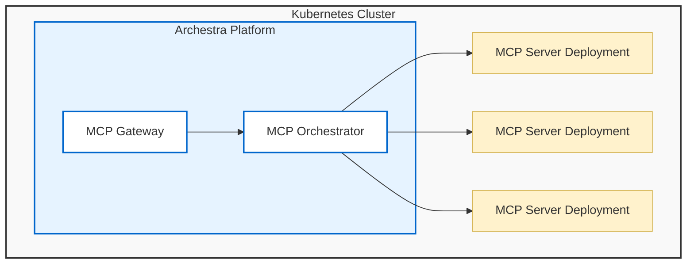

<!-- Renaming/deleting this file? Add a redirect in docs/redirects.json. -->

The MCP Orchestrator runs self-hosted MCP servers inside your Kubernetes cluster. It creates the deployment, injects configuration and secrets, exposes logs and status in Archestra, and connects those servers to Agents and MCP Gateways.

The orchestrator is only needed for MCP servers that Archestra hosts. Remote MCP servers can still be managed in the [Private MCP Registry](/docs/platform-private-registry) and exposed through [MCP Gateways](/docs/platform-mcp-gateway) without creating Kubernetes deployments.

## Runtime Model

Each self-hosted MCP server runs as its own Kubernetes deployment. That gives each server an isolated process, restart lifecycle, environment, image, and network boundary.

When a server is installed from the registry, Archestra creates or updates the deployment for that installation. Gateway traffic is routed to the deployment when a tool assigned from that installation runs.

The orchestrator also surfaces server status, container logs, and restart controls so operators do not need to leave Archestra for common MCP runtime tasks.

## Idle Hibernation

> **Enterprise feature, in beta** — see the [Pricing Model](/docs/platform-pricing-model).

A self-hosted MCP server that no one uses still holds a running pod. Idle hibernation scales that pod down to zero. Your cluster then holds pods only for the servers people use.

Archestra hibernates a server once it sits unused for the configured idle window. The next tool call wakes it automatically. The caller waits for the pod to start, then gets its result. You can leave hibernated servers alone.

Idle hibernation is off by default. An operator offers it with the `ARCHESTRA_ORCHESTRATOR_MCP_IDLE_HIBERNATION_ENABLED` environment variable. Once offered, turn it on in **Settings > MCP**. The `ARCHESTRA_ORCHESTRATOR_MCP_IDLE_HIBERNATION_SECONDS` variable sets the idle window, 30 minutes by default. See [Environment Variables](/docs/platform-deployment#mcp-server-orchestrator).

Each registry entry can override the organization setting. Open the entry's edit page and set **Idle hibernation**. Choose inherit, always allow, or never hibernate. The mode applies to every install of that entry. Installs of a multitenant entry share one deployment. Any install set to never hibernate keeps that deployment running.

Three states appear in the registry:

- **Hibernated**: the deployment is scaled to zero.
- **Waking**: the pod is starting after a tool call.
- **Running**: the server answers tool calls.

Hibernation covers every self-hosted deployment Archestra manages, including servers with [advanced YAML](#server-configuration). Waking restores the replica count the deployment had before it slept. Archestra annotates the deployments it hibernates with `archestra.io/hibernated`. It leaves a deployment you scaled to zero yourself alone.

Logs stay available while a server sleeps. The pod is gone. The view shows the deployment's Kubernetes events instead — a scale-down, for example.

### What Wakes a Server

A tool call wakes the server it targets. Browsing does not.

Agents still see every tool of a sleeping server, because Archestra lists tools from its database. Listing resources or prompts across a gateway skips the servers that sleep. One such listing would otherwise wake every sleeping server at once — a gateway with fifty of them would start fifty pods to answer a question nobody asked. Their resources and prompts reappear once a tool call wakes the server.

Background work never wakes a server either. Periodic tool re-discovery and health checks read what they can and leave a sleeping server asleep.

### Cluster Capacity

Hibernation returns pod capacity to the cluster. Other workloads can take that capacity while a server sleeps. Pods may then wait for room when many servers wake at once.

Archestra waits rather than failing the server. The pod stays queued and starts when capacity frees. The tool call returns a retryable message naming the capacity condition.

Three things prepare a cluster for wakes:

- **A cluster autoscaler** — Cluster Autoscaler or Karpenter — adds a node for a pending pod.
- **Spare headroom** from low-priority placeholder pods that real workloads preempt. Kubernetes calls this [over-provisioning](https://kubernetes.io/docs/tasks/administer-cluster/node-overprovisioning/).
- **Accurate CPU and memory requests** on your MCP servers. The scheduler places pods by them.

A new node takes a minute or more to join. Headroom matters most for servers that answer latency-sensitive calls.

### Waking During a Registry Outage

Archestra gives a generated deployment the `IfNotPresent` image pull policy for any registry image. A node that already holds the image starts the pod without calling your container registry. That wake succeeds even while the registry is unreachable.

A pod placed on a node without the image still pulls it. A node the autoscaler just added starts empty, for example. Spare headroom keeps more wakes on nodes that already hold the image.

Two kinds of server stay on always-pull. A server installed before you upgraded keeps its old policy. Restart or reinstall it to move it onto the cached image. A server with advanced YAML keeps the `imagePullPolicy` its author wrote — edit the YAML to change it.

Choose **Restart pods with a fresh image** on the registry entry to move a server onto the current image. That rollout goes to the container registry. The next restart or reinstall returns the server to the cached image.

### Recovery

A wake that does not finish leaves the server hibernated. The next tool call retries it.

An administrator can hard reset a stuck server. Archestra destroys the deployment and rebuilds it from current configuration. The reset also clears the runtime state Archestra kept for that server. Send `POST /api/mcp_server/:id/hard-reset`. The caller needs the MCP server installation admin permission.

A reset takes a few minutes and can outlast the request. The response then reports `status: "in-progress"`, and the server's status in the registry carries the outcome.

## Server Configuration

Self-hosted registry entries define how the deployment should be built.

- **Base image with command and args**: use Archestra's MCP server base image and specify the command to run.
- **Custom image**: provide your own Docker image when the server is packaged as a container.
- **Environment and secrets**: define install-time fields, static environment variables, and secret values needed by the server.
- **Advanced YAML**: override the generated Kubernetes deployment when you need custom pod configuration.

Registry entries define whether a server is remote or self-hosted before the orchestrator creates any Kubernetes resources. See [Private MCP Registry - Server Configuration](/docs/platform-private-registry#server-configuration) for those registry fields.

## Transports

Self-hosted servers support two transports:

- **stdio**: Archestra runs the server process and communicates over standard input/output. This is the default for many local MCP servers.
- **streamable-http**: Archestra exposes the server through an internal Kubernetes service and communicates over HTTP. Use this when the server needs concurrent requests, downstream HTTP headers, or per-request credential injection.

Stdio is simple and works well for process-oriented servers. Streamable-http is the better fit when the server behaves like a normal HTTP service or needs request-specific identity.

## Image Pull Secrets

If a custom MCP server image is stored in a private container registry, configure image pull secrets so Kubernetes can authenticate when pulling it.

Archestra supports two patterns:

- **Existing Kubernetes secret**: select a preexisting `kubernetes.io/dockerconfigjson` secret from the Archestra platform namespace.
- **Provided registry credentials**: enter the registry server, username, and password, and Archestra creates the Docker registry secret.

Multiple image pull secrets can be configured for one server.

## Scheduling Defaults

If `tolerations` or `nodeSelector` are configured in the Helm values for the Archestra platform pod, those values are automatically inherited as defaults by all self-hosted MCP server deployments. This ensures MCP servers are scheduled on the same node pool as the platform without additional configuration.

These defaults can be overridden per-server via the advanced YAML config. See [Service, Deployment, & Ingress Configuration](/docs/platform-deployment#service-deployment--ingress-configuration) for the relevant Helm values.

## Credentials

The orchestrator injects the configuration and secrets required by self-hosted MCP servers. These values come from the installed server connection, not from the MCP client.

For stdio servers, credentials are usually provided as environment variables or secrets in the deployment. For streamable-http servers, Archestra can also inject request-specific HTTP credentials when the tool assignment uses dynamic credential resolution.

See [MCP Authentication](/docs/mcp-authentication#upstream-mcp-server-authentication) for credential resolution, OAuth refresh, and enterprise IdP token exchange.

## Use Case: Monthly Invoice Reports

The finance team installs `invoice-reporter`, a self-hosted MCP server that builds monthly invoice summaries. It runs on the first working day of each month and sits unused for the rest.

With idle hibernation on, the pod disappears 30 minutes after the last report. The deployment then costs nothing until the next run. When an analyst asks their agent for the September summary, the server wakes and answers. The team pins `payment-alerts` to never hibernate. Alerts cannot wait for a pod to start.
