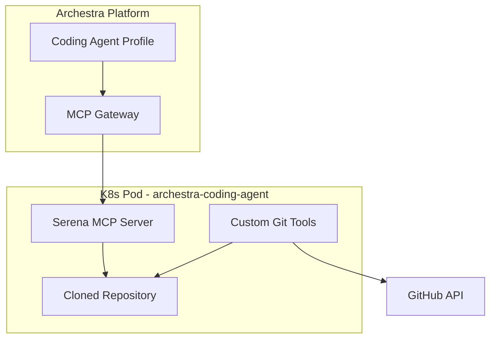

# Archestra Coding Agent Plan

## Summary of Research

### Serena Capabilities (What It Does Well)

- **Semantic code retrieval**: `find_symbol`, `find_referencing_symbols`, `read_file`
- **Symbol-level editing**: `replace_symbol_body`, `insert_after_symbol`, `insert_before_symbol`
- **File operations**: `create_text_file`, `read_file`
- **Shell execution**: `execute_shell_command` (with security options)
- **Language server support**: 30+ languages via LSP
- **Docker support**: Official Docker image available at `ghcr.io/oraios/serena:latest`
- **Extensibility**: Custom tools via Python subclassing

### Serena Gaps (What It Doesn't Do)

- No native git clone/pull/push
- No GitHub API integration (issues, PRs, branches)
- No repository checkout workflow

### GitHub MCP Server Capabilities

The official [github/github-mcp-server](https://github.com/github/github-mcp-server) provides:

- `create_branch`, `create_pull_request`, `list_commits`
- `get_file_contents`, `create_or_update_file`, `push_files`
- `fork_repository`, `create_repository`
- `create_issue`, `update_issue`, `add_issue_comment`
- `search_code`, `search_repositories`

**Important**: GitHub MCP server works at the API level (no local filesystem). It doesn't do `git clone`.---

## Architecture Decision



**Recommendation**: Create a **superset image** that bundles:

1. **Serena** - for semantic code operations
2. **Custom Git/GitHub tools** - for clone, commit, push, PR creation

This avoids requiring users to configure multiple MCP servers per coding session.---

## Implementation Approach

### Option A: Python Extension of Serena (Recommended)

Extend Serena by adding custom tools using its `Tool` base class:

```python
from serena.tools import Tool

class GitCloneTool(Tool):
    """Clone a GitHub repository to the workspace."""
    
    def apply(self, repo_url: str, branch: str = "main") -> str:
        # Implementation using subprocess or GitPython
        ...

class CreatePullRequestTool(Tool):
    """Create a pull request on GitHub."""
    
    def apply(self, title: str, body: str, base: str, head: str) -> str:
        # Implementation using PyGithub or requests
        ...
```


### Option B: Sidecar Pattern

Run GitHub MCP server alongside Serena in same pod (more complex networking).---

## Proposed Tools to Add

| Tool | Description ||------|-------------|| `git_clone` | Clone a repository to `/workspace` || `git_status` | Get current git status || `git_diff` | Show uncommitted changes || `git_commit` | Stage and commit changes || `git_push` | Push commits to remote || `git_checkout_branch` | Create or switch branches || `github_create_pr` | Create a pull request || `github_list_prs` | List open pull requests || `github_get_issue` | Get issue details |---

## Directory Structure

```javascript
experiments/archestra-coding-agent/
├── Dockerfile
├── Makefile
├── requirements.txt
├── pyproject.toml
├── README.md
├── src/
│   ├── __init__.py
│   ├── tools/
│   │   ├── __init__.py
│   │   ├── git_tools.py      # git clone, commit, push, etc.
│   │   └── github_tools.py   # PR creation, issues, etc.
│   └── config/
│       └── coding_agent_context.yml  # Serena context with our tools
└── tests/
    └── test_git_tools.py
```

---

## Key Files

### Dockerfile

```dockerfile
FROM ghcr.io/oraios/serena:latest

# Install git and GitHub CLI
RUN apt-get update && apt-get install -y git gh

# Install Python dependencies for GitHub API
COPY requirements.txt .
RUN pip install -r requirements.txt

# Copy custom tools
COPY src/ /app/custom_tools/

# Register custom tools with Serena
ENV SERENA_CUSTOM_TOOLS_PATH=/app/custom_tools
```


### Makefile

```makefile
IMAGE_NAME := europe-west1-docker.pkg.dev/friendly-path-465518-r6/archestra-public/archestra-coding-agent
VERSION := 0.0.1

build:
    docker build -t $(IMAGE_NAME):$(VERSION) .

push: build
    docker push $(IMAGE_NAME):$(VERSION)
```

---

## Archestra Integration

### MCP Server Configuration

Add to internal MCP catalog with:

- **Docker image**: `europe-west1-docker.pkg.dev/friendly-path-465518-r6/archestra-public/archestra-coding-agent:0.0.1`
- **Config fields**: `GITHUB_TOKEN`, `REPO_URL` (optional)
- **Volume mount consideration**: The pod will clone repos to ephemeral storage

### Profile Setup

Create a "Coding Agent" profile with:

- System prompt for coding tasks
- This MCP server assigned
- Appropriate autonomy policies for file editing

---

## Open Questions for You

1. **Git authentication**: How should the agent authenticate to GitHub?

- A) Environment variable `GITHUB_TOKEN` passed at MCP server config time
- B) OAuth flow from Archestra user context
- C) Both options

2. **Repository lifecycle**: Should repos persist across sessions?

- A) Ephemeral (clone fresh each session) - simpler
- B) Persistent volume per session - faster for repeat work

3. **Scope of first version**: Start minimal or comprehensive?