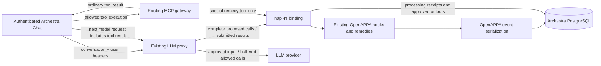

# OpenAPPA inside Archestra

This opt-in integration calls the existing OpenAPPA runtime through napi-rs.
It uses Archestra's native loader, LLM proxy, buffered streaming gate, MCP
gateway remedy tool, and PostgreSQL migrations. It starts no OpenAPPA
HTTP server. The paired OpenAPPA change adds an optional PostgreSQL event store
and an entry point to the existing MCP remedy implementation.



## Build and run

Cargo fetches OpenAPPA from its public Git repository at commit
`8ed22934068f030faea9310eee2eb0ddef756a4d`, pinned in this package's manifest and
the workspace lockfile. A sibling checkout is not required. Update the revision
and lockfile together when adopting a newer runtime. The lockfile also selects
`rmcp` 3.4.0, matching the runtime's MCP API. Rebuild the native addon and
restart the backend after updating; production uses the normal Archestra image build.

From `archestra/platform`:

```sh
pnpm install --frozen-lockfile
pnpm --filter @archestra/openappa-rs build:dev
pnpm --filter @backend db:migrate
```

Configure the usual Archestra database and auth secret, then explicitly set:

```sh
ARCHESTRA_OPENAPPA_ENABLED=true
```

With this flag enabled in `platform/.env`, `tilt up` builds and load-checks the
native addon before starting the development backend. Changes to its Rust
sources, build configuration, or the workspace Cargo manifest/lockfile rebuild
the addon and restart the backend after a successful build. Failed builds leave
the previous backend running and appear as errors in Tilt. With the flag off,
Tilt skips this build. The build uses the same pinned OpenAPPA dependency as
Docker; it does not use a sibling OpenAPPA checkout.

The feature flag defaults to false and does not inherit `ARCHESTRA_BETA`.
Enabling it automatically adds `appa` to the effective proxy plugin list.
An explicit `appa` entry in `ARCHESTRA_LLM_PROXY_PLUGINS` cannot enable APPA
while the flag is off. With the flag off, the existing Tool
Guardrails run unchanged: APPA is not loaded, session headers are not required
or injected, and the remedy tool is neither advertised nor callable. Additive
schema migrations still run normally.

Enabling without a policy path is a configuration error. The native runtime
validates the policy and initializes lazily on first use. Failures do not fall
back to the old evaluator. Restart the backend after changing either setting.

`test-policy.toml` is a narrow verification fixture, not a production policy.
It treats `archestra__whoami` as suspicious input and requires trusted context
for `archestra__list_agents`, and admits the read-only `archestra__search_tools`
discovery step. To reproduce the browser check, assign those two
read-only tools through Archestra's existing tool settings, use Custom tool
access (or remove their Auto-mode exclusions), configure an OpenAI provider,
and select **GPT-5.6 Terra** in Chat. No provider key belongs in source files.
The remedy tool is implicitly available while the integration is enabled.

In a new conversation, ask Chat to discover and run `whoami`. The fixture first
returns an acceptance remedy; ask Chat to execute the offered plan and retry.
After the successful identity read, restart the backend and ask Chat to run
`list_agents` without accepting any further remedy. The native policy should
refuse because the session's trust is now suspicious. The paired `summary.md`
records this complete live sequence with GPT-5.6 Terra.

The existing platform Dockerfile builds and deploys the fourth native addon
using the same pinned Cargo dependency. Build it through the normal image path:

```sh
docker buildx build --target unified-slim .
```

Cargo fetches the full pinned repository, including the runtime's plugin fingerprint
inputs. Its checked-in `receiver/appa-yell/salt.txt` is a public protocol constant
already compiled into every OpenAPPA runtime, not a deployment credential.
The production `pnpm deploy` includes `index.cjs`, declarations, the native
binary, and the shared napi loader. Native builds are excluded from Turbo's
cross-platform cache. The normal Archestra image and release workflows are
unchanged; no separate addon release or binary download is introduced. The
plugin list gates execution, so builds still compile/package the addon when
APPA is not enabled.

## Identity and lifecycle

Chat sends `X-Appa-Session-ID` using the conversation ID. The model constructor
also supports `X-Appa-Parent-ID`; the initial top-level Chat flow omits it.
The proxy derives the organization from the resolved agent. Internal agent runs,
including Chat, Slack and A2A, use the existing local-request trust boundary.
Caller identity is optional audit attribution. External callers authenticate through the
proxy's existing authentication; a raw provider key and user headers alone are
not sufficient. There is no APPA-specific signed identity header.

The native actor ID hashes only the session ID. Everyone in a shared thread
uses the same guardrail state, regardless of caller or organization attribution.
Session IDs must identify a conversation uniquely within this deployment. A changed
parent is refused. `SessionStart` restores the existing trajectory. This version
does not submit `Prompt` or `TurnEnd` from Chat or infer them in the proxy.
Abandoned-call cleanup and unused remedy-permit lifetime are unchanged.
Detached MCP task execution remains disabled only while the flag is enabled.

Both streaming and non-streaming proxy paths call `ToolCall`; existing streaming
buffers retain tool deltas until the decision completes. Existing name
normalization unwraps `run_tool` and client decorations. Chat does not check
APPA again before execution. Each call uses `call:<provider-tool-call-id>` as its
host identity, persisted with the dispatch. Several calls can remain open and
return in any order, including after a backend restart. Hook processing remains
serialized; tool execution can overlap.

On the next model request, the proxy reads the provider adapter's tool results,
including explicit protocol error flags. Ordinary results are client-reported
completion, not independent evidence of execution. It submits them as success
or explicit failure; structured cancellation retains an unknown outcome. The
native interface also retains explicitly reported unknown outcomes. No earlier Chat hook is required.

APPA's admitted output or blocking text is applied through the existing
`toolResultUpdates` mechanism before forwarding to the provider. Repeated history
uses the persisted answer. Chat keeps its ordinary tool-result storage and UI;
the proxy filters model input, not data already stored or displayed by Chat.

## Storage and interrupted processing

Migration `0471_openappa_native.sql` creates five tables:

| Table | Owner / purpose |
| --- | --- |
| `openappa_events` | Rust-encoded ordered event batches by root and sequence |
| `openappa_policy_files` | Original policy bytes addressed by their hash |
| `openappa_sessions` | Scoped actor/root/parent mapping and start decision |
| `openappa_operations` | Call, lifecycle, and remedy receipts |
| `openappa_processed_results` | Result status, decision, and approved output |

Rust owns event encoding, decoding, policy validation, replay, ordering, and
compare-and-swap behavior. TypeScript does not interpret policy events. A
dedicated PostgreSQL connection thread supports the existing synchronous store
API under async hook dispatch. The host's transaction and receipt SQL use that
same connection.

The initial native runtime serializes dispatch in-process. A PostgreSQL advisory
lock serializes each trajectory family across backend processes. Before an
operation that might consult an external authority, the binding commits a
`pending` receipt. It then opens one transaction for all hook event writes and
the completed receipt/approved output. Success commits both; errors roll back
both and discard tentative in-memory runtime state. A durable pending receipt
blocks further work in that family after an interruption.

Completed result keys are session ID + tool-call ID. Operation keys are
session ID + operation ID. Resending different bytes under the same key still receives the
saved approved output, without another hook, sanitizer, or annotator call.
Calls with reused operation IDs and changed arguments are refused. Result
correlation uses the original checked call even after compaction removes it.

Pending receipts deliberately require operator investigation. Inspect the
scoped operation/result, native event history, and external authority records.
Do not blindly delete the pending row or retry the consult: an external side
effect may have happened before the process lost its response. No automatic
recovery/reset endpoint is provided. This guarantees conservative replay
behavior, not exactly-once execution of arbitrary external services.

## Remedies and current limits

`archestra__execute_remedy_plan` uses the existing built-in registry, gateway
dispatch, schemas, and branding. It is implicit protocol support, like existing
run controls. The native gate checks the control call and the existing Rust MCP
implementation validates the offer against the session actor. Registered
remote authorities and sanitizers work. Narrowing offers remain model decisions.
This integration does not support human approval. Calls requiring it stay blocked,
and remedies requiring an unavailable human authority return APPA explanations.
The binding accepts no host approval ruling and has no review/resume events.

A denied call follows the existing proxy refusal envelope. If one proposed
call is denied, none of that response's tool calls reach the client. The proxy
settles earlier admissions from that batch with `cancel_call`, reporting known
non-execution as failure. Closing facts, a refusal replacing the original call
receipt, and the result receipt commit together. Replaying a canceled call ID
therefore cannot release it again. Other in-flight calls remain open. Cleanup
failure refuses the response; an interrupted native transaction retains the
existing pending-receipt recovery requirement. Refusal text
and remedy information come from APPA, with existing tool-name translation;
they are not replaced by legacy Tool Guardrails explanations. There is no
Chat-specific denied-call execution wrapper or automatic model retry.

Locked chats are refused while enabled because the native tables do not yet
use their browser-held encryption keys. Agent and skill delegation are checked
as ordinary tools in the parent's policy, including their returned output.
Internal delegated runs use the existing guardrails independently, outside the
parent's APPA trajectory. APPA child restrictions and return contracts are not
propagated until a child-return adapter exists. Provider-hosted tools remain
outside this initial adapter. Existing Chat/gateway permission and policy checks still apply
independently; only the LLM proxy's legacy policy evaluation is replaced.

Start new conversations when enabling this feature. Historical tool results
from before activation have no native admission receipts and are refused;
the integration does not invent approvals or silently migrate prototype state.

There is one native worker/connection per process, so throughput optimization,
connection recovery without a backend restart, retention/purge workflows, an
operator recovery UI, and deployment-specific TLS credential options remain
follow-up work. PostgreSQL TLS uses the system trust store and URL SSL settings.

## Verification

From this package, after Archestra migrations have been applied:

```sh
pnpm smoke:load
OPENAPPA_TEST_DATABASE_URL=postgresql://... pnpm test
```

The native tests use real hooks, a real PostgreSQL database, two Node processes,
and a local HTTP sanitizer. They cover changed resends, concurrent duplicates,
session isolation, parallel identical calls, reverse-order results after restart,
canceled-batch replay, remedy acceptance, restriction persistence without model
history, one-time sanitizer execution, unknown outcomes, and injected receipt
commit failure with event rollback. The storage test in the OpenAPPA tree is:

```sh
OPENAPPA_TEST_DATABASE_URL=postgresql://... cargo test -p appa-eventlog --features postgres -- --ignored
```

Backend coverage includes flag-off Tool Guardrails, APPA proxy calls/results,
whole-response refusal, explicit protocol errors, replay, session headers, MCP
remedy availability and refusal of human-approval offers. Chat tests verify that ordinary tools
execute and return their original output without APPA callbacks in either mode.

The pinned OpenAPPA revision includes the companion PostgreSQL and embedded-remedy
changes. Archestra uses embedded remedies without a human approval context.
Previous demo/browser results do not qualify this proxy-only refactor; validation
for this change is reported separately in the PR.

Organization policy text is stored in PostgreSQL and edited in OpenAPPA. Copy an existing file policy into the editor when upgrading.

The session-key migration clears old OpenAPPA sessions, events, and processing receipts.
Saved organization policies and policy files are preserved.
