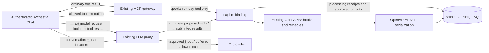

# OpenAPPA inside Archestra

This opt-in integration calls the existing OpenAPPA runtime through napi-rs.
It uses Archestra's native loader, LLM proxy, buffered streaming gate, MCP
gateway remedy tools, and PostgreSQL migrations. It starts no OpenAPPA
HTTP server. The paired OpenAPPA change adds an optional PostgreSQL event store
and an entry point to the existing MCP remedy implementation.



## Build and run

Cargo fetches OpenAPPA from its public Git repository at commit
`e2065813a7635759fef5ccfe8fbe73dfc44039c9`, pinned in this package's manifest and
the workspace lockfile. A sibling checkout is not required. Update the revision
and lockfile together when adopting a newer runtime. The lockfile also selects
`rmcp` 3.4.0, matching the runtime's MCP API. Rebuild the native addon and
restart the backend after updating; production uses the normal Archestra image build.

From `archestra/platform`:

```sh
pnpm install --frozen-lockfile
pnpm --filter @archestra/openappa-rs build:dev
pnpm --filter @backend db:migrate
```

Configure the usual Archestra database and auth secret, then explicitly set:

```sh
ARCHESTRA_OPENAPPA_ENABLED=true
```

With this flag enabled in `platform/.env`, `tilt up` builds and load-checks the
native addon before starting the development backend. Changes to its Rust
sources, build configuration, or the workspace Cargo manifest/lockfile rebuild
the addon and restart the backend after a successful build. Failed builds leave
the previous backend running and appear as errors in Tilt. With the flag off,
Tilt skips this build. The build uses the same pinned OpenAPPA dependency as
Docker; it does not use a sibling OpenAPPA checkout.

The feature flag defaults to false and does not inherit `ARCHESTRA_BETA`.
Enabling it automatically adds `appa` to the effective proxy plugin list.
An explicit `appa` entry in `ARCHESTRA_LLM_PROXY_PLUGINS` cannot enable APPA
while the flag is off. With the flag off, the existing Tool
Guardrails run unchanged: APPA is not loaded, the session header is not read,
and the remedy tools are neither advertised nor callable. Additive
schema migrations still run normally.

Enabling without a policy path is a configuration error. The native runtime
validates the policy and initializes lazily on first use. Failures do not fall
back to the old evaluator. Restart the backend after changing either setting.

`test-policy.toml` is a narrow verification fixture, not a production policy.
It treats `archestra__whoami` as suspicious input and requires trusted context
for `archestra__list_agents`, and admits the read-only `archestra__search_tools`
discovery step. To reproduce the browser check, assign those two
read-only tools through Archestra's existing tool settings, use Custom tool
access (or remove their Auto-mode exclusions), configure an OpenAI provider,
and select **GPT-5.6 Terra** in Chat. No provider key belongs in source files.
The remedy tools are implicitly available while the integration is enabled.

In a new conversation, ask Chat to discover and run `whoami`. The fixture first
returns an acceptance remedy; Chat executes the offered plan on its own and
retries. After the successful identity read, restart the backend and ask Chat
to run `list_agents`. The native policy should refuse because the session's
trust is now suspicious.

The existing platform Dockerfile builds and deploys the fourth native addon
using the same pinned Cargo dependency. Build it through the normal image path:

```sh
docker buildx build --target unified-slim .
```

Cargo fetches the full pinned repository, including the runtime's plugin fingerprint
inputs. Its checked-in `receiver/appa-yell/salt.txt` is a public protocol constant
already compiled into every OpenAPPA runtime, not a deployment credential.
The production `pnpm deploy` includes `index.cjs`, declarations, the native
binary, and the shared napi loader. Native builds are excluded from Turbo's
cross-platform cache. The normal Archestra image and release workflows are
unchanged; no separate addon release or binary download is introduced. The
plugin list gates execution, so builds still compile/package the addon when
APPA is not enabled.

## Identity and lifecycle

Chat sends `X-Appa-Session-ID` using the conversation ID. The model constructor
also supports `X-Appa-Parent-ID`; the initial top-level Chat flow omits it.
The proxy derives the organization from the resolved agent. Internal agent runs,
including Chat, Slack and A2A, use the existing local-request trust boundary.
Caller identity provides audit attribution. For external clients, it scopes the session and binds remedy offers to the authenticated credential. External callers authenticate through existing proxy mechanisms.

The native actor ID hashes the session ID. Authorized users share guardrail state within one organization. An organization change is refused.

The proxy scopes external session IDs to the authenticated credential. Another credential cannot join a personal session by repeating its ID. The remedy gateway resolves the recorded owner and ignores caller-supplied session headers. A changed parent is refused.

`SessionStart` restores the existing trajectory. The proxy sends `Prompt` at the start of each user turn, and `TurnEnd` after a terminal model answer. Detached MCP tasks remain disabled while OpenAPPA is enabled.

Both streaming and non-streaming proxy paths call `ToolCall`; existing streaming
buffers retain tool deltas until the decision completes. Existing name
normalization unwraps `run_tool` and client decorations. Chat does not check
APPA again before execution. Each call uses `call:<provider-tool-call-id>` as its
host identity, persisted with the dispatch. Several calls can remain open and
return in any order, including after a backend restart. Hook processing remains
serialized; tool execution can overlap.

On the next model request, the proxy reads the provider adapter's tool results,
including explicit protocol error flags. Ordinary results are client-reported
completion, not independent evidence of execution. It submits them as success
or explicit failure; structured cancellation retains an unknown outcome. The
native interface also retains explicitly reported unknown outcomes. No earlier Chat hook is required.

APPA's admitted output or blocking text is applied through the existing
`toolResultUpdates` mechanism before forwarding to the provider. Repeated history
uses the persisted answer. Chat keeps its ordinary tool-result storage and UI;
the proxy filters model input, not data already stored or displayed by Chat.

## Storage and interrupted processing

Migration `0471_openappa_native.sql` creates the event and receipt tables. Migration `0479_perpetual_malcolm_colcord.sql` adds host-key indexes. Offer routing is a host-signed plaintext claim, not a table.

| Table | Owner / purpose |
| --- | --- |
| `openappa_events` | Rust-encoded ordered event batches by root and sequence |
| `openappa_policy_files` | Original policy bytes addressed by their hash |
| `openappa_sessions` | Scoped actor/root/parent mapping and start decision |
| `openappa_operations` | Call, lifecycle, and remedy receipts |
| `openappa_processed_results` | Result status, decision, and approved output |

Rust owns event encoding, decoding, policy validation, replay, ordering, and
compare-and-swap behavior. TypeScript does not interpret policy events. A
dedicated PostgreSQL connection thread supports the existing synchronous store
API under async hook dispatch. The host's transaction and receipt SQL use that
same connection.

Dispatches for different trajectory families run concurrently. An in-process
lock serializes each family within a backend process, and a PostgreSQL advisory
lock serializes it across backend processes. Before an operation that might
consult an external authority, the binding commits a `pending` receipt. Hook
event writes and the completed receipt/approved output then commit as separate
short transactions. The runtime keeps no trajectory state in memory between
events, so a failed dispatch leaves nothing to discard. A durable pending
receipt blocks further work in that family after an interruption.

Completed result keys are session ID + tool call ID. Operation keys are session ID + operation ID. Remedy-execution receipts bind the authenticated spender. Submitting different result bytes under a completed result key returns the saved approved output without re-evaluating hooks. Submitting changed arguments under an existing logical call ID is refused.

Pending receipts deliberately require operator investigation. Inspect the
scoped operation/result, native event history, and external authority records.
Do not blindly delete the pending row or retry the consult: an external side
effect may have happened before the process lost its response. No automatic
recovery/reset endpoint is provided. This guarantees conservative replay
behavior, not exactly-once execution of arbitrary external services.

## Remedies and current limits

`archestra__execute_remedy_plan` executes remedies through the native gate. Offer routing is a signed plaintext claim on the notice and control call. Any replica verifies the HMAC and reconstructs the session. The runtime event log validates the offer before execution.

Personal offers require their original user. Organization offers allow any caller in that organization. Unknown, unauthorized, or spent offers return terminal feedback without executing.

The embedded API returns typed remedy outcomes, refusal reasons, and offer descriptions. Interactive human approval is not implemented. Calls requiring human approval stay blocked.

The proxy replaces a denied call with `archestra__get_remedy_plans`. The notice preserves the original call position and provider call ID. It carries the blocked tool, its arguments, and the policy ruling in plain text. Other allowed calls in the same response run normally. On later requests, the proxy restores each notice to the original tool call and injects the ruling as its result.

The runtime withholds results for unreleased call IDs. Unrecognized or expired remedy calls return a terminal message telling the model that nothing was applied.

Locked chats are refused while OpenAPPA is enabled. Agent and skill delegation are governed as ordinary tool calls. Sessions declaring provider-hosted tools or `tool_search` are refused with HTTP 400, except a hosted web search on OpenAI Responses (below). Notice restoration runs on Anthropic Messages (including Bedrock InvokeModel), OpenAI Responses, and OpenAI Chat Completions. On other protocols, OpenAPPA evaluates calls and results, but notices stay in history as notice calls.

The provider runs a hosted `web_search` inside the inference call, so the proxy cannot stop the call; it rules on what the call brought in. It withholds the response from the first `web_search_call` item on — the search record, the text the model wrote with the results in view, and any calls after it — and submits that as the result of a `web_search` tool call. An admitted result passes through unchanged. A held one reaches the client as a notice in place of the withheld part, so the model never sees it in a later request unless a remedy releases it. List `web_search` under `confined_results` to have the runtime stage the result: accepting the offer returns it. Any other denial drops it, and the model searches again once the remedy allows the call. The query itself has already reached the provider, which holds the session's context anyway. A search-backed turn loses token streaming after the search starts, since the verdict needs the whole turn.

Start new conversations when enabling this feature. Historical tool results
from before activation have no native admission receipts and are refused;
the integration does not invent approvals or silently migrate prototype state.

There is one native worker/connection per process, so throughput optimization,
connection recovery without a backend restart, retention/purge workflows, an
operator recovery UI, and deployment-specific TLS credential options remain
follow-up work. PostgreSQL TLS uses the system trust store and URL SSL settings.

## Verification

From this package, after Archestra migrations have been applied:

```sh
pnpm smoke:load
ARCHESTRA_OPENAPPA_TEST_DATABASE_URL=postgresql://... pnpm test
```

The native tests use real hooks, a real PostgreSQL database, two Node processes,
and a local HTTP sanitizer. They cover changed resends, concurrent duplicates,
session isolation, parallel identical calls, reverse-order results after restart,
canceled-batch replay, remedy acceptance, restriction persistence without model
history, one-time sanitizer execution, unknown outcomes, and injected receipt
commit failure with event rollback. The storage test in the OpenAPPA tree is:

```sh
OPENAPPA_TEST_DATABASE_URL=postgresql://... cargo test -p appa-eventlog --features postgres -- --ignored
```

Backend coverage includes flag-off Tool Guardrails, APPA proxy calls and
results, denial notices and their restoration, explicit protocol errors, replay,
session identity from headers and from the client's own request, and MCP remedy
availability. Chat tests verify that ordinary tools
execute and return their original output without APPA callbacks in either mode.

The pinned OpenAPPA revision includes the companion PostgreSQL and embedded-remedy
changes. Archestra uses embedded remedies without a human approval context.
Previous demo/browser results do not qualify this proxy-only refactor; validation
for this change is reported separately in the PR.

Organization policy text is stored in PostgreSQL and edited in OpenAPPA. Copy an existing file policy into the editor when upgrading.

The session-key migration clears old OpenAPPA sessions, events, and processing receipts.
Saved organization policies and policy files are preserved.

## Agent feedback reporting

Agent feedback reporting defaults to enabled when OpenAPPA and Guardrails v2
are enabled. Set `ARCHESTRA_OPENAPPA_YELL_ENABLED=false` to disable reports
to the shared OpenAPPA receiver.
The `archestra__yell` tool is available to protected sessions; its hook is
checked as `yell` against the active policy. The receiver destination is set
by the host, never by tool arguments. The report identifies Archestra and the configured frontend hostname. The host passes the authenticated actor
to OpenAPPA, which verifies the previously released call belongs to that actor.

Reports use upstream classification, size limits, gzip, signing, and HTTPS
transport. The receiver has create-only access to a private GCS bucket and
notifies Slack. The public signature is not authentication; incoming reports
remain untrusted. Raw prompts, tool arguments, outputs, and session identifiers
are omitted from diagnostics. Policy names and the free-text message are sent;
messages must not contain secrets or task content. The deployment reporting flag is
separate from policy editing and cannot be changed through policy TOML.
