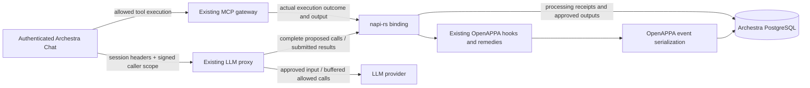

# OpenAPPA inside Archestra

This opt-in integration calls the existing OpenAPPA runtime through napi-rs.
It uses Archestra's native loader, LLM proxy, buffered streaming gate, MCP
gateway, execution outcomes, and PostgreSQL migrations. It starts no OpenAPPA
HTTP server. The paired OpenAPPA change adds an optional PostgreSQL event store
and an entry point to the existing MCP remedy implementation.



## Build and run

Keep the matching source trees as siblings named `archestra` and `openappa`.
The Rust path dependencies are deliberate while these coordinated changes are
reviewed; neither repository silently downloads an unpinned OpenAPPA version.

From `archestra/platform`:

```sh
pnpm install --frozen-lockfile
pnpm --filter @archestra/openappa-rs build:dev
pnpm --filter @backend db:migrate
```

Configure the usual Archestra database and auth secret, then set
`ARCHESTRA_OPENAPPA_POLICY_PATH` to an absolute, readable OpenAPPA deployment
TOML file. The flag applies to the backend deployment. Without it, the existing
proxy guardrails remain active. Startup/migration errors do not fall back to
unguarded operation. The native runtime initializes lazily on first use and
stays initialized; restart the backend to change the deployment configuration.

`test-policy.toml` is a narrow verification fixture, not a production policy.
It treats `archestra__whoami` as suspicious input and requires trusted context
for `archestra__list_agents`, and admits the read-only `archestra__search_tools`
discovery step. To reproduce the browser check, assign those two
read-only tools through Archestra's existing tool settings, use Custom tool
access (or remove their Auto-mode exclusions), configure an OpenAI provider,
and select **GPT-5.6 Terra** in Chat. No provider key belongs in source files.
The remedy tool is implicitly available while the integration is enabled.

In a new conversation, ask Chat to discover and run `whoami`. The fixture first
returns an acceptance remedy; ask Chat to execute the offered plan and retry.
After the successful identity read, restart the backend and ask Chat to run
`list_agents` without accepting any further remedy. The native policy should
refuse because the session's trust is now suspicious. The paired `summary.md`
records this complete live sequence with GPT-5.6 Terra.

The existing platform Dockerfile builds and deploys the fourth native addon.
Supply the paired source as a named BuildKit context:

```sh
docker buildx build --build-context openappa=../../openappa --target unified-slim .
```

The Docker source selection includes the existing runtime's plugin fingerprint
inputs. Its checked-in `receiver/appa-yell/salt.txt` is a public protocol constant
already compiled into every OpenAPPA runtime, not a deployment credential.
The production `pnpm deploy` includes `index.cjs`, declarations, the native
binary, and the shared napi loader. Native builds are excluded from Turbo's
cross-platform cache.

## Identity and lifecycle

Chat sends `X-Appa-Session-ID` using the conversation ID. The model constructor
also supports `X-Appa-Parent-ID`; the initial top-level Chat flow omits it.
The proxy derives organization and caller from its authenticated context.
Chat signs the proxy-agent/user/session/parent tuple using the existing auth
secret, in an internal header covered by log redaction. Loopback and attribution
headers alone are insufficient. External authenticated proxy clients can supply
the identity headers; raw provider keys alone do not identify an Archestra user.

The native actor ID hashes the organization/caller/session tuple. A changed
parent is refused. `SessionStart` restores the existing trajectory. Chat reports
`Prompt` once for an identified submitted user message and `TurnEnd` after a
non-aborted UI stream completes. An inference response is never treated as a
turn boundary. Cancellation leaves uncertain work for the existing next-prompt
cleanup. Detached MCP task execution is disabled for this initial adapter.

Both streaming and non-streaming proxy paths call `ToolCall`; existing streaming
buffers retain tool deltas until the decision completes. Existing name
normalization unwraps `run_tool` and client decorations. Chat checks the same
durable call receipt again immediately before execution, covering resumed
approvals and conversations created before the feature was enabled.

Chat captures the existing MCP `isError`/cancellation classification before
formatting loses it. It checks the result before it reaches the AI SDK and saved
conversation history. The proxy reapplies receipts when history is resent.
External adapter `isError=false` defaults do not establish success; their status
remains unknown and their unchecked bodies are withheld.

## Storage and interrupted processing

Migration `0463_openappa_native.sql` creates five tables:

| Table | Owner / purpose |
| --- | --- |
| `openappa_events` | Rust-encoded ordered event batches by root and sequence |
| `openappa_policy_files` | Original policy bytes addressed by their hash |
| `openappa_sessions` | Scoped actor/root/parent mapping and start decision |
| `openappa_operations` | Call, lifecycle, and remedy receipts |
| `openappa_processed_results` | Result status, decision, and approved output |

Rust owns event encoding, decoding, policy validation, replay, ordering, and
compare-and-swap behavior. TypeScript does not interpret policy events. A
dedicated PostgreSQL connection thread supports the existing synchronous store
API under async hook dispatch. The host's transaction and receipt SQL use that
same connection.

The initial native runtime serializes dispatch in-process. A PostgreSQL advisory
lock serializes each trajectory family across backend processes. Before an
operation that might consult an external authority, the binding commits a
`pending` receipt. It then opens one transaction for all hook event writes and
the completed receipt/approved output. Success commits both; errors roll back
both and discard tentative in-memory runtime state. A durable pending receipt
blocks further work in that family after an interruption.

Completed result keys are organization + authenticated caller + session +
tool-call ID. Resending different bytes under the same key still receives the
saved approved output, without another hook, sanitizer, or annotator call.
Calls with reused operation IDs and changed arguments are refused. Result
correlation uses the original checked call even after compaction removes it.

Pending receipts deliberately require operator investigation. Inspect the
scoped operation/result, native event history, and external authority records.
Do not blindly delete the pending row or retry the consult: an external side
effect may have happened before the process lost its response. No automatic
recovery/reset endpoint is provided. This guarantees conservative replay
behavior, not exactly-once execution of arbitrary external services.

## Remedies and current limits

`archestra__execute_remedy_plan` uses the existing built-in registry, gateway
dispatch, schemas, and branding. It is implicit protocol support, like existing
run controls. The native gate checks the control call and the existing Rust MCP
implementation validates the offer against the authenticated actor. Registered
remote authorities and sanitizers work. Interactive MCP elicitation has no
embedded bridge yet and returns the runtime's existing no-answer behavior.

The proxy's existing refusal response ends the model step. The offered remedy
is saved in Chat and becomes model context on the next user turn; automatic
same-turn remedy continuation is not implemented. Native feedback may suggest
a child as an alternative, but Chat delegation is explicitly refused until a
complete child-return adapter exists. The native boundary contains the existing
child hook plumbing, not a finished Chat child lifecycle.

Locked chats are refused while enabled because the new native tables do not
yet use their browser-held encryption keys. Only approved text is returned to
Chat; rich MCP UI content, images, and structured content are omitted so they
cannot reintroduce the original result during history/compaction. Other client
lifecycle detection and provider-hosted tools are outside this initial adapter.
Existing Chat/gateway permission and policy checks still apply independently;
only the LLM proxy's legacy policy evaluation is replaced.

Start new conversations when enabling this feature. Historical tool results
from before activation have no native admission receipts and are refused;
the integration does not invent approvals or silently migrate prototype state.

There is one native worker/connection per process, so throughput optimization,
connection recovery without a backend restart, retention/purge workflows, an
operator recovery UI, and deployment-specific TLS credential options remain
follow-up work. PostgreSQL TLS uses the system trust store and URL SSL settings.

## Verification

From this package, after Archestra migrations have been applied:

```sh
pnpm smoke:load
OPENAPPA_TEST_DATABASE_URL=postgresql://... pnpm test
```

The native tests use real hooks, a real PostgreSQL database, two Node processes,
and a local HTTP sanitizer. They cover changed resends, concurrent duplicates,
tenant isolation, remedy acceptance, restriction persistence without model
history, one-time sanitizer execution, unknown outcomes, and injected receipt
commit failure with event rollback. The storage test in the OpenAPPA tree is:

```sh
OPENAPPA_TEST_DATABASE_URL=postgresql://... cargo test -p appa-eventlog --features postgres -- --ignored
```

Backend regression coverage lives in
`backend/src/routes/proxy/llm-proxy-openappa.test.ts`, alongside the existing
proxy, Chat, gateway, and logging suites. Browser verification and the exact
observed limitations are recorded in the paired OpenAPPA `summary.md`.

## Prototype follow-up: Chat denials and human review

The prototype branch now includes the reusable Chat fixes from the demo snapshot:

- A denied tool call remains a tool call with its original ID, name and arguments. Its tool result contains the policy ruling, allowing the model loop to explain the outcome.
- The native binding substitutes authoritative stored feedback for results attributed to denied calls; supplied result text cannot forge a successful execution.
- Human-review offers open Archestra's inline approval card through a caller- and session-scoped in-process bridge. The ruling travels only through the host channel, outside model-provided arguments.
- Approved calls resume against an exact-input receipt. Cancellation, denial, mismatched input and replay cannot release an unapproved call.
- Non-human audience/trust narrowing offers remain visible to the model. They are not automatically accepted, allowing independent work before accepting a restrictive read.

Use the paired `feat/archestra-native-postgres` OpenAPPA branch: its embedded remedy implementation preserves the host ruling when consulting an authority without an MCP request context.

This port does not include the demo tools/outbox migration, audience resolver, GitHub annotator, policy studio, status line, mascot or fixture deployment. It also does not include the separate Claude MCP protocol negotiation workaround.

Validation covers the real Chat tool wrapper's next model step, signed proxy call preservation, scoped review, cancellation/denial, native PostgreSQL receipts, forged-result rejection and deferred narrowing. No browser or live-provider run was performed for this isolated port.
