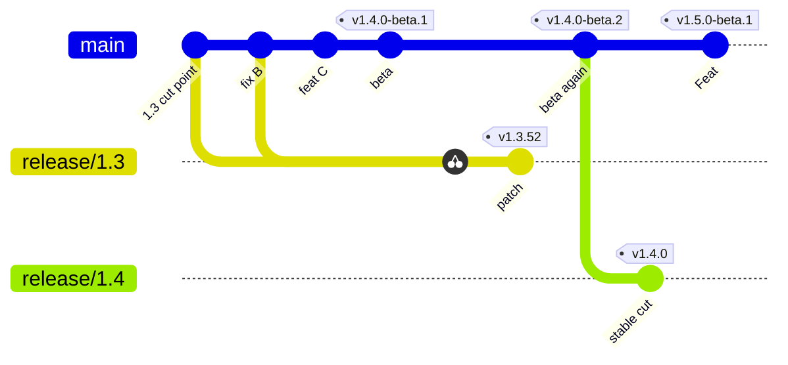

# Release Checklist

Archestra uses two release pipelines:
- **Beta:** Automatic releases from `main` (for example, `1.4.0-beta.2`).
- **Stable:** Tested and approved releases from `release/X.Y` (for example, `1.3.52` or `1.4.0`).

[Release-please](https://github.com/googleapis/release-please-action#supporting-multiple-release-branches) manages versions and changelogs. GitHub Actions builds the artifacts. Only approved stable releases update `latest`.



## Release A Beta

1. [ ] Open the release-please PR on `main` (for example, `1.4.0-beta.2`).
2. [ ] Review the changelog and confirm checks pass.
3. [ ] Merge the PR and confirm the **Release Please** workflow publishes the beta release.

## Ship A Stable Fix

1. [ ] Land the fix on `main` first. The fix ships automatically in the next beta.
2. [ ] Add the label `backport release/X.Y` for each configured target (for example, `backport release/1.3`).
   - The label can be added before or after the main PR merges. The workflow checks requests every five minutes.
   - **Open Backport PRs** cherry-picks the merged commit with `-x` and opens a separate PR per target.
   - The automation opens PRs; it never merges them or approves stable publication.
3. [ ] Review each generated backport PR, confirm its checks pass, then add it to that branch's merge queue.
   - Only include necessary bug fixes. Do not include new features, refactors, or schema migrations.
   - Conflicts and schema changes produce a manual-action comment instead of a pushed backport.
   - Never merge `main` into a release branch.
4. [ ] Merge the generated release-please patch PR on `release/X.Y` (for example, `1.3.52`).
5. [ ] Complete **Test And Approve Stable** below.

### Backport Targets And Recovery

`.github/backport-targets.json` is the explicit list of branches that accept automatic backport requests.
Add each new stable or candidate branch there, and create its `backport release/X.Y` label.
Remove retired branches from that list when making them read-only.
The workflow always runs trusted automation from the default branch, including manual retries.

Use **Open Backport PRs → Run workflow** to retry a merged main PR.
Supply its number and, optionally, one configured target branch.
An existing backport PR, including a closed PR, is not duplicated or reopened.
Label requests remain discoverable after workflow outages. Remove the request label when abandoning a backport.
An existing backport branch is never force-pushed or reset.
A push that succeeded before PR creation failed can resume if its source provenance matches.

For conflicts, create a manual branch from the release target and resolve the cherry-pick:

```bash
git checkout -b backport/fix-name origin/release/X.Y
git cherry-pick -x <main-commit-sha>
```

Open a PR against `release/X.Y` and complete the same review and release checks.
A schema migration is not eligible for automatic backporting; prepare a stable fix without it.

The workflow uses the existing release GitHub App token so generated PRs trigger CI.
Backport PRs receive the usual reviewer assignment and run checks even though the release App authored them.

## Cut A New Stable Feature Line

This is a complete cutover. Once the new stable release publishes, it becomes the only supported stable line and the previous line becomes read-only. The release operator or release agent completes all GitHub configuration and pull-request steps; contributors do not need to change their workflow.

1. [ ] Choose a tested beta tag (for example, `platform-v1.4.0-beta.2`). Confirm it is a published prerelease on `main` and passed qualification. Reconcile any existing target branch, tag, draft release, release PR, queue ruleset, and candidate workflow before continuing: resume only exact, protected state for that beta commit; never recreate objects or overwrite ambiguous state.
2. [ ] Get explicit approval for the stable cut. State the beta tag, `X.Y.0` version, new branch, previous line that will become EOL, repository-setting changes, and PRs that will be created and merged.
3. [ ] If the live `release/*` required-check rule blocks branch creation, temporarily set only `do_not_enforce_on_create: true` under the approved setting changes. Preserve the original ruleset payload and arrange restoration before changing it. If branch creation or any following verification fails, restore and read back the original ruleset before stopping.
4. [ ] Create `release/1.4` from that tag (not from `main`), then immediately restore and verify the original core ruleset:
   ```bash
   git checkout -b release/1.4 platform-v1.4.0-beta.2
   git push origin release/1.4
   ```
5. [ ] Before merging any PR, configure and verify GitHub protections:
   - The live `release/*` core ruleset applies and matches `main` for pull requests, required checks, deletion, non-fast-forward protection, and bypass actors.
   - An exact `release/1.4` ruleset has the same merge-queue parameters and bypass actors as `main`. GitHub does not support a merge queue on the wildcard ruleset.
   - `stable-release` has required reviewers, prevents self-review, and reports `can_admins_bypass: false`.
   - Replace wildcard deployment access with exact policies for `release/1.3` and `release/1.4` during qualification.
   - Derive settings from the live rulesets. Do not hard-code ruleset IDs, check names, integration IDs, reviewer IDs, or queue parameters.
6. [ ] Open a PR to `release/1.4` configuring `.github/release-please/release-please-config.json` with the **Stable cut** settings below. Merge it through the new queue.
7. [ ] Inventory open `release/1.3` PRs. Recreate still-required fixes that already landed on `main` as `cherry-pick -x` backports to `release/1.4`, merge them, and wait for the release PR to update.
8. [ ] Verify and merge the generated `1.4.0` release PR through the queue, then qualify its artifacts under **Test And Approve Stable**. The stable-cut approval covers this planned merge but not the independent environment approval.
9. [ ] Immediately before environment approval, retire the previous stable line:
   - Confirm no `release/1.3` release workflow is running or waiting for approval, then close its remaining PRs with an EOL explanation.
   - Remove `release/1.3` from the `stable-release` deployment policies so only `release/1.4` can publish.
   - Delete its exact merge-queue ruleset.
   - Add an exact active EOL ruleset that blocks updates to `release/1.3`, has no bypass actors, and sets `update_allows_fetch_and_merge: false`.
   - Keep its branch, tags, releases, images, and charts for reproducibility.
10. [ ] Verify the old line rejects updates and only `release/1.4` can use `stable-release`. Have a second maintainer approve the environment, then verify full publication.
11. [ ] Open and merge a PR that removes `release-as` from `release/1.4`. Future patches become `1.4.1`, `1.4.2`, etc.
12. [ ] Get separate explicit approval to cut `1.5.0-beta.1`. State the current `main` SHA and the configuration and release PRs that will be merged.
13. [ ] On `main`, open and merge a PR setting the **Next beta** configuration below. Merge the generated `1.5.0-beta.1` release PR through the queue.
14. [ ] Confirm the beta published without moving Docker `latest`, then open and merge a PR removing `release-as` from `main`. Confirm rolling beta PRs resume.

The operator or release agent must create, queue, monitor, and verify these PRs and settings directly. Human actions are limited to the two explicit cut approvals, the independent `stable-release` approval, reviewer selection when it cannot be derived safely, and exceptional recovery decisions.

### Release Please Configuration

Edit `packages.platform` in `.github/release-please/release-please-config.json`:

| Field | Stable cut (`release/1.4`) | Next beta (`main`) |
| --- | --- | --- |
| `versioning` | `always-bump-patch` | `prerelease` |
| `prerelease` | `false` | `true` |
| `prerelease-type` | Remove field | `beta` |
| `release-as` (temporary) | `1.4.0` | `1.5.0-beta.1` |
| `draft` | `true` | `true` |

`draft: true` creates a draft GitHub release. It does not make the pull request a draft.

## Test And Approve Stable

Merging a release PR on `release/X.Y` builds the artifacts and waits for `stable-release` environment approval. Test these exact artifacts before approving:

1. [ ] Confirm all build jobs in the workflow run completed successfully.
2. [ ] Download the `release-helm-chart` and `release-image-*` workflow artifacts.
3. [ ] Install the saved chart in a test environment with `ARCHESTRA_BETA=false`. Confirm image digests match the build.
4. [ ] Test a clean install and an upgrade from the previous stable version:
   - Verify database migrations, sign-in, chat, MCP tools, LLM proxy, and background workers.
   - Confirm existing data remains intact after upgrade.
5. [ ] For a new stable line, complete its old-line retirement and exact deployment-policy checks before approval.
6. [ ] Have a second maintainer approve the `stable-release` environment in GitHub Actions.
   - Add a brief, sanitized test summary in the approval comment. Never include sensitive data.
   - A rerun or new candidate requires a fresh approval after its artifacts are verified.
7. [ ] Confirm the workflow publishes the GitHub release, updates Helm charts, and points Docker `latest` to the new version.
8. [ ] Confirm each `latest` image tag resolves to the digest from the approved `release-image-*` artifacts.

## Troubleshooting

- **Build failure:** Inspect the failure and re-run failed jobs in the same workflow run.
- **Testing fails before approval:**
  1. Cancel the workflow run.
  2. Delete the GitHub draft release. Keep the git tag. (Unapproved draft releases block other releases).
  3. Fix the issue on `main` and backport to the release branch.
  4. Set temporary `release-as` to the next patch (`X.Y.1` after a rejected `X.Y.0`), merge the new release PR, and qualify its artifacts. Never reuse an existing version number.
- **Cutover fails after the old line is locked but before publication:** Stop. With explicit recovery authorization, cancel the new run, delete its blocking draft but keep its tag, restore the old line's exact deployment policy and merge queue, and remove its EOL rule before accepting old-line changes. Resume the cut with a fixed, newly versioned patch candidate; never recreate the tagged version.
- **Partial publication:**
  1. Do not publish artifacts or move `latest` manually.
  2. Inspect GitHub releases and container registries.
   3. Keep the existing draft release and git tag. Re-run failed jobs in the original workflow run using the saved artifacts.
   4. Obtain explicit authorization before approving a retry that waits for `stable-release`.
   5. If the retry fails or state remains inconsistent, stop and investigate.

<details>
<summary>One-time setup — initial rollout</summary>

1. [ ] Freeze existing release automation and close obsolete release PRs.
2. [ ] Create GitHub environment `beta-release` without required approvals.
3. [ ] Create GitHub environment `stable-release` with required reviewers, self-review prevention, administrator bypass disabled, and an exact deployment policy for the active stable branch.
4. [ ] Add branch protection rules for `release/*`.
5. [ ] Create `release/1.3` from the latest stable tag (`platform-v1.3.51`). In its release-tooling-only PR, keep the manifest at that tag's version; set `versioning: always-bump-patch`, `prerelease: false`, and `draft: true`; remove `release-as` and `prerelease-type`.
6. [ ] On `main`, configure beta settings with temporary `release-as: 1.4.0-beta.1`.
7. [ ] Confirm registry credentials work for release branches.
8. [ ] Unfreeze releases once branches and environments are ready.

</details>
